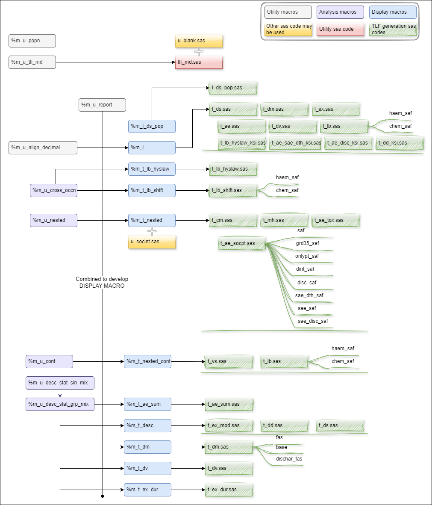

# Introduction

This user manual provides a guidance to O-GEM macros. 

O-GEM is ***Outputs Generation via Efficient Macros*** which is a sas macro system including [display](macros/display/display.md), [analysis](macros/analysis/analysis.md), [utility](macros/utility/utility.md) macros and also TLF generation codes. It aims to develop unique display macros for unique TLF format, so that programmers could **just call display macros** in respective TLF codes to generate outputs. 

O-GEM consists of two parts, the first part is TLF environment setup and the second part is output generation via TLF macros. 
* **TLF Environment Setup** 
  Create METADATA used in every outputs, one metadata includes titles, footnotes, program names and output file names. The other metadata includes column headers such as displayed treatment group, BigN across TLFs. 
* **Output Generation** 
  * For every unique TLF template, there'll be a display macro.  
  * One TLF generation code could generate multiple outputs by calling a display macro multiple times. 
 
 

# General Rules
* Standardized datasets for QC
  * Name of datasets (.sas7bdat) is the same as output (.rtf). 
  * Name of variables are COL1, COL2, COL3, … (COL0 for page by value). 
  * Label of variables is the same as column headers in output which will be used for reporting.
* Adherent to AZSOL  
  * Display macros are developed based on AZSOL. 
  * Follows [AZ TABLES AND LISTINGS OUTPUT FILE FORMAT](https://azcollaboration.sharepoint.com/sites/SS365/AD253/Clinical%20Data%20Standards%20Library/Guidelines%20and%20Training/TLF/Tables_and_Listings_Output_File_Format_Job_Aid_1.0.pdf?csf=1&web=1&e=tcNeiQ). 
* Follows [Program and Output Naming Conventions in AZ Oncology Programming](https://azcollaboration.sharepoint.com/sites/CMU175/04%20Programming/Program_Output%20Naming%20Conventions%20in%20AZ%20Oncology%20Programming.pdf?csf=1&web=1&e=Rmbsky).

# Structure and dependecy
Below is the structure and dependency of macros and also TLF generation codes (currently covers ONCO Core TLF but could also be applied to other TLF). 
More information stored in [O-GEM Index](https://azcollaboration.sharepoint.com/sites/O-GEM2/Shared%20Documents/General/O-GEM%20Index.xlsx?d=wb25d071b4025404caf18f0d7487c4b1d&csf=1&web=1&e=TgVKlA) <u>Outputs Index tab</u>, Column O(Program name), Column P(Suffix), Column Q(Output file name) and Column R(Display macro used).

|File|Location in Entimice|
|:---|:---|
|Macros|root/global_tools/oncology/o_gem/pgm/v1/tlf/prod/macro |
|u_blank.sas|root/global_tools/oncology/o_gem/pgm/v1/tlf/prod/macro|
|u_socint.sas|root/global_tools/oncology/o_gem/pgm/v1/tlf/prod/macro|
|tlf_md.sas|root/global_tools/oncology/o_gem/pgm/v1/tlf/prod/program|
|Generation codes of Core TLF|root/global_tools/oncology/o_gem/pgm/v1/tlf/prod/program|

# How to Use
There're 3 steps, 
1. TLF Environment setup 
   * Copy O-GEM macros and tlf_md.sas to study reporting event folder.  
   * Update localsetup.sas which will be run before every TLF. 
   * Convert TOC file(the structure is one record per one TLF) to metadata named as TLF.TITLES.
2. TLF generation codes(.sas) creation automatically. 
   * One Step to generate every code for each TLF in TOC file and a batch run code, batch_tlf.sas. 
3. TLF codes modification and execution. 

     

More details seen [how to use O-GEM](/howtouse/howtouse.md). 

The centralized O-GEM  
  * in Entimice 'root/global_tools/oncology/o_gem/pgm/v1/tlf/prod'. 
  * in SharePoint [O-GEM](https://azcollaboration.sharepoint.com/sites/O-GEM2/SitePages/CollabHome.aspx). 

# Resource

|Item|Description|Type|
|:---|:---|:---|
|[O-GEM SharePoint](https://azcollaboration.sharepoint.com/sites/O-GEM2/SitePages/CollabHome.aspx)|||
|[O-GEM Index.xlsx](https://azcollaboration.sharepoint.com/sites/O-GEM2/Shared%20Documents/General/O-GEM%20Index.xlsx?d=wb25d071b4025404caf18f0d7487c4b1d&csf=1&web=1&e=u9u49c)|An **index file** which includes AZSOL template ID, corresponding O-GEM macros used, and names of TLF generation code. It has created hyperlinks for different TLF and also has flagged Core in ***Output Index*** tab.|Index|
|[O-GEM User Manual.url](https://azu-oncology-rd.github.io/O-GEM)|HTML format for easy reference (GitHub account needed).|User Manual|
|[TOC_INDEX.xlsx](https://azcollaboration.sharepoint.com/sites/O-GEM2/Shared%20Documents/General/TOC_INDEX.xlsx?d=wcac3215991234061aaba7aee439c1c74&csf=1&web=1&e=QcsuQP)|Example TOC file|Example|
|[DXXXXXXXXXX_TiFo_MOSAIC_CONVERT.xlsm](https://azcollaboration.sharepoint.com/sites/O-GEM2/Shared%20Documents/General/DXXXXXXXXXX_TiFo_MOSAIC_CONVERT.xlsm?d=w05acd47b84b94c40a5f821cd4e4e1a32&csf=1&web=1&e=a6nyAx)|Convert csv metadata exported from MOSAIC via VBA to a TOC file which could be used in O-GEM. More information please seen in [O-GEM User Manual](https://azu-oncology-rd.github.io/O-GEM) ***How to use*** page.|Tool|
|[localsetup.sas](https://azcollaboration.sharepoint.com/sites/O-GEM2/Shared%20Documents/General/localsetup.sas?csf=1&web=1&e=e0G1gb)|An example localsetup including headers (BigN, descriptive texts) generation.|Example|
|root/global_tools/oncology/o_gem/pgm/v1/tlf/prod|Entimice location|Program|
# Revision history

|Revision|Effective|Summary of Changes|
|:---|:---:|:---|
|Macro/Utility 1.0|24Sep2024|Initial version|
|UM 1.0|24Sep2024|Initial version|

