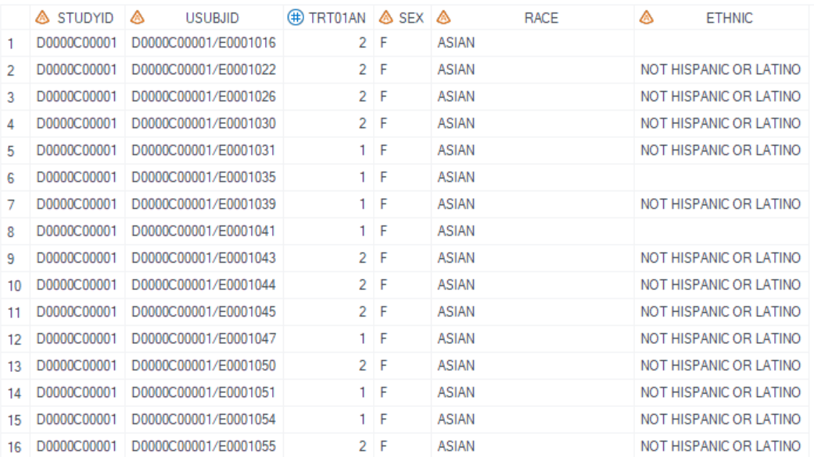

# Example

[Example 1 Summarize categorical variables](#example-1-summarize-categorical-variables)<br>
[Example 2 Use pre-define formats to summary categorical Variables](#example-2-use-pre-define-formats-to-summary-categorical-variables)<br>
[Example 3 Summarize continuous variables](#example-3-summarize-continuous-variables)<br>
[Example 4 Summarize categorical and continuous variables](#example-4-summarize-categorical-and-continuous-variables)<br>
[Example 5 Use specified denominator for calculating percentage](#example-5-use-specified-denominator-for-calculating-percentage)<br>

---

## Example 1 Summarize categorical variables

**Details**<br>
This example does the following:<br>
Compute "n" and "n (%)" statistics for categorical variables only based on adsl dataset itself as the denominator.<br>

**Program**<br>

```sas
%m_u_desc_stat_grp_mix(inds=   adam.adsl
							, datout= adsl_stat1
							, varlist_cat= SEX RACE ETHNIC
							, varlist_cont= 
							, exclude_stat= 
							, add_lead_row=Y
							, output_order= 
							, byvar= TRT01AN
							, denom_dt= 
							, grp_miss=0
							, pop_mvar=saspopb
							, deBug=N
							);
```
**Program Description**<br>

***Input data feature***<br>
The input dataset adam.adsl includes variables SEX, RACE, and ETHNIC. SEX, RACE, ETHNIC are character variables, and ETHNIC contains some records with missing values.<br>


***Parameter description***<br>
1. Calculate treatment group through parameter `pop_mvar=saspop`. <br>
Global macro `saspopb` which includes total group, is created in [%m_u_popn](../../utility/m_u_popn/m_u_popn_descp.md) which should be executed prior to invoking this macro.<br>

2. Set `varlist_cat= SEX RACE ETHNIC` to calculate the counts and counts_percentage of categorical variables.<br>

3. Set `add_lead_row=Y` to output the leading row of categorical variables before the summary of "cat_n_percent".<br>

4. Set `varlist_cont=` specifies no continuous variables will be calculated at the same time. `exclude_stat=` specifies that results will output "cat_n" and "cat_n_percent" for categorical variables, no statistic will be excluded. `output_order=` will use default order of variables, which will be same as `varlist_cat`, namely order by SEX, RACE, and then ETHNIC. Set `denom_dt=` means using default dataset as denominator, `inds` in this example will be used as denominator.<br>

**Output**<br>

Generate a dataset named `adsl_stat1` that contains the "cat_n" (category count) and "cat_n_percent" (category percentage) statistics. If the dataset contains missing values, a separate row labeled "Missing" is created to represent these instances.<br>
For the report, COL1 through COL5 will be utilized, with COL1 designated for variable labels for each row section, COL2 for the statistics column, and the treatment groups' data starting from COL3.<br>

 

---

## Example 2 Use pre-define formats to summary categorical Variables

**Details**<br>
This example does the following:<br>

1. Calculate the "n (%)" statistic, excluding the "cat_n" statistic.<br>
2. Apply the pre-defined format to display values for SEX and AGEGR1N.<br>
3. Assign a new label to the AGEGR1N variable to overwrite the existing leading row description.<br>

**Program**<br>

```sas
proc format; 
	value $gender (notsorted)
	"F"="Female"
	"M"="Male"
	;
	value age1_cat (notsorted)
	1=">= 15 - < 18"
	2=">= 18 - < 65"
	3=">= 65"
	4="Missing"
	;
quit;

data adsl;
label AGEGR1N = 'Age group (Year)';
set adam.adsl;
format SEX $gender. AGEGR1N age1_cat.;
run;

%m_u_desc_stat_grp_mix(inds=  adsl
							, datout= adsl_stat2
							, varlist_cat= AGEGR1N SEX RACE ETHNIC
							, exclude_stat=  cat_n
							, add_lead_row=Y
							, byvar= TRT01AN
							, grp_miss=0
							, pop_mvar=saspopb
							, deBug=N
							);
							
```

**Program Description**<br>

***Input data feature***<br>
The input dataset adsl includes the variables AGEGR1N, SEX, RACE, and ETHNIC. AGEGR1N is a numeric variable, and SEX, RACE, ETHNIC are character variables. The original label for AGEGR1N is "Pooled Age Group 1 (N)". 
<br>

***Parameter description***<br>

Similar to Example 1, but labeled AGEGR1N as "Age group (Year)", and formated analysis variables AGEGR1N and SEX as the pre-define format before calling this macro. New labels and formated values will be displayed as row text in the output.<br>

>Note: The sequence during the formatting process can influence the outcome. In proc format, if `(notsorted)` is specified, then formatted values are sorted based on their positional order, not by their original values nor by formatted values.  <br>

Only to calculate the "cat_n_percent" (category percentage) and excluded "cat_n" for variables `varlist_cat= AGEGR1N SEX RACE ETHNIC` when `exclude_stat=cat_n` option is specified.<br>


**Output**<br>
 
 Generate a dataset named "work.adsl_stat1.sas7bdat" that contains the "cat_n_percent" statistic. It will utilize columns COL1 through COL5 for reporting purposes, where COL1 is reserved for labels of variables for each row section, and COL2 is designated as the statistics column. The data for treatment groups starts from COL3.<br>


 >Note: In this example, if only one statistic "cat_n_percent" is presented, suggest to remove the statistics column. To do this, set `hide_lvls = Y` to hide the column to only display the label column and the result columns. For the report, only COL1 through COL4 will be utilized, with COL1 storing labels for each variable section, and the treatment groups' data starting from COL2.<br>


---

## Example 3 Summarize continuous variables 

**Details**<br>
This example does the following: <br>
1. Compute "n", "Mean", "SD", "Min", "Q1", "Median", "Q3", "Max", and "Sum" statistics for continuous variables. <br>
2. Assign new labels for analysis variables aiming to overwritten the existing leading row description. <br>
 
**Program**<br>

```sas
data adsl;
label AGE = 'Age (Year)' 
	WEIGHT='Weight (kg)'
	HEIGHT='Height (cm)'
	BMIBL = 'BMI group (kg/m2)';
set adam.adsl;
run;

%m_u_desc_stat_grp_mix(inds= adsl
							, datout= adsl_stat3
							, varlist_cat=  
							, varlist_cont= AGE WEIGHTBL HEIGHTBL BMIBL
							, exclude_stat= con_mis
							, decimal_list=###2
							, output_order=  
							, byvar= TRT01AN
							, grp_miss=0
							, pop_mvar=saspopb
							, deBug=N
							);
							
```

**Program Description**<br>

***Input data feature***<br>
The input dataset adsl includes the analysis variables AGE, WEIGHTBL, HEIGHTBL, and BMIBL. They are all continuous variables.<br>
<br>
 
***Parameter description***<br>
1. Similar to Example 2, but set `varlist_cont= AGE WEIGHTBL HEIGHTBL BMIBL` to specify the continuous analysis variables. New labels for variables of `varlist_cont` are assigned before calling this macro. <br>

2. Leave `varlist_cat` blank to specify no category variables will be calculated at the same time. `output_order=` specifies that default order of variables will be used, which will be same as `varlist_cont`, namely order by AGE, WEIGHTBL, HEIGHTBL, and BMIBL.<br>
   
3. For BMIBL, there's no rounding in input dataset and we need to specify the number of decimal places. `decimal_list=###2` means decimal places for BMIBL is set to '2', and other variables are determined by the values in `inds`.<br>

4. `exclude_stat= con_mis` to exclude "con_mis" value, and display "n", "Mean", "SD", "Min", "Q1", "Median", "Q3", "Max", and "Sum" statistics in the output.<br>


**Output**<br>
 
 Generate a dataset named "work.adsl_stat3.sas7bdat" that stores the "n", "Mean", "SD", "Min", "Q1", "Median", "Q3", "Max", "Sum" statistics. COL1-COL5 will be used for the report. COL1 stores labels of variables for each row section, COL2 is statistics column. The treatment groups start from COL3.


<br>

---

## Example 4 Summarize categorical and continuous variables


**Details**<br>
This example does the following:<br>
1. Calculate "n (%)" for categorical variables and statistics "n", "Mean", "SD", "Min", "Q1", "Median", "Q3" and "Max" for continuous variables.<br>
2. Apply the pre-defined format to display values for SEX and AGEGR1N.<br>
3. Assign new labels to analysis variables to replace the existing leading row descriptions.<br>
4. Determine the order of variables for the output.<br>
5. Apply `exclude_stat= cat_n con_sum` to exclude specific statistics from the output.<br>

**Program**<br>

```sas
proc format; 
	value $gender (notsorted)
	"F"="Female"
	"M"="Male"
	;
	value age1_cat (notsorted)
	1=">= 15 - < 18"
	2=">= 18 - < 65"
	3=">= 65"
	4="Missing"
	;
quit;

data adsl;
label AGEGR1N = 'Age group (Year)' 
	AGE = 'Age (Year)' 
	WEIGHT='Weight (kg)'
	HEIGHT='Height (cm)'
	BMIBL = 'BMI group (kg/m2)';
set adam.adsl;
format SEX $gender. AGEGR1N age1_cat.;
run;

%m_u_desc_stat_grp_mix(inds= adsl
							, datout= adsl_stat4
							, varlist_cat=  AGEGR1N SEX RACE ETHNIC
							, varlist_cont= AGE WEIGHTBL HEIGHTBL BMIBL
							, exclude_stat= cat_n con_sum con_mis
							, add_lead_row=Y
							, output_order=  AGEGR1N AGE SEX RACE ETHNIC WEIGHTBL HEIGHTBL BMIBL
							, byvar= TRT01AN
							, grp_miss=0
							, pop_mvar=saspopb
							, deBug=N
							);
							
```

**Program Description**<br>

***Input data feature***<br>
The adsl dataset, which includes variables AGEGR1N, AGE, SEX, RACE, ETHNIC, WEIGHTBL, HEIGHTBL, and BMIBL, serves as the input dataset. <br>
<br>

***Parameter description***<br>
1. Calculate treatment group through parameter `pop_mvar=saspop`.<br>
Global macro `saspopb` which includes total group, is created in [%m_u_popn](../../utility/m_u_popn/m_u_popn_descp.md) which should be executed prior to invoking this macro.<br>

2. To calculate statistics for each variables of `varlist_cat= AGEGR1N SEX RACE ETHNIC` and `varlist_cont= AGE WEIGHTBL HEIGHTBL BMIBL`. 
New labels and formats are assigned to variables before calling this macros and will be displayed as row texts in the output. <br>

3. `output_order=  AGEGR1N AGE SEX RACE ETHNIC WEIGHTBL HEIGHTBL BMIBL` specifies that order of row sections is defined as AGEGR1N, AGE, SEX, RACE, ETHNIC, WEIGHTBL, HEIGHTBL, and then BMIBL.<br>

4. `exclude_stat= cat_n con_sum con_mis` specifies that "n" for categorical variables and "Sum","Missing" for continuous variables will be excluded and display "n (%)", "n", "Mean", "SD", "Min", "Q1", "Median", "Q3", and "Max" statistics in the output.<br>

**Output**<br>
 
Generate a dataset named "work.adsl_stat4.sas7bdat" that stores the "n (%)", "n", "Mean", "SD", "Min", "Q1", "Median", "Q3", and "Max" statistics. COL1-COL5 will be used for the report. COL1 stores labels of variables for each row section, COL2 is statistics column. Results of the treatment groups start from COL3.
<br>

>Note: if `output_order` option is null, default output order will be continuous variables first, and then categorical variables. Assume that output_order is not provided in this example, the order will be AGE, WEIGHTBL, HEIGHTBL, BMIBL, AGEGR1N, SEX, RACE, and then ETHNIC.
<br>

---
  
## Example 5 Use specified denominator for calculating percentage

**Details**<br>
This example does the following:<br>
Use the `denom_dt` option to specify the denominator dataset for computing "n (%)" statistic.  <br>

**Program**<br>

```sas

data denominator_random;
	set adam.adsl; 
	if RANDFL = "Y"; 
	keep  USUBJID TRT01PN RANDFL; 
run;

%m_u_desc_stat_grp_mix(inds= adsl
							, datout= adsl_stat5
							, varlist_cat=  SAFFL
							, exclude_stat= cat_n 
							, add_lead_row=N
							, byvar= TRT01PN
							, denom_dt= denominator_random
							, pop_mvar=saspopb
							, deBug=N);							
```

**Program Description**<br>

***Input data feature***<br>
1. Input dataset adsl only keep the SAFFL='Y' records. <br>
<br>

2. Create denominator datast<br>
Define randomization dataset as the denominator dataset. USUBJID and `byvar` (e.g. TRT01PN) must be included in dataset. <br>
 <br>

***Parameter description***<br>
1. Calculate treatment group through parameter `pop_mvar=saspop` <br>
Global macro `saspopb` which includes total group, is created in [%m_u_popn](../../utility/m_u_popn/m_u_popn_descp.md) which should be executed prior to invoking this macro.<br>

2. Sepcified `denom_dt=denominator_random` in this macro. Call this macro, only to calculate "cat_n_percent" for categorical variable `varlist_cat= SAFFL` when `exclude_stat=cat_n` option is specified. <br>

**Output**<br>
 
Generate a dataset named "work.adsl_stat5.sas7bdat" that stores the "cat_n_percent" statistic. Percentage is not based on safety population, but based on randomzation population, which has more subjects.
 

---
