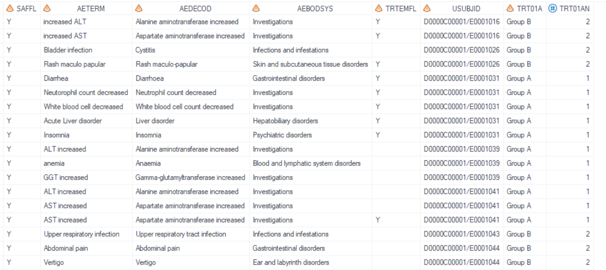
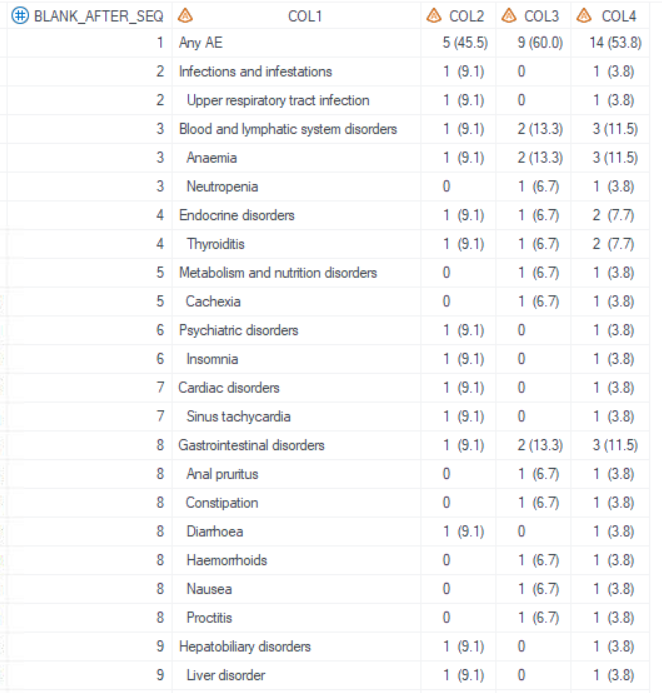
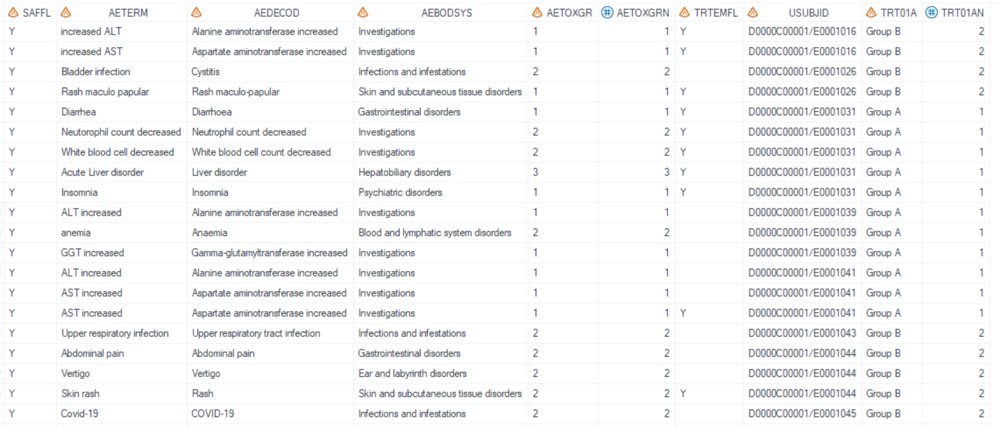
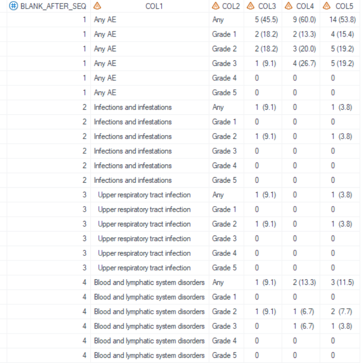
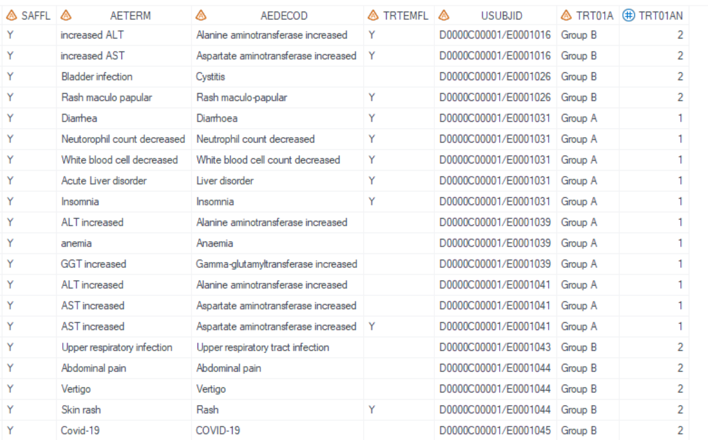
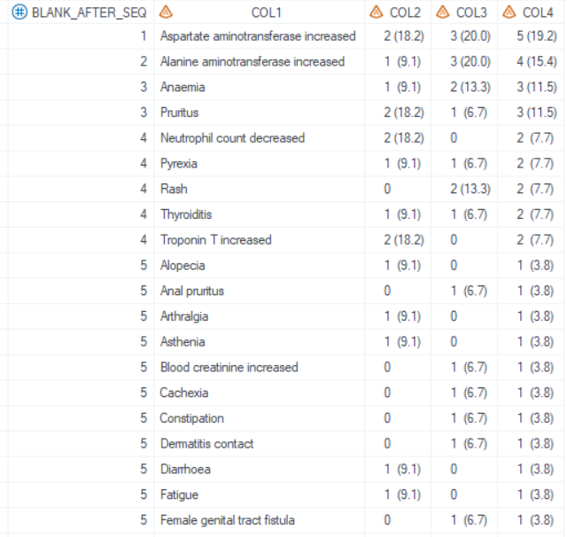

# Example

[Example 1 Adverse events by system organ class and preferred term](#example-1-adverse-events-by-system-organ-class-and-preferred-term)<br>
[Example 2 Adverse events by system organ class and preferred term and maximum CTCAE grade](#example-2-adverse-events-by-system-organ-class-and-preferred-term-and-maximum-ctcae-grade)<br>
[Example 3 Adverse events sorted by decreasing frequency on preferred term level](#example-3-adverse-events-sorted-by-decreasing-frequency-on-preferred-term-level)<br>

---

## Example 1 Adverse events by system organ class and preferred term

**Details**<br>

This example does the following:<br>
Create nested table for adverse events by system organ class and preferred term. <br>

**Program**

```sas

%m_u_nested(inds=adam.adae
	,pop_flag = %str(SAFFL="Y")
	,whr = %str(TRTEMFL="Y")
	,trtgrpn = TRT01AN 
	,trtTot = Y
	,UniqueIDVars = USUBJID
	,lev1 = AEBODSYS
	,lev2 = AEDECOD
	,lev3 =
    ,comnvarn =
    ,comnvarnfmt =
    ,comnvarn_level =
	,rowtext = %str(Any AE)
    ,socfile =
    ,socint =
	,uncoded = %str(Not coded)
	,lab1 = %str(System Organ Class@  Preferred Term)
	,lab2 =
	,sortby = lev1soc#lev2ab
	,filterPctBy =
	,pop_mvar = saspopb
	,deBug =
	);
```

**Program Description**<br>

***Input data feature***<br>
A standard dataset adam.adae serves as the input dataset, which contains required variables USUBJID, TRT01AN, SAFFL, TRTEMFL, AEBODSYS, and AEDECOD.<br>


***Parameter description***<br>
1. `rowtext = %str(Any AE)` specifies that a leading row which row text is "Any AE" is generated. For the `lab1`, the symbol "@" is the split character which defined in PROC REPORT statement `split`. "(\*ESC*)n" could also be used to split.<br>  

2. For the `uncoded`, If the `lev1` (AEBODSYS) or `lev2` (AEDECOD) value is missing, it will be imputed and displayed as "Not coded", and placed at the end within each level.<br>

3. For the `sortby`, the value is "lev1soc#lev2ab", means that the `lev1` (AEBODSYS) sort by SOC international order, and `lev2` (AEDECOD) sort alphabetically.<br>

**Output**<br>
Dataset "work.final_m_u_nested.sas7bdat" is generated. Results of the treatment groups start from COL2. Since `trtTot` is set to "Y", the total treatment group column is generated as the last column COL4 in output dataset.<br>


---

## Example 2 Adverse events by system organ class and preferred term and maximum CTCAE grade

**Details**<br>

This example does the following:<br>
Create nested table for adverse events by system organ class and preferred term, each system organ class / preferred term is summarized by CTC grade. <br>

**Program**

```sas
* Define format;
proc format;
	value grd 
        1 = "Any"
        2 = "Grade 1"
        3 = "Grade 2"
        4 = "Grade 3"
        5 = "Grade 4"
        6 = "Grade 5"
    ;
run;

 
%m_u_nested(inds=adam.adae
	,pop_flag = %str(SAFFL="Y")
	,whr = %str(TRTEMFL="Y")
	,trtgrpn = TRT01AN 
	,trtTot = Y
	,UniqueIDVars = USUBJID
	,lev1 = AEBODSYS
	,lev2 = AEDECOD
	,lev3 =
    ,comnvarn = AETOXGRN
    ,comnvarnfmt = grd
    ,comnvarn_level = %str(1 2 3 4 5|1|2|3|4|5)
	,rowtext = %str(Any AE)
    ,socfile =
    ,socint =
	,uncoded = %str(Not coded)
	,lab1 = %str(System Organ Class@  Preferred Term)
	,lab2 = %str(CTCAE Grade)
	,sortby = lev1soc#lev2ab
	,filterPctBy =
	,pop_mvar = saspopb
	,deBug =
	);
```

**Program Description**<br>

***Input data feature***<br>
A standard dataset adam.adae serves as the input dataset, which contains required variables USUBJID, TRT01AN, SAFFL, TRTEMFL, AEBODSYS, AEDECOD, and AETOXGRN.<br>


***Parameter description***<br>
1. `rowtext = %str(Any AE)` specifies that a leading row which row text is "Any AE" is generated. For the `lab1`, the symbol "@" is the split character which defined in PROC REPORT statement `split`. "(\*ESC*)n" could also be used to split.<br>  

2. The `comnvarn` is set to "AETOXGRN", means that every `lev1` (AEBODSYS) and `lev2` (AEDECOD) will be summarized by "AETOXGRN".<br>

3. For the `comnvarnfmt`, the format "grd" had been defined in advance. <br>

4. For the `comnvarn_level`, the first values is "1 2 3 4 5" corresponding to row "Any", means `comnvarn`(AETOXGRN) value in (1 2 3 4 5). Likewise, the second value is "1" corresponding to row "Grade 1", filter is "AETOXGRN in (1)". etc.<br>

5. For the `sortby`, the value is "lev1soc#lev2ab", means that the `lev1`(AEBODSYS) sort by SOC international order, and `lev2`(AEDECOD) sort alphabetically.<br>
 

**Output**<br>
Dataset "tlf.t_ae_tox_saf.sas7bdat" is generated. Since the `comnvarn` is specified, the corresponding column is generated after the COL1, and the corresponding header name is defined in `lab2`. Therefore, the treatment groups start from COL3 accordingly.<br>


---

## Example 3 Adverse events sorted by decreasing frequency on preferred term level

**Details**<br>

This example does the following:<br>
Create nested table for adverse events by preferred term only, and sorted by the decreasing frequency in total treatment. <br>

**Program**<br>

```sas
 
%m_u_nested(inds=adam.adae
	,pop_flag = %str(SAFFL="Y")
	,whr = %str(TRTEMFL="Y")
	,trtgrpn = TRT01AN
	,trtTot = Y
	,UniqueIDVars = USUBJID
	,lev1 = AEDECOD
	,lev2 =
	,lev3 =
    ,comnvarn =
    ,comnvarnfmt =
    ,comnvarn_level =
	,rowtext =
    ,socfile =
    ,socint =
	,uncoded =
	,lab1 = %str(Preferred Term)
	,lab2 =
	,sortby = %str(descending lev1total)
	,filterPctBy =
	,pop_mvar = saspopb
	,deBug =
	);
```

**Program Description**<br>

***Input data feature***<br>
A standard dataset adam.adae serves as the input dataset, which contains required variables USUBJID, TRT01AN, SAFFL, TRTEMFL, and AEDECOD. No AEBODSYS is needed.


***Parameter description***<br>
1. For `lev1`, the value is "AEDECOD", and the sub-level `lev2`, `lev3` are missing, means that this nested output only contain 1 level.<br>   

2. The `rowtext` set to missing, means that the first row (summary row) will not be displayed.<br>

3. For the `sortby`, the value is "descending lev1total", means that the `lev1` (AEDECOD) is sorted by descending frequency based on total column.<br>

 
**Output**<br>

Dataset "work.final_m_u_nested.sas7bdat" is generated. Dataset is sorted by descending frequency of COL5 (total treatment group column).<br>
