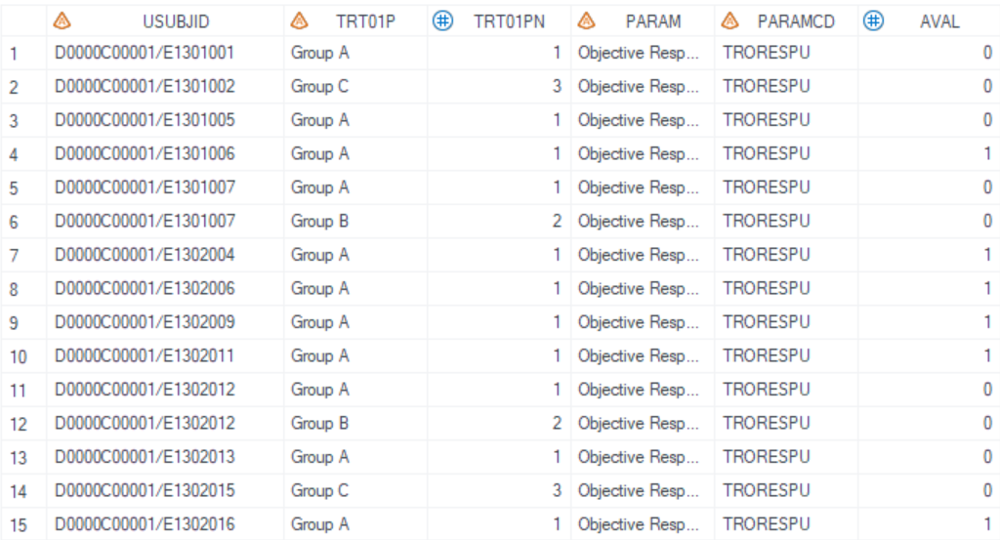
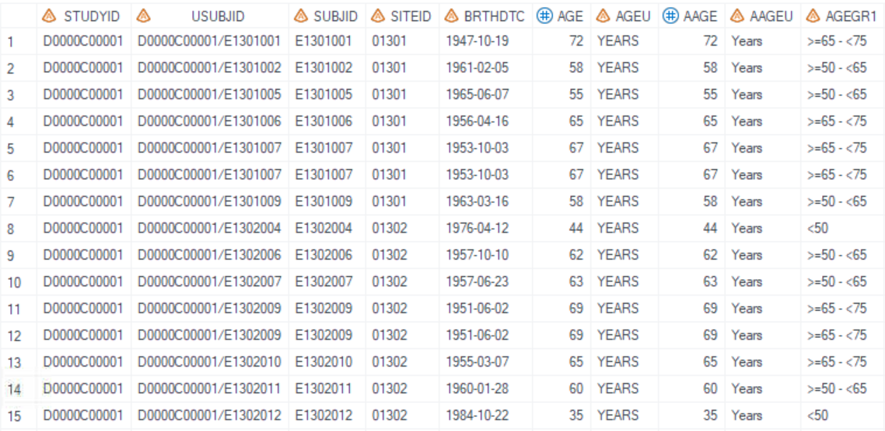
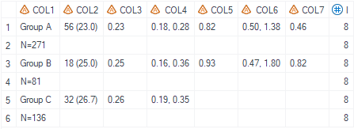
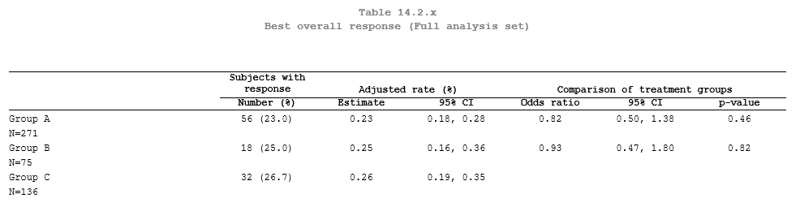
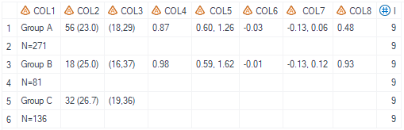
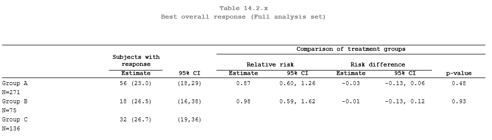

# Example

[Example 1 Summary of rate, adjusted rate and odds ratio related](#example-1-summary-of-rate-and-adjusted-rate-and-odds-ratio-related)<br>

[Example 2 Summary of rate and confidence interval, relative risk and confidence interval and risk difference related](#example-2-summary-of-rate-and-confidence-interval-relative-risk-and-confidence-interval-and-risk-difference-related)<br>

---

## Example 1 Summary of rate and adjusted rate and odds ratio related

**Details**

This example does the following:<br>
Display overall summary of rate, adjusted rate and odds ratio related statistics, following the template of [AZTONCEF02A](https://azcollaboration.sharepoint.com/sites/O-GEM2/Shared%20Documents/General/O-GEM%20Index.xlsx?d=wb25d071b4025404caf18f0d7487c4b1d&csf=1&web=1&e=g89VOk&nav=MTVfe0M0Q0Y5NTY1LUIwQUUtNDhENy05RjhELTFCQjJFMzlCODU1NX0).<br>

**Program**

```sas
%m_t_aztoncef02(inds= adeff_all
                                                        , adsl= adsl_all
                                                        , trtgrpn= trt01pn
                                                        , trtgrp= trt01p
                                                        , trtfmt=
                                                        , pop_flag= ittfl='Y'
                                                        , whr= paramcd='TRORESPU' and OTLVBPFL='Y' and PARQUAL='INDEPENDENT ASSESSOR'
                                                        , strata= strat1n strat2n
                                                        , event=
                                                        , var=
                                                        , reportout= N
                                                        , debug= N
                                                        , rate_ci= N
                                                        , rate_alpha= 0.05
                                                        , rate_decim=
                                                        , rate_missval= 
                                                        , rate_adj= Y
                                                        , rate_adj_alpha= 0.05
                                                        , rate_adj_cidecim=
                                                        , rate_adj_missval=
                                                        , odds= Y
                                                        , cmh= N
                                                        , trtpair= 1-3|2-3
                                                        , cal_alpha=
                                                        , cal_pside=
                                                        , cal_pdecim=
                                                        , cal_cidecim=
                                                        , cal_missval= 
                                                        , cmh_cltype=
                                                        , collabel= col1='Group' col2='Number (%)' col3='Estimate' col4='95% CI'
                                                        , lenlist = 32#18#18#18
                                                        , justlist = l#c#c#c
                                                        , justlist_header = l#c#c#c
                                                        , nolblist = Y#N#N#N
                                                        , orderlist = Y#N#N#N
                                                        , defcol = (col1) ("(*ESC*)S={just = center borderbottomwidth=0pt MARGINBOTTOM= 2pt}Subjects with response(*ESC*)S={}"col2) ("(*ESC*)S={just = center borderbottomwidth=0pt MARGINBOTTOM= 2pt}Adjusted rate (%)(*ESC*)S={}" col3 col4)
                                                        , pg= 18
                                                        , blank_after=
                                                        , sfx = a
							);
```

**Program Description**

***Input data feature***<br>
The input dataset `inds` is a standard ADEFF adam dataset that contains required variables: USUBJID, TRT01PN,TRT01P,AVAL,PARAM,PARAMCD etc. The dataset must include variable AVAL with value of 0 or 1. 


The input dataset `adsl` is optional, and should contain required variables: USUBJID, TRT01PN, TRT01P.


***Parameter description***<br>
1. Filter the dataset using either the `whr` variable, or during data-preprocess of the input dataset and make sure only one `PARAMCD` is selected. <br>

2. Parameter `strata` defines the stratification variables to be consifered if any, note that the value type for `strata` must be numeric.

3. The parameter `trtpair` defines the treatment group pair for analysis and `trtref` specifies the treatment group that will be used as reference. The `trtref` should be within `trtpair`. 

4. Parameters `rate_ci`, `rate_adj`, `odds`, `cmh` controls whether or not the corresponding section will be calculated. Please refer to Parameter section for detailed description.<br>Note that for template AZTONCEF02A, we do NOT need confidence interval for rate and thus we set the value to be N. 

5. There are 3 sets of paraters ending with `alpha`,`decim`,`missval`, they control the alpha value, decimal places and display text for missing values for corresponding sections.

**Output**

***Output Dataset***<br>
TBN after DEBUG is fixed. Dataset to be kept should be concise. Double check the naming of `work.report_final.sas7bdat` if changed


Generate output datasets "work.report_final.sas7bdat" and "tlf.aztoncef02_a.sas7bdat" <br>
The dataset for QC includes variables from COL1 to COL7. COL1 is the treatment group column and COL2-COL7 are result columns of different statistics.<br>


***Output rtf***<br>
Corresponding "t_aztoncef02_a.rtf" is generated. <br>


---


## Example 2 Summary of rate and confidence interval relative risk and confidence interval and risk difference related

**Details**

This example does the following:<br>
Display overall summary of rate and confidence interval, relative risk estimate and confidence interval, risk difference estimate, confidence interval and p-value following the template of [AZTONCEF02B](https://azcollaboration.sharepoint.com/sites/O-GEM2/Shared%20Documents/General/O-GEM%20Index.xlsx?d=wb25d071b4025404caf18f0d7487c4b1d&csf=1&web=1&e=J42Lg3).<br>

**Program**

```sas
%m_t_aztoncef02(inds= adeff_all
                                                        , adsl= adsl_all
                                                        , trtgrpn= trt01pn
                                                        , trtgrp= trt01p
                                                        , trtfmt=
                                                        , pop_flag= ittfl='Y'
                                                        , whr= paramcd='TRORESPU' and OTLVBPFL='Y' and PARQUAL='INDEPENDENT ASSESSOR'
                                                        , strata= strat1n strat2n
                                                        , event=
                                                        , var=
                                                        , reportout= Y
                                                        , debug= N
                                                        , rate_ci= Y
                                                        , rate_alpha= 0.05
                                                        , rate_decim=
                                                        , rate_missval= 
                                                        , rate_adj= N
                                                        , rate_adj_alpha= 
                                                        , rate_adj_cidecim=
                                                        , rate_adj_missval=
                                                        , odds= N
                                                        , cmh= Y
                                                        , trtpair= 1-3|2-3
                                                        , cal_alpha=
                                                        , cal_pside=
                                                        , cal_pdecim=
                                                        , cal_cidecim=
                                                        , cal_missval= 
                                                        , cmh_cltype=
                                                        , collabel= col1='Group' col2='Estimate' col3='95% CI'  col4='Estimate' col5='95% CI' col6='Estimate' col7='95% CI'  col8='p-value'
                                                        , lenlist = 22#11#11#11#11#11#11#11
                                                        , justlist = l#c#c#c#c#c#c#c
                                                        , justlist_header = l#c#c#c#c#c#c#c
                                                        , nolblist = Y#N#N#N#N#N#N#N
                                                        , orderlist = Y#N#N#N#N#N#N#N
                                                        , defcol = (col1) ("(*ESC*)S={just = center borderbottomwidth=0pt MARGINBOTTOM= 2pt}Subjects with response(*ESC*)S={}" col2) (col3)
                                                        ("(*ESC*)S={just = center borderbottomwidth=0pt MARGINBOTTOM= 2pt}Comparison of treatment groups (*ESC*)S={}" 
                                                        ("(*ESC*)S={just = center borderbottomwidth=0pt MARGINBOTTOM= 2pt}Relative risk(*ESC*)S={}" col4 col5) ("(*ESC*)S={just = center borderbottomwidth=0pt MARGINBOTTOM= 2pt}Risk difference (*ESC*)S={}" col6 col7) col8)
                                                        , pg= 18
                                                        , blank_after=
                                                        , sfx = b	
							);
```

**Program Description**

***Input data feature***<br>
The input dataset `inds` is a standard ADEFF adam dataset that contains required variables: USUBJID, TRT01PN,TRT01P,AVAL,PARAM,PARAMCD etc. The dataset must include variable AVAL with value of 0 or 1. 


The input dataset `adsl` is optional, and should contain required variables: USUBJID, TRT01PN, TRT01P.


***Parameter description***<br>
1. Filter the dataset using either the `whr` variable, or during data-preprocess of the input dataset and make sure only one `PARAMCD` is selected. <br>

2. Parameter `strata` defines the stratification variables to be consifered if any, note that the value type for `strata` must be numeric.

3. The parameter `trtpair` defines the treatment group pair for analysis and `trtref` specifies the treatment group that will be used as reference. The `trtref` should be within `trtpair`. <br>

4. Parameters `rate_ci`, `rate_adj`, `odds`, `cmh` controls whether or not the corresponding section will be calculated. Please refer to Parameter section for detailed description. 

5. There are 3 sets of paraters ending with `alpha`,`decim`,`missval`, they control the alpha value, decimal places and display text for missing values for corresponding sections. 

**Output**

***Output Dataset***<br>
TBN after DEBUG is fixed. Dataset to be kept should be concise. Double check the naming of `work.report_final.sas7bdat` if changed


Generate output datasets "work.report_final.sas7bdat" and "tlf.aztoncef02_b.sas7bdat" <br>
The dataset for QC includes variables from COL1 to COL7. COL1 is the treatment group column and COL2-COL8 are result columns of different statistics.<br>


***Output rtf***<br>
Corresponding "t_aztoncef02_b.rtf" is generated. <br>


---