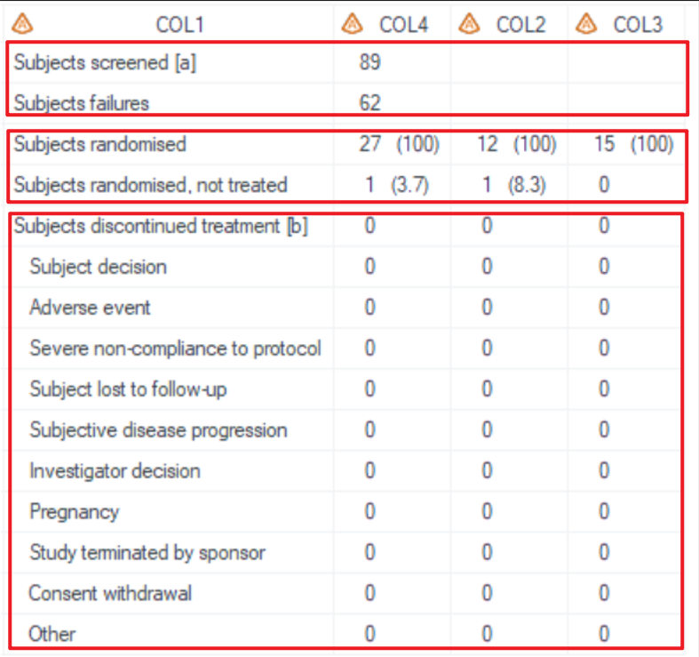
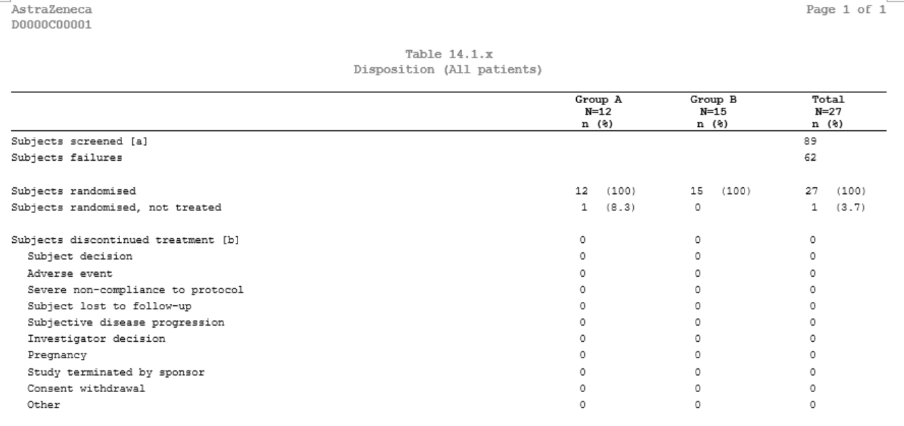
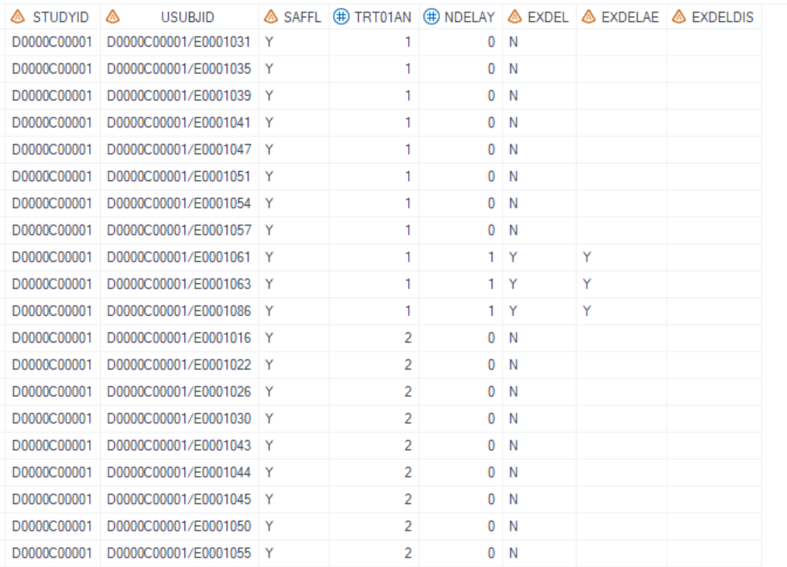
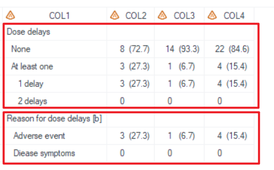
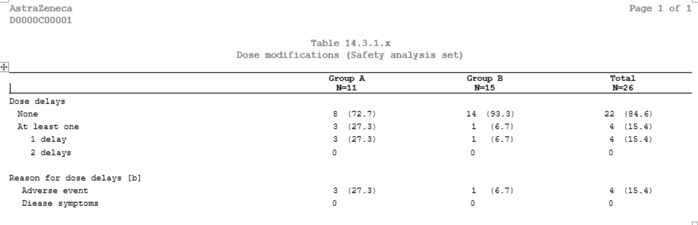

# Example

[Example 1 Disposition](#example-1-disposition)<br>
[Example 2 Dose modifications](#example-2-dose-modifications)<br>

---

## Example 1 Disposition

**Details**<br>

This example does the following:<br>
Output the disposition table, following the template  [AZTONCSP01A](https://azcollaboration.sharepoint.com/sites/O-GEM2/Shared%20Documents/General/O-GEM%20Index.xlsx?d=wb25d071b4025404caf18f0d7487c4b1d&csf=1&web=1&e=8G77sB&nav=MTVfezI3REUxMTFGLTc1QTgtNDNGNi04MzczLTNDRjk5Mzg4MjNGMn0).<br>


**Program**<br>

```sas
proc format;
	value $DCTREAS (notsorted)
	'SUBJECT DECISION'='Subject decision'
	'ADVERSE EVENT'='Adverse event'
	'SEVERE NON-COMPLIANCE TO PROTOCOL'='Severe non-compliance to protocol'
	'SUBJECT LOST TO FOLLOW-UP'='Subject lost to follow-up'
	'SUBJECTIVE DISEASE PROGRESSION'='Subjective disease progression'
	'INVESTIGATOR DECISION'='Investigator decision'
	'PREGNANCY'='Pregnancy'
	'STUDY TERMINATED BY SPONSOR'='Study terminated by sponsor'
	'CONSENT WITHDRAWAL'='Consent withdrawal'
	'OTHER'='Other'
	;
run;

/*****denominator:randomization subjects*****/
data denominator_random; set ADAM.ADSL; where FASFL = "Y"; keep usubjid TRT01PN; run;

/*****denominator:treatment subjects*****/
data denominator_trt_start; set ADAM.ADSL; where TRTSDT ~= .; keep usubjid TRT01PN; run;

%m_t_desc(
	inds = ADAM.ADSL
	, trtgrpn =TRT01PN
	, pop_mvar=FASpopb
	, formatlist = format DCTREAS $DCTREAS.

/*****The first analysis section*****/
	/*****Subject screened*****/
	    , sub_data_filter1=where ENRLFL = "Y"
	    , sub_var1=ENRLFL
	    , sub_var_label1=label ENRLFL='Subjects screened [a]'
	    , sub_data_ord1=1
	    , no_percent1= Y
	    , sub_denominator1=
	    , n_indents1 = 0
		, no_grp1=Y
		, sub_leading1=N
		, sub_fmt1=N

	/*****Screen failures*****/
		, sub_data_filter2=where RANDFL ~= "Y"
		, sub_var2=ENRLFL
		, sub_var_label2=label ENRLFL='Subjects failures'
		, sub_data_ord2=1
		, no_percent2= Y
		, sub_denominator2=
		, n_indents2= 0	
		, no_grp2=Y
		, sub_leading2=N
		, sub_fmt2=N

/*****The second analysis section*****/
	/*****Subjects [[randomised|assigned]]*****/
		, sub_data_filter3=where RANDFL = "Y" 
		, sub_var3=RANDFL 
		, sub_var_label3=label RANDFL='Subjects randomised' 
		, sub_data_ord3=2
		, no_percent3 = N
		, sub_denominator3 =
		, n_indents3 = 0
		, no_grp3=N
		, sub_leading3=N
		, sub_fmt3=N

	/*****Subjects [[randomised|assigned]], not treated*****/
		, sub_data_filter4=where RANDFL = "Y" and TRTSDT = . 
		, sub_var4=RANDFL 
		, sub_var_label4=label RANDFL='Subjects randomised, not treated' 
		, sub_data_ord4=2
		, no_percent4 = N
		, sub_denominator4 = denominator_random
		, n_indents4 = 0
		, no_grp4=N
		, sub_leading4=N
		, sub_fmt4=N	

/*****The third analysis section*****/
	/*****Subjects discontinued treatment [b]*****/
		, sub_data_filter5=where EOTSTT = "DISCONTINUED" 
		, sub_var5=STUDYID 
		, sub_var_label5=label STUDYID='Subjects discontinued treatment [b]' 
		, sub_data_ord5=3
		, no_percent5= N
		, sub_denominator5= denominator_trt_start
		, n_indents5= 0	
		, no_grp5=N
		, sub_leading5=N
		, sub_fmt5=N
	/*****Reason of Subjects discontinued treatment [b]*****/
		, sub_data_filter6=where EOTSTT = "DISCONTINUED" 
		, sub_var6=DCTREAS 
		, sub_var_label6=label DCTREAS='Subjects discontinued treatment [b]' 
		, sub_data_ord6=3
		, no_percent6= N
		, sub_denominator6= denominator_trt_start
		, n_indents6= 2	
		, sub_fmt6= Y
		, sub_leading6= N
		, no_grp6=N

	, lenlist = 60#13#13#13   
	, justlist= l#c#c#c
	, justlist_header= l#c#c#c
	, nolblist=Y#N#N#N
	, orderlist=Y#N#N#N
	, defcol=
    , pg=18
	, pg_byvar=N
 	, sfx = mono 
	, debug=Y
	);
 
```

**Program Description**<br>

***Input data feature***<br> 
A dataset with a per-subject structure is used as input where the analysis variables including STUDYID, USUBJID, TRT01PN, ENRLFL, FASFL, RANDFL, EOTSTT, DCTREAS and TRT01PN are present as columns within the dataset.<br> 


***Parameter description***<br>
* **The first analysis section: "Subject screened" + "Screen failure"**<br>
  1. Use `sub_var_label1=label ENRLFL='Subjects screened [a]'` and `sub_var_label2=label ENRLFL='Subjects failures'` to display row texts.<br>
  2. There's no blank row between "Subject screened" and "Screen failure" which means these 2 blocks belong to a same analysis section, then set both `sub_data_ord1` and `sub_data_ord2` to '1'.<br>
  3. To generate numbers without percentages only for total column ,  `no_percent1` and `no_percent1` need to be set as 'Y', `sub_denominator1` and `sub_denominator2` need to be set as null, `no_grp1` and `no_grp2` need to be set as 'Y'.<br>
  4. Since there's no need to have any indentations or the leading row ( without any results), set `n_indents1`, `n_indents2` as '0' and `sub_leading1` and `sub_leading2` as 'N'.<br>
  5. `sub_fmt1=N` and `sub_fmt2=N` mean the row texts are controlled by `sub_var_label1` and `sub_var_label2` without any dummy rows.<br>


* **The second analysis section: "Subjects randomised" + "Subjects randomised, not treated"**<br>
  1. There's no blank row between "Subjects randomised" and "Subjects randomised, not treated" but after the first analysis section, then set both `sub_data_ord3` and `sub_data_ord4` to '2' (increasing 1 compared).<br>
  2. `no_percent3 =N` and `no_percent4 = N` mean that percentages are needed.
  3. `sub_denominator3=denominator_random` and `sub_denominator4 = denominator_random` mean that the denominator of percentages is based on "denominator_random" dataset which should be pre-defined.
  4. `no_grp3=N` and `no_grp4=N` mean that results for all columns not only total column need to be generated.<br>
  

* **The third analysis section: "Subjects discontinued treatment" + "Reason of Subjects discontinued treatment"**<br>
  1. "Subjects discontinued treatment" setting is the same as the second analysis section except that `sub_denominator5` is set as "denominator_trt_start", because percentages should be based on the number of subjects started treatment.<br>
  2. "Reason of subjects discontinued treatment" is different with previous analysis where the dummy rows defined by format is needed. To do this, set `formatlist = format DCTREAS $DCTREAS.` and `sub_fmt6=Y`.<br>

* By setting `sfx = mono` with the program name being "t_ds" in this example, the resulting output files will be named as "t_ds_mono.sas7bdat" and "t_ds_mono.rtf".<br>
 
**Output**<br>

***Output Dataset***<br>
Generate output datasets "tlf.t_ds_mono.sas7bdat" (used for QC), and "work.final2output.sas7bdat" (used in proc report process).<br>
The dataset for QC includes variables COL1-COL4. COL1 is the values of `sub_var_labelXX` and COL2-COL4 are result columns of treatment groups. <br>

 
***Output rtf***<br>
Corresponding "t_ds_mono.rtf" is generated.



---

## Example 2 Dose modifications

**Details**<br>

This example does the following:<br>
Output the dose modifications table(take dose delays as an example), following the template [AZTONCEX04](https://azcollaboration.sharepoint.com/sites/O-GEM2/Shared%20Documents/General/O-GEM%20Index.xlsx?d=wb25d071b4025404caf18f0d7487c4b1d&csf=1&web=1&e=Y30REv&nav=MTVfezQ4MDU5RUJDLUJCMUQtNEFBOS05NTY2LTJCOEU0MEFFMkEzRX0).<br>

**Program**<br>

```sas
%** Step1. Proc format used in TLF **;
proc format;	
	value $FLAG_ALO (notsorted)
	"N" = "None"
	"Y" = 'At least one';
 
	value EXDELNC (notsorted)
	1 = '1 delay' 
	2 = '2 delays';
 
	value $reas1c
		'Y' = 'Adverse event' ; 
	value $reas5c
		'Y' = 'Disease symptoms'  ;
run;

data saf;
set adam.adsl;
where saffl='Y';
run;


%m_t_desc(  inds = RDEXON
, trtgrpn = TRT01AN
, pop_mvar=saspopb
, formatlist = format EXDEL $FLAG_ALO. 
                      NDELAY EXDELNC. 
					  EXDELAE $reas1c. 
					  EXDELDIS $reas5c. 
,  total=Y

/*****The first analysis section*****/
	/*****Dose delays*****/
	, sub_data_filter1= where SAFFL = 'Y'
	, sub_var1= EXDEL
	, sub_var_label1=label EXDEL= 'Dose delays'
	, sub_data_ord1=1
	, no_percent1= N
	, sub_denominator1=saf
	, n_indents1= 0
	, sub_leading1= Y
	, sub_fmt1=Y

	/*****Number of dose delays*****/
	, sub_data_filter2= where SAFFL = 'Y' and NDELAY>=1
	, sub_var2= NDELAY
	, sub_var_label2=label NDELAY= ''
	, sub_data_ord2=1
	, no_percent2= N
	, sub_denominator2=saf
	, n_indents2= 4
	, sub_leading2=N
	, sub_fmt2= Y

/*****The second analysis section*****/
	/*****Reason for dose delays*****/
	, sub_data_filter3= 
	, sub_var3= SAFFL
	, sub_var_label3=label SAFFL= 'Reason for dose delays [b]'
	, sub_data_ord3=2
	, sub_header_only3=Y
	, no_percent3= N
	, sub_denominator3=saf
	, n_indents3= 0
	, sub_leading3= Y
	, sub_fmt3=N

	/*****Reason for dose delays, AE*****/
	, sub_data_filter4= where SAFFL = 'Y' and EXDELAE='Y'
	, sub_var4= EXDELAE
	, sub_var_label4=label EXDELAE= ''
	, sub_data_ord4=2
	, no_percent4= N
	, sub_denominator4=saf
	, n_indents4= 2
	, sub_leading4= N
	, sub_fmt4=Y

	/*****Reason for dose delays, Diease symptoms*****/
	, sub_data_filter5= where SAFFL = 'Y' and EXDELDIS='Y'
	, sub_var5= EXDELDIS
	, sub_var_label5=label EXDELDIS= 'Diease symptoms'
	, sub_data_ord5=2
	, no_percent5= N
	, sub_denominator5=saf
	, n_indents5= 2
	, sub_leading5=N
	, sub_fmt5= N 
 
, lenlist = 39#20#20#20
, justlist=l#c#c#c
, justlist_header=l#c#c#c
, nolblist=Y#N#N#N
, orderlist=Y#N#N#N
, defcol=
, pg=20
, sfx=saf	);

```

**Program Description**<br>

***Input data feature***<br> 
A dataset with a standard per-subject structure is used as the input, where the variables, including STUDYID, USUBJID, TRT01AN, SAFFL, Dose delays related variables: EXDEL, NDELAY, EXDELxx (Dose delays reasons) are present as columns within the dataset.<br> 


***Parameter description***<br>

* **The first analysis section: "Dose delays" + "Number of dose delays"**<br>
  1. "Dose delays" block includes a leading row without any results and 2 rows using dummy texts. <br>
  * Set `sub_var_label1=label EXDEL= 'Dose delays'` and `sub_leading1= Y` to display a leading row. <br>
  * Include "EXDEL $FLAG_ALO." in `formatlist` (where $FLAG_ALO. is pre-defined in proc format) and set `sub_fmt1=Y` to display the formatted dummy rows. <br>
  2. "Number of dose delays" block includes only formatted rows. <br>
  * Include "NDELAY EXDELNC." in `formatlist` and `sub_fmt2= Y` to display formatted rows without a leading row (set `sub_leading2= N`). <br>
  * Set `n_indents2= 4` to indent for these rows.<br>


* **The second analysis section: "Reason for dose delays" + "Reason for dose delays, AE" + "Reason for dose delays, Diease symptoms"**<br>
  1. "Reason for dose delays" block includes only a leading row, thus set `sub_var_label3=label SAFFL= 'Reason for dose delays [b]'` and `sub_header_only3=Y`.
  2. Usually, reasons for dose delays are not mutually exclusive for subjects with multiple dose delays, although subjects are counted once per category.  There're 2 ways to generate "Reason for dose delays, AE" block and "Reason for dose delays, Diease symptoms" block. <br>
  * Use **format** to control, set `sub_fmt4=Y` and include "EXDELAE $reas1c." in `formatlist` for "Reason for dose delays, AE" block . <br>
  * Use **label** to control, set `label EXDELDIS= 'Diease symptoms'` and `sub_fmt5= N` for "Reason for dose delays, Diease symptoms" block . <br>


**Output**<br>

***Output Dataset***<br>
Generate output datasets "tlf.t_ex_mod_saf.sas7bdat" (used for QC), and "work.final2output.sas7bdat" (used in proc report process).<br>
The dataset for QC includes variables from COL1 to COL4. COL1 is used to store the labels for the variables in each row section. The results for the treatment groups start from COL2.<br>

 

***Output rtf***<br>
Corresponding "t_ex_mod_saf.rtf" is generated.<br>  

