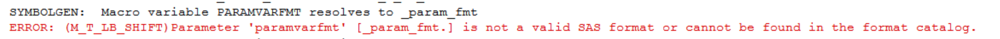

# Common Error
**Mandatory and Conditional values** 
Note: Mandatory parameters `paramvar`, `sfx` are required and should be stated. 
>ERROR: (M_T_LB_SHIFT) (m_u_parmchk) Required parameter paramvar is missing 
 
>ERROR: (M_T_LB_SHIFT) (m_u_parmchk) Required parameter sfx is missing 

**Check format** 
Note: Mandatory parameters `paramvarfmt` should be created before calling this macro. 
>ERROR: (M_T_LB_SHIFT) Parameter 'paramvarfmt' [&paramvarfmt..] is not a valid SAS format or cannot be found in the format catalog. 

**Check others** 
Note: As per template, there are 3 column before the `<<Criterion>> on-treatment CTCAE grade`, two '#" will be found in `headerlist`. 
>ERROR: (M_T_LB_SHIFT) Parameter 'headerlist'[&headerlist.] should have 3 values.  

 
>ERROR: (M_T_LB_SHIFT) The last item in format of rowfmt [&rowlablst.] should be 'Total' when rowTot eq Y.  

>WARNING: (M_T_LB_SHIFT) If need to display by page, please fill title7 column with 'j=l "#byval(byvar)"' in tlf.titles
