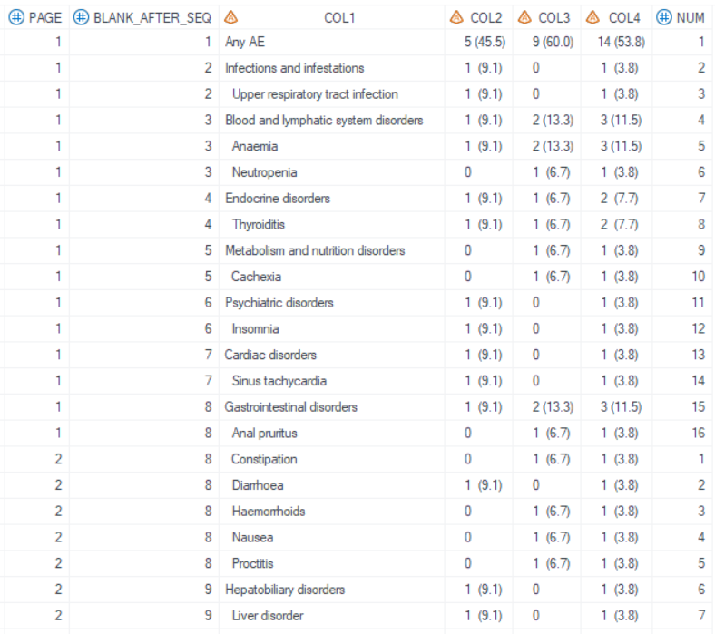
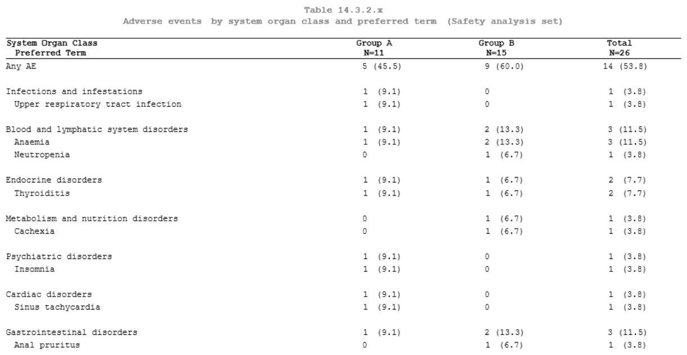
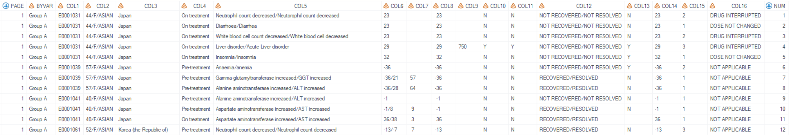
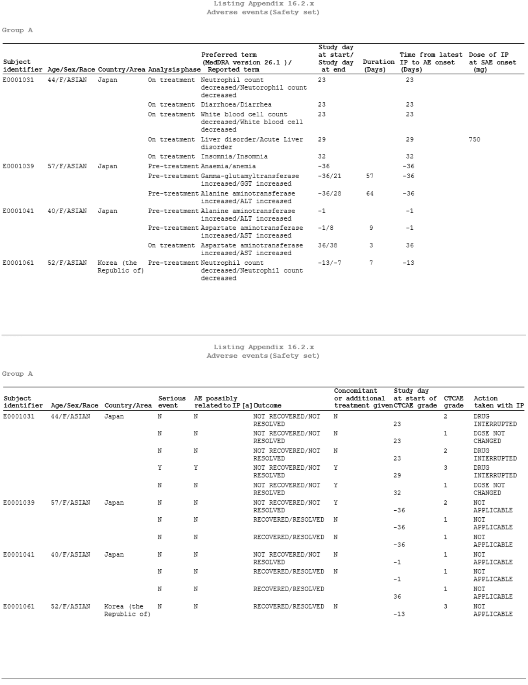

# Example

[Example 1 Report for table](#example-1-report-for-table)<br>
[Example 2 Report for listing](#example-2-report-for-listing)<br>

---

## Example 1 Report for table

**Details**

This example does the following:<br>
Used dataset which is generated by [%m_t_nested](../../display/m_t_nested/m_t_nested_descp.md) to report a table.

**Program**

```sas
 
%m_u_report(table=final2output
	,lenlist=5#2#2#2
  	,justlist=l#c#c#c
  	,justlist_header=l#c#c#c
  	,nolblist=N#N#N#N
  	,blank_after=blank_after_SEQ
	,pg=15
	);
```

**Program Description**

***Input data feature***<br>
Final2output dataset is generated by [%m_t_nested](../../display/m_t_nested/m_t_nested_descp.md). This dataset contains COL1-COL4 (which are displayed as the table content), PAGE (which is used as the page variable), and blank_after_SEQ (insert blank line after the same values based on this variable).



Parameter feature<br>

1. The `lenlist` is set to "5#2#2#2", means that the width ratio for COL1-COL4 is 5:2:2:2.
2. The `justlist` is set to "l#c#c#c", means that the COL1's content is left-aligned, COL2 to COL4 are center-aligned.
3. The `justlist_header` is set to "l#c#c#c", means that the header of COL1 is left-aligned, COL2 to COL4 are center-aligned.
4. The `nolblist` is set to "N#N#N#N", means that every column header is displayed.
5. The `blank_after` is set to "blank_after_SEQ", means that blank line is insert after the same value of blank_after_SEQ.
6. The `pg` is set to "15", new page is generated when line number>15.
 
**Output**<br>
Table is displayed.


---

## Example 2 Report for listing

**Details**

This example does the following:<br>
Used dataset which is generated by [%m_l](../../display/m_l/m_l_descp.md) to report a listing.

**Program**

```sas

%m_u_report(table=final2output
	,lenlist=
  	,justlist=l#l#l#l#l#l#l#l#l#l#l#l#l#l#l#l
  	,justlist_header=l#l#l#l#l#l#l#l#l#l#l#l#l#l#l#l
  	,nolblist=N#N#N#N#N#N#N#N#N#N#N#N#N#N#N#N
  	,idlist=Y#Y#Y
  	,idpage=N#N#N#N#N#N#N#N#N#Y
	,pg=15
	);
```

**Program Description**

***Input data feature***<br>
Final2output dataset is generated by [%m_l](../../display/m_l/m_l_descp.md). This dataset contains COL1-COL16 (which are displayed as listing content), PAGE (which is used as page variable), and BYVAR (which is used to display subtitle).



***Parameter description***<br>

The example is a listing with 16 columns.
1. The `justlist` option is set to "l#l#l#l#l#l#l#l#l#l#l#l#l#l#l#l", namely the content is left-aligned in all columns.
2. The `justlist_header` option is set to "l#l#l#l#l#l#l#l#l#l#l#l#l#l#l#l", namely the header is left-aligned in all columns.
3. The `nolblist` option is set to "N#N#N#N#N#N#N#N#N#N#N#N#N#N#N#N", namely every column header is displayed.
4. The `idlist` option is set to "Y#Y#Y", means that the last "Y" column (column 3), and all columns to its right appear at the left of every page.
5. The `idpage` option is set to "N#N#N#N#N#N#N#N#N#Y", means that the column 10 is set to "Y", therefore, this column and the columns to its right will be displayed on the next page. Given that the `idlist` option had been defined as display the first 3 columns, the final display will be as follow: The first page display column 1 to 9; The second page display column 1 to 3, 10 to 16.

**Output**<br>
Listing is displayed. Start a new page from column 10, and column 1-column 3 are ID variables and appear at the left of every page.

