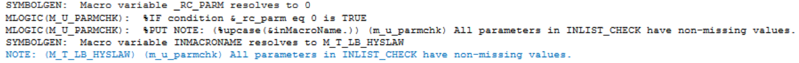

# Example

[Example Check whether macro parameters existing](#check-whether-macro-parameters-existing)<br>

---
## Check whether macro parameters existing
**Details**<br>
This example does the following:<br>
Check whether the macro parameters sfx and inds for %m_t_lb_hyslaw exist.

**Program**

```sas
* Call %m_u_align_decimal;
%let _RC_PARM=;		 

%m_u_parmchk(inMacroName=m_t_lb_hyslaw,
INLIST_CHECK=sfx inds)

```
**Program Description**

1. `_RC_PARM` resolves to 0 when all the macro variables listed in `INLIST_CHECK` exist, otherwise 1.
2. If both `INLIST_IGNORE` and `INLIST_CHECK` are empty, all macro variables with empty values are listed in the log.

**Output**

Macro variable `_RC_PARM` is created.<br>



