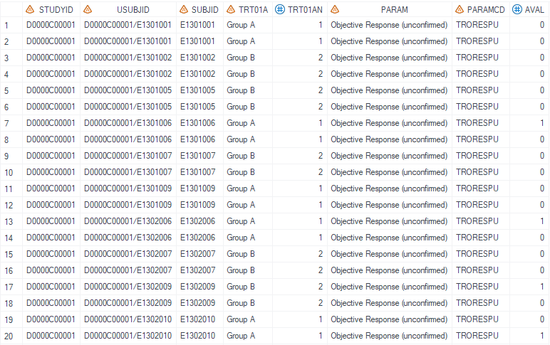

# Example

[Example 1 CI calculation with same bigN](#example-1-ci-calculation-with-same-bign)<br>
[Example 2 CI calculation with different bigN](#example-2-ci-calculation-with-different-bign)<br>

---


## Example 1 CI calculation with same bigN

**Details**<br>
This example does the following:<br>
Calculate confidence intervals where the value of bigN displayed is the same as denominator of percentage calculation.<br>

**Program**<br>

```sas
%m_u_binom_cp_sin(inds=   anl
							, adsl=
							, byvar= trt01a
							, group_number= 1
							, group_name= Drug1
							, ord= 1
							, alpha= .05
							, level= 1
							, digit= 2
							, missval= NE
							, outds= test1
							, deBug= N
							);
```
**Program Description**<br>

***Input data feature***<br>
The input dataset anl is pre-processed with only information about the investigated variable (eg: Objective Response). <br>
The dataset must include variable AVAL with value of 0 or 1. 


***Parameter description***<br>
1. Define the treatment group variable using `byvar`. Specify the treatment group number and group name using `group_number` `group_name`. <br>

2. Set `alpha = .05, level = 1, digit = 2` to calculate the confidence interval with alpha of 0.05, level of binomial proportion of 1 and round decimal place to 2.<br>

**Output**<br>

Generate a dataset named `test1` (dataset name defined by `outds`) that contains the number of observations (small n), proportion, confidence interval and big N.<br>
If unable to calculate the confidence interval , display text defined by `missval` will be displayed.<br>

 

Generate a dataset named `raw_format_test1` that containsthe number of observations (small n), proportion, confidence interval and big N in raw format.<br>
If user needs to produce output that does not follow company templates, please use this dataset and format data into desired layout.<br>


---

## Example 2 CI calculation with different bigN

**Details**<br>
This example does the following:<br>
Calculate confidence intervals where the value of bigN displayed is different from the denominator of percentage calculation.<br>

**Program**<br>

```sas
%m_u_binom_cp_sin(inds=   anl
							, adsl= adam.adsl
							, byvar= trt01a
							, group_number= 1
							, group_name= Drug1
							, ord= 1
							, alpha= .05
							, level= 1
							, digit= 2
							, missval= NE
							, outds= test1
							, deBug= N
							);
```
**Program Description**<br>

***Input data feature***<br>
The input dataset anl is pre-processed with only information about the investigated variable (eg: Objective Response). <br>
The dataset must include variable AVAL with value of 0 or 1. 


***Parameter description***<br>
1. Define the treatment group variable using `byvar`. Specify the treatment group number and group name using `group_number` `group_name`. <br>

2. Set `adsl = adam.adsl` to set the display bigN different from the denominator of the percentage which is counted based on dataset specified by `inds`.<br>

3. Set `alpha = .05, level = 1, digit = 2` to calculate the confidence interval with alpha of 0.05, level of binomial proportion of 1 and round decimal place to 2.<br>

**Output**<br>

Generate a dataset named `test1` (dataset name defined by `outds`) that contains the number of observations (small n), proportion, confidence interval and big N.<br>
Note that value for bigN is different from the result in Example 1.
If unable to calculate the confidence interval , display text defined by `missval` will be displayed.<br>

 

Generate a dataset named `raw_format_test1` that contains the number of observations (small n), proportion, confidence interval and big N in raw format.<br>
Note that value in col6 is different from the result in Example 1.<br>
If user needs to produce output that does not follow company templates, please use this dataset and format data into desired layout.<br>


---
