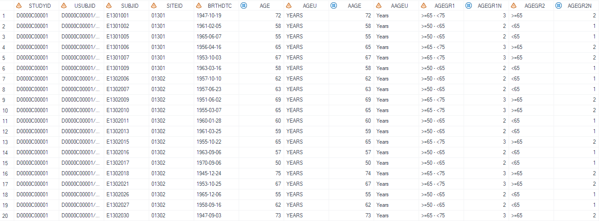

# Example

[Example 1 Calculate hazard ratio and confidence interval and p-value without by variable](#example-1-calculate-hazard-ratio-and-confidence-interval-without-by-variable)<br>
[Example 2 Calculate hazard ratio and confidence interval and p-value with by varaible and two alpha values](#example-2-calculate-hazard-ratio-and-confidence-interval-and-pvalue-with-by-variable-and-two-alpha-values)<br>
[Example 3 Calculate hazard ratio and confidence interval and p-value with by varaible and two alpha values and not transposed](#example-3-calculate-hazard-ratio-and-confidence-interval-and-pvalue-with-by-variable-and-two-alpha-values-and-not-transposed)<br>
---


## Example 1 Calculate hazard ratio and confidence interval without by variable

**Details**<br>
This example does the following:<br>
Calculate hazard ratio and 95% confidence interval for treatment pairs defined by `pair` without by variable.<br>

**Program**<br>

```sas
%m_u_cox_logrank(inds=   anl
						,out			=	final_test
						,blocklbl		=	Comparison of treatment groups
						,modelkey		=	cox
						,transfl		=	Y
						,trtgrpn        =	trt01pN		
						,var			=	aval
						,byvar			=
						,alpha			=	
						,censor			=
						,indicator		=
						,ties			=
						,pair       	=	1-3|2-3
						,strata			=	STRAT1 STRAT2                                                                        
						,pvalside		=	
						,missval        =
						,digit          =	2
						,cidecimal   	=  
						,hrlbl      	= 			
						,pvallbl      	= 
						,cilbl			=  
						,prefix         =
						,debug			= N
							);
```
**Program Description**<br>

***Input data feature***<br>
The input dataset adtte is a standard ADAM adtte dataset that contains the time variable, censor variable, treatment group variable and by variable if any. <br>


***Parameter description***<br>
1. Define the treatment group variable using `trtgrpn`. <br>

2. Set `modelkey` as `cox` generates statistics only for hazard ratio and confidence interval.

3. Set treatment group pairs that needs to analyze by defining `pair`, the treamtment group positioned on second place is used as reference group. <br>

4. Specify stratification variables with `strata`. <br>

**Output**<br>

Generate a dataset named `final_test` (dataset name defined by `out`) that contains the hazard ratio, 95% confidence interval.<br>
The column for reference group is left blank. <br>

 

---

## Example 2 Calculate hazard ratio and confidence interval and Pvalue with by variable and two alpha values

**Details**<br>
This example does the following:<br>
Calculate hazard ratio, 95% and 90% confidence interval for treatment pairs defined by `pair` and grouped by age.<br>

**Program**<br>

```sas
%m_u_cox_logrank(inds=   anl
						,out			=	final_test
						,blocklbl		=	Comparison of treatment groups
						,modelkey		=	cox|logrank
						,transfl		=	Y
						,trtgrpn        =	trt01pN		
						,var			=	aval
						,byvar			=	AGEGR1
						,alpha			=	0.05|0.1
						,censor			=
						,indicator		=
						,ties			=
						,pair       	=	1-3|2-3
						,strata			=	STRAT1 STRAT2                                                                        
						,pvalside		=	
						,missval        =
						,digit          =	2
						,cidecimal   	=  
						,hrlbl      	= 			
						,pvallbl      	= 
						,cilbl			=  
						,prefix         =
						,debug			= N
							);
```
**Program Description**<br>

***Input data feature***<br>
The input dataset adtte is a standard ADAM adtte dataset that contains the time variable, censor variable, treatment group variable and by variable if any. <br>


***Parameter description***<br>
1. Define the treatment group variable using `trtgrpn`. <br>

2. Set `modelkey` as `cox|logrank` indicating that both hazard ratio related statistics and p-value are required. 

3. Set treatment group pairs that needs to analyze by defining `pair`, the treamtment group positioned on second place is used as reference group. <br>

4. Specify stratification variables with `strata` and by variable using `byvar`. <br>

5. Set `alpha` as `0.05|0.1` calculates results for 95% and 90% confidence interval. <br>

**Output**<br>
Generate a dataset named `final_test` (dataset name defined by `out`) that contains the hazard ratio, 95% and 90% confidence interval and p-value for each age group.<br> 
The column for reference group is left blank. <br>

 

---

## Example 3 Calculate hazard ratio and confidence interval and pvalue with by variable and two alpha values and not transposed

**Details**<br>
This example does the following:<br>
Calculate hazard ratio, 95% and 90% confidence interval for treatment pairs defined by `pair` and grouped by age.<br>

**Program**<br>

```sas
%m_u_cox_logrank(inds=   anl
						,out			=	final_test
						,blocklbl		=	Comparison of treatment groups
						,modelkey		=	cox|logrank
						,transfl		=	N
						,trtgrpn        =	trt01pN		
						,var			=	aval
						,byvar			=	AGEGR1
						,alpha			=	0.05|0.1
						,censor			=
						,indicator		=
						,ties			=
						,pair       	=	1-3|2-3
						,strata			=	STRAT1 STRAT2                                                                        
						,pvalside		=	
						,missval        =
						,digit          =	2
						,cidecimal   	=  
						,hrlbl      	= 			
						,pvallbl      	= 
						,cilbl			=  
						,prefix         =
						,debug			= N
							);
```
**Program Description**<br>

***Input data feature***<br>
The input dataset adtte is a standard ADAM adtte dataset that contains the time variable, censor variable, treatment group variable and by variable if any. <br>


***Parameter description***<br>
1. Define the treatment group variable using `trtgrpn`. <br>

2. Set `modelkey` as `cox|logrank` indicating that both hazard ratio related statistics and p-value are required. <br>

3. Set `transfl` as `N` generates dataset that is not transposed. Treatment groups are positioned on rows instead of columns and statistic discriptions are shown as column headers. <br>

4. Set treatment group pairs that needs to analyze by defining `pair`, the treamtment group positioned on second place is used as reference group. <br>

5. Specify stratification variables with `strata` and by variable using `byvar`. <br>

6. Set `alpha` as `0.05|0.1` calculates results for 95% and 90% confidence interval. <br>

**Output**<br>
Generate a dataset named `final_test` (dataset name defined by `out`) that contains the hazard ratio, 95% and 90% confidence interval and p-value for each age group.<br>
Note the difference in column headers, statistic discriptions are put as column headers while in Example 2, treatment groups are put as column headers. <br> 
The column for reference group is left blank. <br>

 

---
