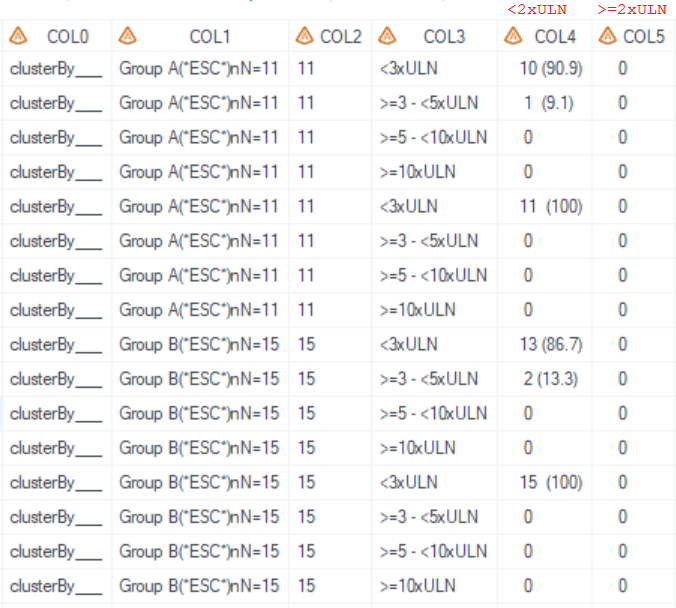
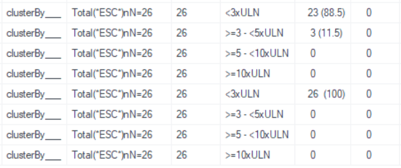

# Example

[Example Calculate for cross tables](#example-calculate-for-cross-tables)

---

## Example Calculate for cross tables 

**Details**

This example does the following:<br> 
Output a cross table dataset for assessment of Hy’s law, following the template of [AZTLB11](https://azcollaboration.sharepoint.com/sites/O-GEM2/Shared%20Documents/General/O-GEM%20Index.xlsx?d=wb25d071b4025404caf18f0d7487c4b1d&csf=1&web=1&e=0oX7Ko&nav=MTVfe0Y3NDlCRTQ3LUI0MzUtNEY4MC05ODkzLTc1MzQwODdEQTVBOX0).<br>

**Program**

```sas
proc format;
	value _t_lb_hyslaw_rowc
	1="<3xULN"
	2=">=3 - <5xULN"
	3=">=5 - <10xULN"
	4=">=10xULN"
	;
	value _t_lb_hyslaw_colc
	1="<2xULN"
	2=">=2xULN"
	;
run;
* Call m_u_cross_occn;
%m_u_cross_occn(
	inds=adlb
	,whr=SAFFL='Y' and TRT01AN in (1 2 3)  
	,clusterBy=ClUSTERBY___
	,clusterByFmt=
	,trtgrpn= TRT01AN 
	,trtTot=Y
	,UniqueIDVars=USUBJID
	,whr1=LBTESTCD_ in ("ALT")
	,rowvarc1=ROWNUMC /*char*/
	,rowtxt1=ALT 
	,rowfmt1=_t_lb_hyslaw_rowc
	,rowtot1=N
    ,whr2=LBTESTCD_ in ("AST")
	,rowvarc2=ROWNUMC /*char*/
	,rowtxt2=AST
	,rowfmt2=_t_lb_hyslaw_rowc
	,rowtot2=N
	,colvarc=COLNUMC
	,colfmt=_t_lb_hyslaw_colc
	,coltot=N
	,pop_mvar=saspopb
	,deBug=Y
);
```

**Program Description**

***Input data feature***<br> 
In this example, the variable ROWNUMC is calculated based on the ratio of AVAL to the normal range upper limit for ALT and AST. The variable COLNUMC is calculated based on the ratio of AVAL to the normal range upper limit for BILI. The CLUSTERBY&#95;&#95;&#95; is a temporary variable used in the process.<br>

> 

***Parameter description***<br>
1. Need total<br>
There's no total group in input dataset `inds`, so set `trtTot='Y'` and utilize `pop_mvar=saspopb` to display the total group. Global macro `saspopb` which includes total group is created in [%m_u_popn](../../utility/m_u_popn/m_u_popn_descp.md) which should be executed prior to invoking this macro.<br> 
 
2. The `clusterBy` parameter is required; a temporary variable CLUSTERBY&#95;&#95;&#95; is created and assigned `clusterBy=clusterBy`&#95;&#95;&#95; in this example.

3. There are two blocks of the row, first block is `rowtxt1=ALT` and second block is `rowtxt2=AST`. No matter how many row blocks there are, column variable is only one parameter `colvarc=COLNUMC`. 

4. "Total" is not needed in format "_t_lb_hyslaw_rowc" and "_t_lb_hyslaw_colc", thus set `rowtot1=N` and `rowtot2=N` and `coltot=N`.

**Output**

***Output Dataset***<br>
Dataset named "work.final_m_u_cross_occn.sas7bdat" is output for QC and includes variables from COL1 to COL5, as well as COL0 which stores the value for `clusterBy`. COL1 represents the column for treatment groups, COL2 is for the number of observations (Nobs), COL3 contains the categories for ALT and AST, and COL4 and COL5 represent the total bilirubin categories. <br>

><br>
><br>