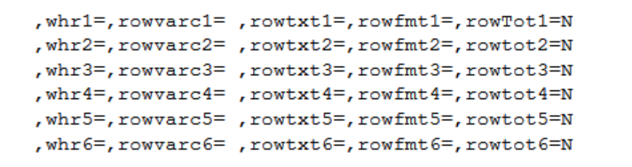

# Syntax

%m_u_cross_occn(<br>
[***inds***=&lt;input-data-set&gt;](#inds), <br>
[***whr***=&lt;filtered-condition&gt;](#whr),<br>
[***pop_mvar***=&lt;macro-prefix-label-for-treatment(s)&gt;](#popmvar),<br>
[***clusterBy***=&lt;cluster-variable&gt;](#clusterby),<br>
[***clusterByN***=&lt;numeric-cluster-variable&gt;](#clusterbyn),<br>
[***clusterByFmt***=&lt;format-of-cluster-variable&gt;](#clusterbyfmt),<br>
[***trtgrpn***=&lt;numeric-treatment-variable&gt;](#trtgrpn),<br>
[***trtTot***=&lt;Y|N (display total treatment column or not)&gt;](#trttot),<br>
[***UniqueIDVars***=&lt;unique-identifier-variable&gt;](#uniqueidvars),<br>
[***whrXX***=&lt;filtered-condition-for-XX-block&gt;](#whrxx),<br>
[***rowvarcXX***=&lt;row-variable-for-XX-block&gt;](#rowvarcxx),<br>
[***rowtxtXX***=&lt;leading-texts-for-XX-block&gt;](#rowtxtxx),<br>
[***rowfmtXX***=&lt;format-for-XX-block&gt;](#rowfmtxx),<br>
[***rowtotXX***=&lt;Y|N (total row needed or not for XX block)&gt;](#rowtotxx),<br>
[***colvarc***=&lt;column-variable&gt;](#colvarc),<br>
[***colfmt***=&lt;format-of-column-variable&gt;](#colfmt),<br>
[***colTot***=&lt;Y|N (total column needed or not)&gt;](#coltot),<br>
[***deBug***=&lt;Y|N&gt;](#debug)<br>
)
;

---
# Parameter

## Control input

#### inds
specifies the input data set.

Item|Contents
:---|:---
Default|
Value| A one or two level dataset name.
Requirement|Mandatory
Restriction|
Interaction|
Eg.|`adlb` <br>`adam.adlb`

#### whr
specifies filtered condition used in where statement.

Item|Contents
:---|:---
Default|
Value|
Requirement|Optional
Restriction|
Interaction|Filter input dataset for `inds`.
Eg.|`TRT01AN in (1 2 3) `


## Control analysis

#### pop_mvar
specifies the macro variable used to class different groups which will be displayed as headers or contents.<br>

Item|Contents
:---|:---
Default|
Value|
Requirement|Mandatory
Restriction|The value of this macro variable should be set according to the value of `gmacro` in the corresponding [%m_u_popn](../../utility/m_u_popn/m_u_popn_descp.md).
Interaction|
Eg.|`saspopb`

#### clusterBy
specifies cluster variable.

Item|Contents
:---|:---
Default|
Value|
Requirement|Mandatory
Restriction|
Interaction|
Eg.|`PARAM`

#### clusterByN
specifies numeric `clusterBy` variable which will be used to sort.

Item|Contents
:---|:---
Default|
Value|
Requirement|Optional
Restriction|
Interaction|Numeric `clusterBy`.
Eg.|`PARAMN`

#### clusterByFmt
specifies format and order of cluster variable, to display in outputs. If both `clusterByN` and `clusterByFmt` have value, then the order is the same with clusterByFmt. 

Item|Contents
:---|:---
Default|
Value|
Requirement|Optional
Restriction|
Interaction|Format and order of `clusterBy`.
Eg.|`$fmt`

#### trtgrpn
specifies the treatment variable(N).

Item|Contents
:---|:---
Default|
Value|
Requirement|Mandatory
Restriction| Type of `trtgrpn` is numeric.
Interaction|  
Eg.|`TRT01AN`

#### trtTot
specifies whether to display total group or not. If leave it as null or not to state it, the default values will be used.<br>

> **Note:**<br>
>Recommend not to change the structure of `inds` dataset to include total group (more details for total group calculation refer to [%m_u_popn](../../utility/m_u_popn/m_u_popn_descp.md)).<br>
> If in `inds`, `trtgrpn` doesn't include total group but need to display, then `trtTot=Y` (The last format value of `pop_mvar` defined by %m_u_popn should be the total group).<br>
> If `trtgrpn` already includes total group in `inds`, then if the last format value of `pop_mvar` is total group, `trtTot=N`; else if the last format value of `pop_mvar` is not the total group, `trtTot=Y`.<br>

Item|Contents
:---|:---
Default|`N`
Value| `Y, N` (not case sensitive)
Requirement|Optional
Restriction|
Interaction| If "Y", the last group defined in `pop_mvar` will be treated as total group and kept. If "N", the last group defined in `pop_mvar` will be treated as total group and deleted. Thus, if "Y", the last format value should be the total group in `pop_mvar`.
Eg.|`N`

#### UniqueIDVars
specifies unique variables to count number of population for different groups. If leave it as null or not to state it, the default values will be used.

Item|Contents
:---|:---
Default|`USUBJID`
Value|
Requirement|Optional
Restriction|
Interaction|
Eg.|`USUBJID`


**Block parameters for row: Start**<br>
>Note: As this macro allows different filter conditions for a dataset to be summarized with different display formats for the row section. These Parameters are as follows, with XX representing the variable's display sequence in the final table, where XX=1, 2, ..., 6. <br>
<br>

#### whrXX
specifies filter condition for XX block. Note: XX denotes 1 to 6.

Item|Contents
:---|:---
Default|
Value|
Requirement|Optional
Restriction|
Interaction|
Eg.|`LBTESTCD_ in ("ALT")`

#### rowvarcXX
specifies the variable storing the row categories. Note: XX denotes 1 to 6.

Item|Contents
:---|:---
Default|
Value|
Requirement|Mandatory
Restriction|
Interaction|
Eg.|`rowvarc`

#### rowtxtXX
specifies leading texts for XX block, if blank then will display the variable name `rowvarcXX`. Note: XX denotes 1 to 6.

Item|Contents
:---|:---
Default|
Value|
Requirement|Optional
Restriction|
Interaction|
Eg.|`ALT`

#### rowfmtXX
specifies format of row variable aiming to add the order for the display sequence and also the contents, should be created before calling this macro. If null, then will use the values of `rowvarcXX`. Note: XX denotes 1 to 6.<br>

```
proc format;
	value _t_lb_hyslaw_rowc
	1="<3xULN"
	2=">=3 - <5xULN"
	3=">=5 - <10xULN"
	4=">=10xULN"
	;
run;
```

Item|Contents
:---|:---
Default|
Value|
Requirement|Optional
Restriction|`rowfmt` should start with 1 and increase consecutively.
Interaction|`rowfmtXX` should include 'Total' as the last value when `rowTotXX=Y`.
Eg.|`_t_lb_hyslaw_rowc`


#### rowtotXX
specifies whether total row is needed for XX block. Note: XX denotes 1 to 6. If leave it as null or not to state it, the default values will be used.

Item|Contents
:---|:---
Default|`N `
Value|`Y, N `
Requirement|Optional
Restriction|
Interaction|If `rowTotXX=Y` then the `rowfmtXX` should be specified include 'Total' as the last value.
Eg.|`N`

**Block parameters for row: End**<br>

#### colvarc
specifies column variable.

Item|Contents
:---|:---
Default|
Value|
Requirement|Mandatory
Restriction|
Interaction|
Eg.|`colnumc`

#### colfmt
specifies format of column variable aiming to add the order for the display sequence and also the contents, should be created before calling this macro.  

```sas
proc format;
	value _t_lb_hyslaw_colc
	1="<2xULN"
	2=">=2xULN"
	;
run;
```
Item|Contents
:---|:---
Default|
Value|
Requirement|Mandatory
Restriction|`colfmt` should start with 1 and increase consecutively.
Interaction|`colfmt` should include 'Total' as the last value when `colTot=Y`.
Eg.|`_t_lb_hyslaw_colc`

#### colTot

specifies whether total column is needed or not. If leave it as null or not to state it, the default values will be used.

Item|Contents
:---|:---
Default|`N`
Value|`Y, N`
Requirement|Optional
Restriction|
Interaction|If `colTot=Y` then the `colfmt` should be specified and include 'Total' as the last value.
Eg.|`N`

## Control debug

#### deBug
specifies whether need to debug or not, if not "Y" then intermediate datasets will be deleted. If leave it as null or not to state it, the default values will be used.<br>

Item|Contents
:---|:---
Default|`N`
Value|`Y, N`(not case sensitive)
Requirement|Optional
Restriction|
Interaction|
Eg.|`N`