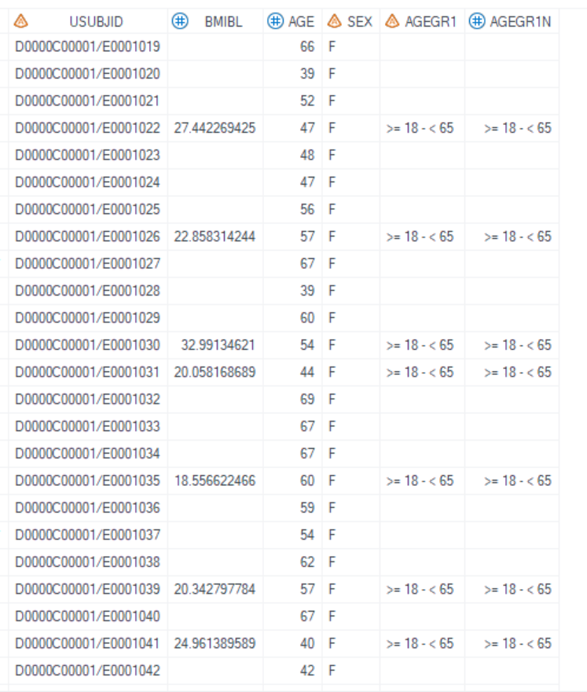
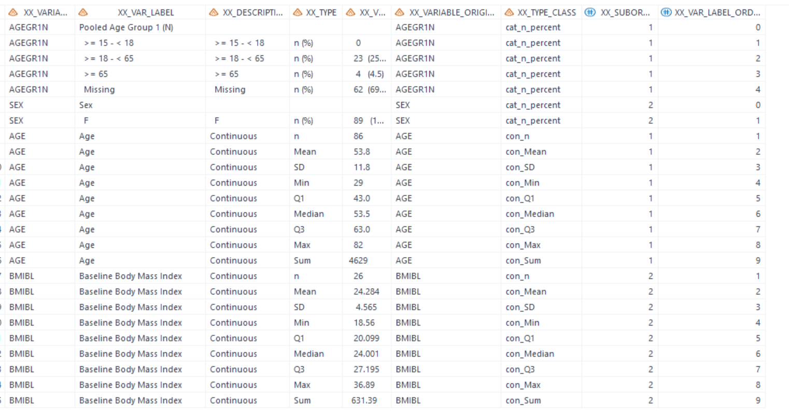

# Example


[Example Calculate descriptive statistics of multiple variables under a single group](#example-calculate-descriptive-statistics-of-multiple-variables-under-a-single-group)

---

## Example Calculate descriptive statistics of multiple variables under a single group

**Details**

This example does the following:<br> 
Calculate descriptive statistics of AGEGR1N, AGE, and SEX under a single group.<br>

**Program**

```sas
proc format; 
	value age1_cat (notsorted)
	1=">= 15 - < 18"
	2=">= 18 - < 65"
	3=">= 65"
	4="Missing"
	;
quit;

data adsl;
set adam.adsl;
format  AGEGR1N age1_cat.;
run;

%m_u_desc_stat_sin_mix(inds= adsl
					, datout=temp_Cohort_demo_sub1
					, varlist_cat=AGEGR1N SEX 
					, varlist_cont=AGE BMIBL
					, exclude_stat= cat_n con_mis
					, add_lead_row=Y
					, decimal_list=#2
					);
```

**Program Description**

***Input data feature***<br>
Input dataset adsl contains AGE, AGEGR1N, SEX and BMIBL variables. AGE, AGEGR1N and BMIBL are numeric variables and SEX is a character variable. 


***Parameter description***<br>
1. `varlist_cat=AGEGR1N SEX` means to summary AGEGR1N and SEX variables. Although AGEGR1N is a numeric variable but will be treated as a categorical variable, the format "age1_cat" is assigned to AGEGR1N since pre-define format is required for numeric variable. `varlist_cont=AGE BMIBL` indicates the continuous variable AGE and BMIBL will be summarized.<br>

2. `exclude_stat= cat_n con_sum con_mis` means that "n" for categorical variables and "Sum","Missing" for continuous variables will be excluded and display "n (%)", "n", "Mean", "SD", "Min", "Q1", "Median", "Q3" and "Max" statistics in the output.<br>

3. `add_lead_row=Y` means that a leading row will be generated before the summary of "cat_n_percent" for each variables of `varlist_cat=AGEGR1N SEX`.<br>
   
4. For BMIBL, there's no rounding in input dataset and we need to specify the number of decimal places. `decimal_list=#2` means decimal places for AGE is determined by values in `inds` and for BMIBL, the decimal places is set to '2'.<br>
**Output**

***Output Dataset***<br>
The generated dataset named "work.temp_Cohort_demo_sub1.sas7bdat" includes all statistics "con_n" (count), "con_Mean" (mean), "con_SD" (standard deviation), "con_Min" (minimum), "con_Q1" (first quartile), "con_Median" (median), "con_Q3" (third quartile), and "con_Max" (maximum) for continuous variable AGE and BMIBL. For BMIBL, the number of decimals for "con_Min" (minimum) and "con_Max" (maximum) is 2. Additionally, it includes "cat_n_percent" (category percentage) for categorical variables AGEGR1N and SEX. If the dataset contains missing values, a separate row labeled "Missing" is created to represent these instances. <br>
XX_VARIABLE and XX_VAR_LABEL represent the names and labels of the variables respectively. XX_TYPE and XX_VAR represent the final statistics and results, while the remaining variables serve as intermediate ones in the process.<br>

<br>
 
 
 