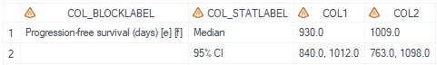
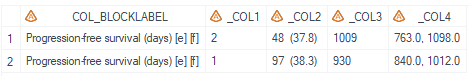
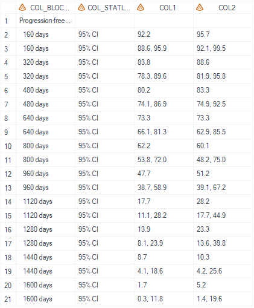

# Example

[Example 1 Calculate progression free survival median and rate at different time stamps](#example-1-calculate-progression-free-survival-median-and-rate-at-different-time-stamps)<br>

---


## Example 1 Calculate progression free survival median and rate at different time stamps

**Details**<br>
This example does the following:<br>
Calculate progression free survival median statistics and progression free survival rate at different time stamps.<br>

**Program**<br>

```sas
%m_u_km(inds=   adtte
							, whr= mittfl='Y' and paramcd='TRPROGM' and parqual='INDEPENDENT ASSESSOR'
							, alpha= 0.05
							, method= KM
							, conftype= LOG
							, trtgrpn= trt01pn
							, trtgrpnord= 
							, pair= 1-2
							, trtgrpn2=
							, var_time= AVAL
							, var_status= CNSR
							, cen_num= 0
							, evnt_num=
							, step_list= 160 to 1686 by 160
							, xdivisor=
							, plot= 0
							, outdat_median= final_median
							, median_label= Progression-free survival (days) [e] [f]
							, outdat_timelist= final_timelist
							, timelist_label= Progression-free survival rate [e]
							, debug_u= N
							);
```
**Program Description**<br>

***Input data feature***<br>
The input dataset adtte is a standard ADAM adtte dataset that contains the time variable, censor variable and treatment group variable. <br>


***Parameter description***<br>
1. `method` and `conftype` should be determined based on SAP, please confirm method with statistician. <br>

2. Filter the dataset using either the `whr` variable, or during data-preprocess of the input dataset and make sure only one `PARAMCD` is selected.<br>

**Output**<br>

Generates a dataset named `final_median` (dataset name defined by `outdat_median`) that contains the median and 95% confidence interval for progression-free survival.<br>
Display text in col_blocklable column is defined by `median_label`.

 

Generates a dataset named `final_median_t` that contains the transposed information same as `final_median` along with the n percent statistics. <br>
Display text in col_blocklable column is defined by `median_label`.



Generates a dataset named `final_timelist` that contains the progression-free survival rate on different time stamps.




1-2 3
2-1|3-1

---