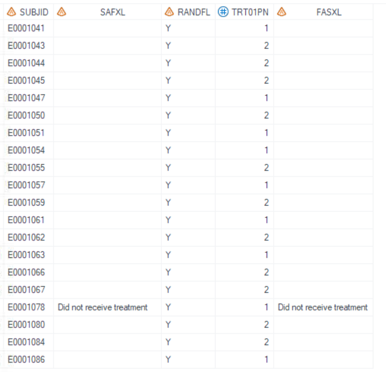
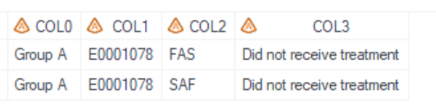
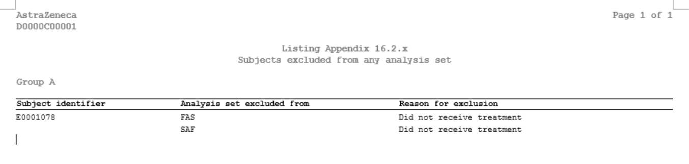

# Example

[Example Display subjects excluded from any analysis set listing](#example-display-subjects-excluded-from-any-analysis-set-listing)<br>

---

## Example Display subjects excluded from any analysis set listing

**Details**<br>

This example does the following:<br>
Output the subjects excluded from any analysis set listing, following the template of [AZLSP03](https://azcollaboration.sharepoint.com/sites/O-GEM2/Shared%20Documents/General/O-GEM%20Index.xlsx?d=wb25d071b4025404caf18f0d7487c4b1d&csf=1&web=1&e=qqQgUc&nav=MTVfezcyQTE2Rjc4LTcyODItNEYyOC1BQjYzLUNBMUFBM0I1MUY1Q30).

**Program**

```sas
** Proc format used for pagebyN **;
proc format;
 	value _tlf_setup_trtfmtl 
	1 = "Group A"
	2 = "Group B"
	;
run;
** Call display macros **;
%m_l_ds_pop(
	inds=adam.adsl
   ,pop_flag= RANDFL='Y'
   ,whr= TRT01PN ^=.
   ,subjid=SUBJID
   ,anaset=FAS#SAF
   ,xlvar=FASXL#SAFXL
   ,pageByN= TRT01PN
   ,pageByFmt=_tlf_setup_trtfmtl
   ,idcoln=1
   ,lenlist=15#20#25
   ,pg=15
   ,sfx=a
   ,deBug=N
); 
```
**Program Description**<br>

***Input data feature***<br>
In this example, adam.adsl dataset is used as input dataset. Variables of RANDFL, SUBJID, TRT01PN, FASXL, and SAFXL, which are listed in `pop_flag`, `pageByN`, `subjid`, and `xlvar`, must exist in input dataset. 
<br>

***Parameter description***<br>
1. Set `pop_flag= RANDFL='Y'` to fitter the randomization population, and `whr=not missing(TRT01PN) ` specifies that this listing excludes subjects who are not randomised and not assigned. <br>

2. Set `pageByN=TRT01PN` specifies planned treatment group is used as by-page variable, and `pageByFmt=_tlf_setup_trtfmtl` specifies that the subtitle displayed based on this format.<br> 

3. Set `anaset=FAS#SAF` and `xlvar=FASXL#SAFXL` specify analysis set excluded from and  corresponding Reasons.<br>

4. The `idcoln=1` parameter specifies the first column using the ID and ORDER option in report and compress the row to blank if the value is the same as the previous row.<br>

5. The `pg= 15` parameter specifies when not includes titles and footnotes, maximumn row is 15 per page.<br>

6. The `sfx= a` parameter indicates that the output filename should be a combination of the program name and the letter 'a', resulting in a filename like "l_ds_pop_a" for this example. <br>

**Output**<br>

***Output Dataset***<br>
Generate output datasets "work.final2qc.sas7bdat" and "tlf.l_ds_pop_a.sas7bdat" (These two datasets are exactly the same dataset and used for QC), and "work.final2output.sas7bdat" (used in proc report process).<br>
The dataset for QC includes variables from COL1 to COL3, which correspond to those specified in `subjid`, `anaset`, and `xlvar`, and COL0, which stores the value for `pageByN` and is displayed in the subtitle in rtf report. 

<br>

***Output rtf***<br>
Corresponding "l_ds_pop_a.rtf" is generated.<br>  


<br>

 