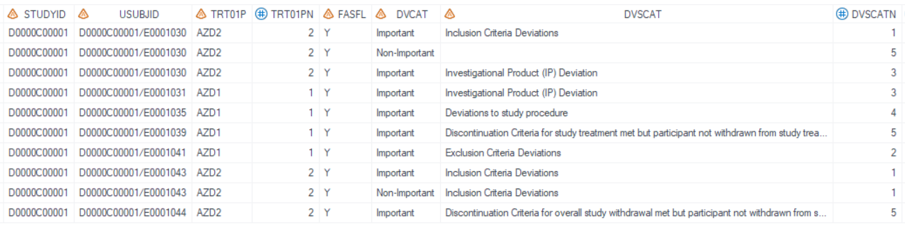
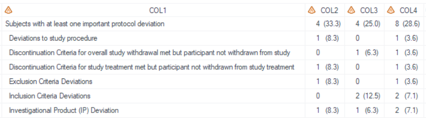
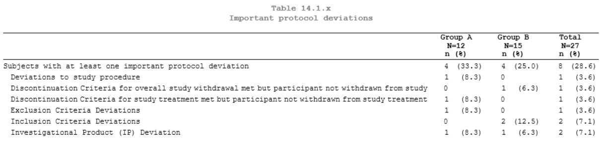
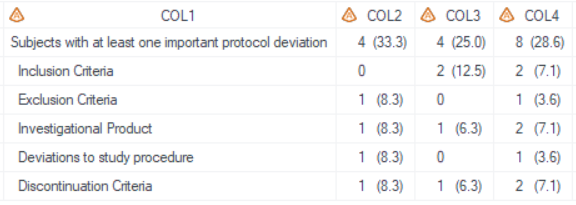
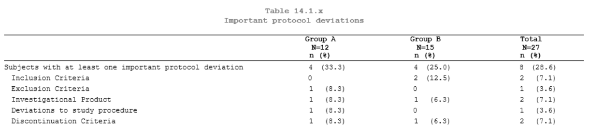

# Example

[Example 1 Important protocol deviations](#example-1-important-protocol-deviations)<br>
[Example 2 Important protocol deviations sorted by specific order](#example-2-important-protocol-deviations-sorted-by-specific-order)<br>

---

## Example 1 Important protocol deviations

**Details**

This example does the following:<br>
Create table for protocol deviation category, following the template of [AZTSP06](https://azcollaboration.sharepoint.com/sites/O-GEM2/Shared%20Documents/General/O-GEM%20Index.xlsx?d=wb25d071b4025404caf18f0d7487c4b1d&csf=1&web=1&e=aDenCj&nav=MTVfezkzRDMxQkM0LTFBREQtNDUxNC04RUE1LTRGQkM4NzQxRUI4MH0).<br>

**Program**

```sas
* Call %m_t_dv;
%m_t_dv(inds =  adprodev
	, pop_flag = %str(FASFL="Y")
    , whr = %str(DVCAT="Important")
	, trtgrpn = TRT01PN
	, pop_mvar = faspopb
	, totrow_var = STUDYID
	, totrow_label = %str(label STUDYID="Subjects with at least one important protocol deviation")
	, varlist = DVSCAT
	, labellist = 
	, lenlist = 15#2#2#2
	, justlist = l#c#c#c
	, justlist_header = l#c#c#c
	, nolblist = Y#N#N#N
	, orderlist = 
	, defcol =
	, blank_after =
	, pg = 18
    , debug = Y
	, sfx = fas
);
```

**Program Description**

***Input data feature***<br> 
Input dataset contains variables of STUDYID, USUBJID, TRT01PN, FASFL, DVCAT, and DVSCAT.<br> 


***Parameter description***<br>
1. Set `totrow_var = STUDYID` to output the leading row. The variable should have the same value for all records, STUDYID meets this criteria. Other variable which meets this criteria is also acceptable.<br>

2. For the `totrow_label`, it use the LABEL statement syntax *label studyid="Subjects with at least one important protocol deviation"*. The label value will be displayed in the leading row.<br>

3. `varlist=DVSCAT` specifies this category variable will be summarized.<br> 

4. By setting `sfx = fas` with the program name being "t_dv" in this example, the resulting output files will be named as "t_dv_fas.sas7bdat" and "t_dv_fas.rtf".<br>

**Output**
***Output Dataset***<br>
The dataset named "tlf.t_dv_fas" is output for QC and includes variables ranging from COL1 to COL4. The first row in COL1 represents the summary event, while the subsequent rows are derived from the DVSCAT variable. Results of the treatment groups start from COL2.<br>


***Output rtf***<br>
The "t_dv_fas.rtf" file is generated with DVSCAT sorted in alphabetical order.<br>


---


## Example 2 Important protocol deviations sorted by specific order

**Details**

This example does the following:<br>
Create table for protocol deviation category in specific order, following the template of [AZTSP06](https://azcollaboration.sharepoint.com/sites/O-GEM2/Shared%20Documents/General/O-GEM%20Index.xlsx?d=wb25d071b4025404caf18f0d7487c4b1d&csf=1&web=1&e=aDenCj&nav=MTVfezkzRDMxQkM0LTFBREQtNDUxNC04RUE1LTRGQkM4NzQxRUI4MH0).<br>

**Program**

```sas
proc format;
  value scatn
    1 = "Inclusion Criteria"
    2 = "Exclusion Criteria"
    3 = "Investigational Product"
    4 = "Deviations to study procedure"
    5 = "Discontinuation Criteria"
  ;
quit;

* Call %m_t_dv;
%m_t_dv(inds =  adprodev
	, pop_flag = %str(FASFL="Y")
    , whr = %str(DVCAT="Important")
	, trtgrpn = TRT01PN
	, pop_mvar = faspopb
	, totrow_var = STUDYID
	, totrow_label = %str(label STUDYID="Subjects with at least one important protocol deviation")
	, varlist = DVSCATN
	, labellist = %str(format DVSCATN scatn.)
	, lenlist = 5#2#2#2   
	, justlist = l#c#c#c
	, justlist_header = l#c#c#c
	, nolblist = Y#N#N#N
	, orderlist = 
	, defcol =
	, blank_after =
	, pg = 18
    , debug = Y
	, sfx = fas
);
```

**Program Description**

***Input data feature***<br> 
Input dataset contains variables of STUDYID, USUBJID, TRT01PN, FASFL, DVCAT, DVSCAT, and DVSCATN.<br> 


***Parameter description***<br>
1. Set `totrow_var = STUDYID` to output the leading row. The variable should have the same value for all records, STUDYID meets this criteria. Other variable which meets this criteria is also acceptable.<br>

2. For the `totrow_label`, it use the LABEL statement syntax *label studyid="Subjects with at least one important protocol deviation"*. The label value will be displayed in the leading row.<br>

3. The numeric variable DVSCATN has been pre-defined in input dataset used for ordering.<br>

4. The format SCATN is defined for variable DVSCATN, the formatted values are the same as displayed ones.<br>

5. By setting sfx = fas with the program name being "t_dv" in this example, the resulting output files will be named as "t_dv_fas.sas7bdat" and "t_dv_fas.rtf".<br>

**Output**
***Output Dataset***<br>
Similar to Example 1, the dataset named "tlf.t_dv_fas.sas7bdat" is output for QC and includes variables ranging from COL1 to COL4. The order of COL1, except for the first row, is based on the values of DVSCATN variable.<br>


***Output rtf***<br>
The "t_dv_fas.rtf" file has been generated, with the COL1 sorted according to a predefined order, as specified by DVSCATN.<br>


---