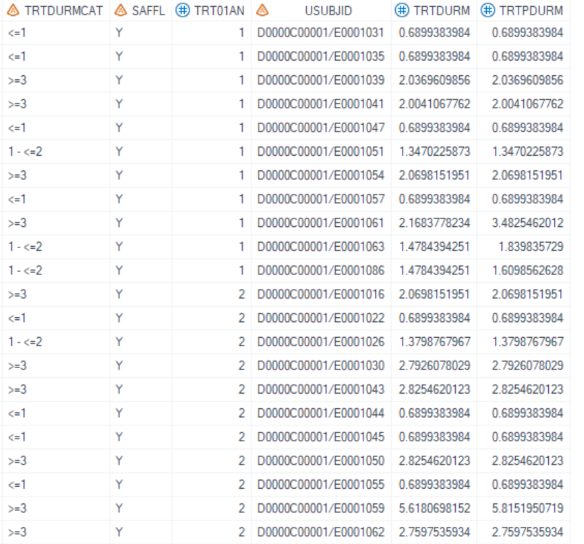
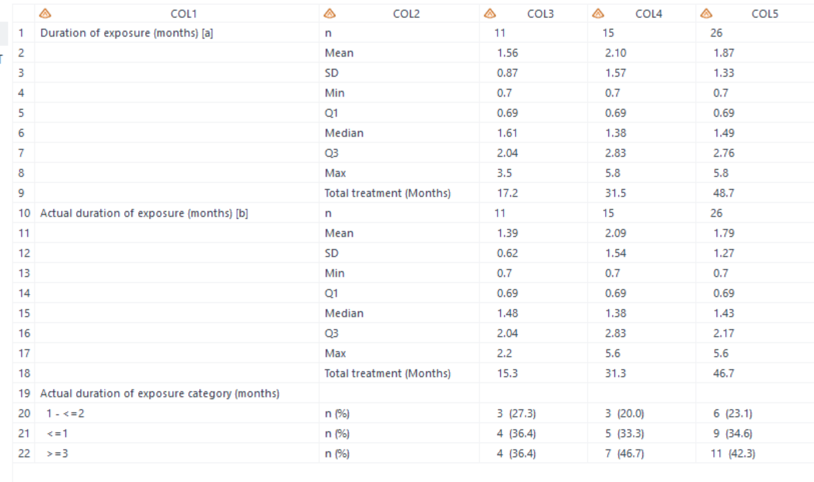
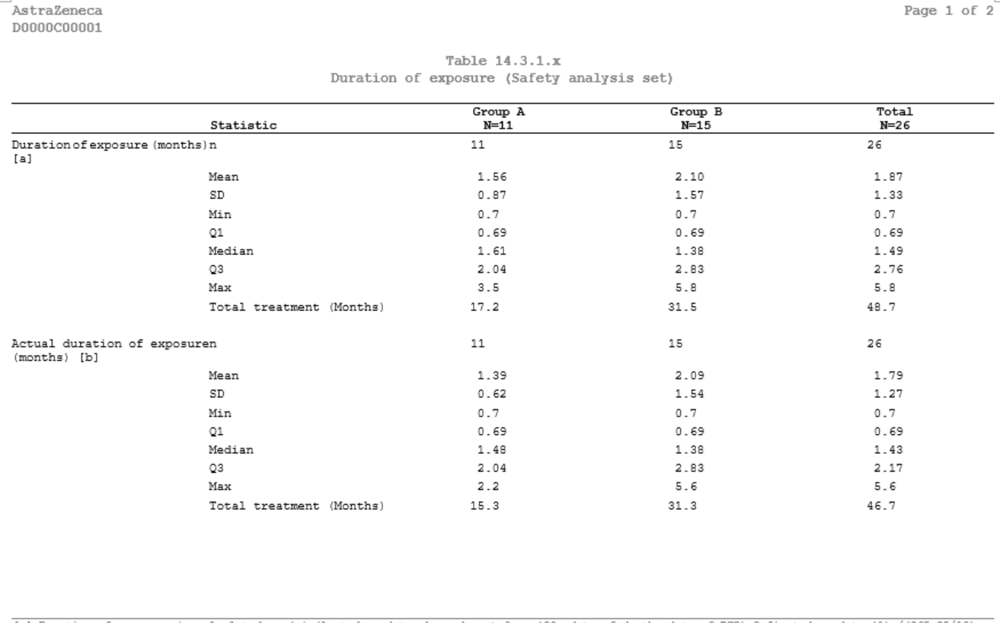
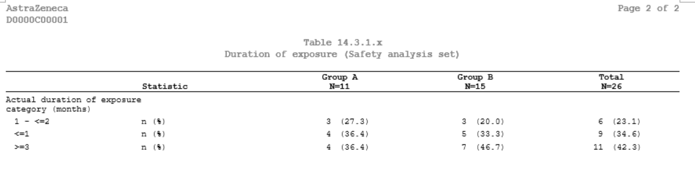
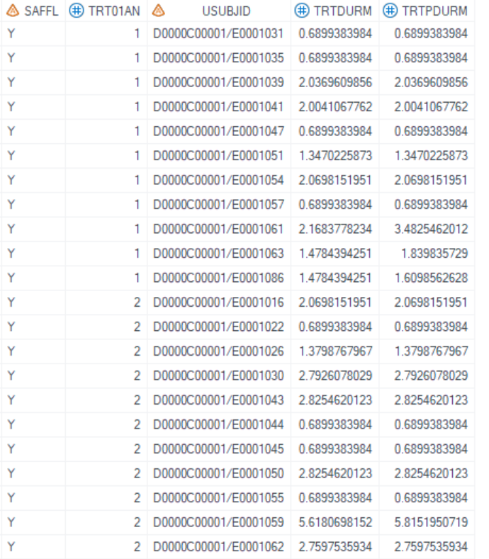
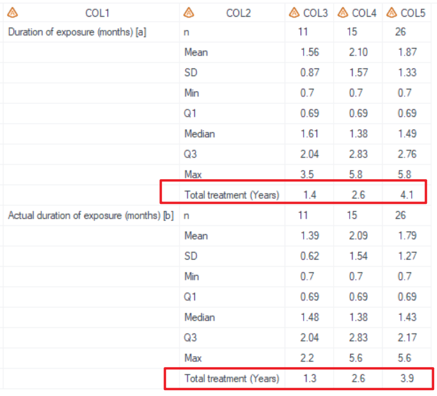
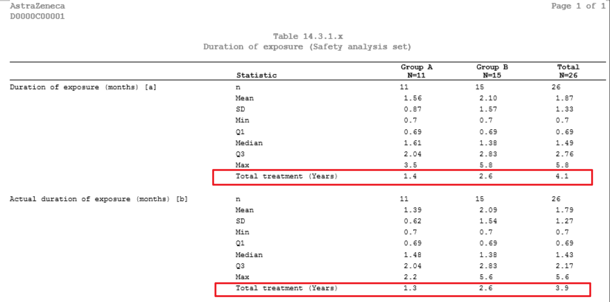

# Example

[Example 1 Summarize categorical and continuous variables in duration of exposure table](#example-1-summarize-categorical-and-continuous-variables-in-duration-of-exposure-table)<br>
[Example 2 Convert unit for total treatment summary](#example-2-convert-unit-for-total-treatment-summary)
 
---

## Example 1 Summarize categorical and continuous variables in duration of exposure table

**Details**<br>

This example does the following: <br>
Create the exposure table, following the template [AZTONCEX01](https://azcollaboration.sharepoint.com/sites/O-GEM2/Shared%20Documents/General/O-GEM%20Index.xlsx?d=wb25d071b4025404caf18f0d7487c4b1d&csf=1&web=1&e=eHlTZ6&nav=MTVfezczNzJCODY2LTUzNjQtNDc5Qy1BRjJDLTExNkY3ODI5RTc5RX0).<br>

**Program**<br>

```sas
 
proc format ;
value $cat (notsorted)
'<=1' = '<=1'
'1 - <=2' = '1 - <=2'
'>=3' = '>=3'
;
run;

%**  Call display macros **;
 
%m_t_ex_dur(inds=ADEXSUM,
			pop_flag = SAFFL = 'Y' ,
			pop_mvar = saspopb ,
			total_YN = Y,
			varlist_cat=TRTDURMCAT,
			varlist_cont=TRTPDURM TRTDURM,
			output_order=TRTPDURM TRTDURM TRTDURMCAT,
			trtgrpN=TRT01AN,
			denominator=adam.adsl,
			formatlist = format TRTDURMCAT $cat.,
			labellist = label TRTPDURM='Duration of exposure (months) [a]'  
							TRTDURM='Actual duration of exposure (months) [b]' 
							TRTDURMCAT='Actual duration of exposure category (months)',
			exclude_stat = cat_n con_mis ,
			total_rule =/1#/1 ,
			total_rowtext = Total treatment (Months)#Total treatment (Months),
			total_decimal_max =1#1 ,
						
			lenlist = 20#19#20#20#20,    
			justlist=l#l#c#c#c,
			justlist_header=l#l#c#c#c,
			nolblist=Y#N#N#N#N,
			orderlist=N#N#N#N#N,
			defcol=,
			blank_after =output_order,
			pg=18,
			sfx=saf
			,debug=Y);
```

**Program Description**<br>

***Input data feature***<br>
The input dataset ADEXSUM includes the variables USUBJID, SAFFL, TRT01AN, and analysis variables of TRTPDURM, TRTDURM, and TRTDURMCAT. Here, TRTDURMCAT represents the derived variable for the category of actual exposure duration. TRTPDURM specifies the planned duration of exposure, while TRTDURM specifies the actual duration of exposure.



***Parameter description***<br>
1. Create format for categorical variable<br>
  Set `formatlist = format TRTDURMCAT $cat.`, will display categorical values according to the order of proc format sequence, not the internal value or formmated values. <br>

2. Need total<br>
There's no total group in input dataset `inds`, so set `total_YN='Y'` and utilize `pop_mvar=saspopb` to display the total group. Global macro `saspopb` which includes total group is created in [%m_u_popn](../../utility/m_u_popn/m_u_popn_descp.md) which should be executed prior to invoking this macro.<br> 

3. Set `varlist_cat=TRTDURMCAT` and `varlist_cont=TRTPDURM TRTDURM` to summary exposure category, plan and actual duration of exposure. Use `output_order=TRTPDURM TRTDURM TRTDURMCAT` to specify the order of report section. When orignial unit is months, set `total_rule =/1#/1` to convert unit to display "Total treatment (Months)".<br>

4. By setting `sfx = saf` with the program name being "t_ex_dur" in this example, the resulting output files will be named as "t_ex_dur_saf.sas7bdat" and "t_ex_dur_saf.rtf".<br>

**Output**<br>

***Output Dataset***<br>
Generate output datasets "work.final2qc" and "tlf.t_ex_dur_saf" (These two datasets are exactly the same dataset and used for QC), and work.final2output (used in proc report process).<br>
Dataset output for QC includes columns from COL1 to COL5. COL1 is `labellist`. COL2 contains the names of statistics, and the results for the treatment groups start from COL3.<br>


***Output rtf***<br>
"t_ex_dur_saf.rtf" is generated. <br>



---

## Example 2 Convert unit for total treatment summary

**Details**<br>

This example does the following: <br>
Create the exposure table, following the template [AZTONCEX01](https://azcollaboration.sharepoint.com/sites/O-GEM2/Shared%20Documents/General/O-GEM%20Index.xlsx?d=wb25d071b4025404caf18f0d7487c4b1d&csf=1&web=1&e=eHlTZ6&nav=MTVfezczNzJCODY2LTUzNjQtNDc5Qy1BRjJDLTExNkY3ODI5RTc5RX0), and convert "Total treatment (Months)" to "Total treatment (Years)" .<br>

**Program**<br>

```sas
%m_t_ex_dur(inds=ADEXSUM,
			pop_flag = SAFFL = 'Y' ,
			pop_mvar = saspopb ,
			total_YN = Y,
			varlist_cont=TRTPDURM TRTDURM,
			output_order=TRTPDURM TRTDURM,
			trtgrpN=TRT01AN,
			denominator=adam.adsl,
			labellist = label TRTPDURM='Duration of exposure (months) [a]'  
							  TRTDURM='Actual duration of exposure (months) [b]',
			exclude_stat =con_mis ,
			total_rule =/12#/12 ,
			total_rowtext = Total treatment (Years)#Total treatment (Years),
			total_decimal_max =1#1 ,
						
			lenlist = 30#19#10#10#10,    
			justlist=l#l#c#c#c,
			justlist_header=l#l#c#c#c,
			nolblist=Y#N#N#N#N,
			orderlist=N#N#N#N#N,
			defcol=,
			blank_after =output_order,
			pg=20,
			sfx=saf
			,debug=N);
```

**Program Description**<br>
***Input data feature***<br>
The input dataset is identical to the dataset used in Example 1, but analysis variables only inlcude TRTPDURM and TRTDURM.<br>


***Parameter description***<br>
Similar to Example 1, but specify rule as `total_rule =/12#/12` to convert "Months" to "Years". <br>

**Output**<br>
***Output Dataset***<br>
Similar to the output of "tlf.t_ex_dur_saf.sas7bdat" in Example 1, but the results for the "Total treatment (Years)" are different due to the application of a new calculation rule.<br>


***Output rtf***<br>
The total treatment duration is displayed in years within the "t_ex_dur_saf.rtf".<br>

 
 
---
 