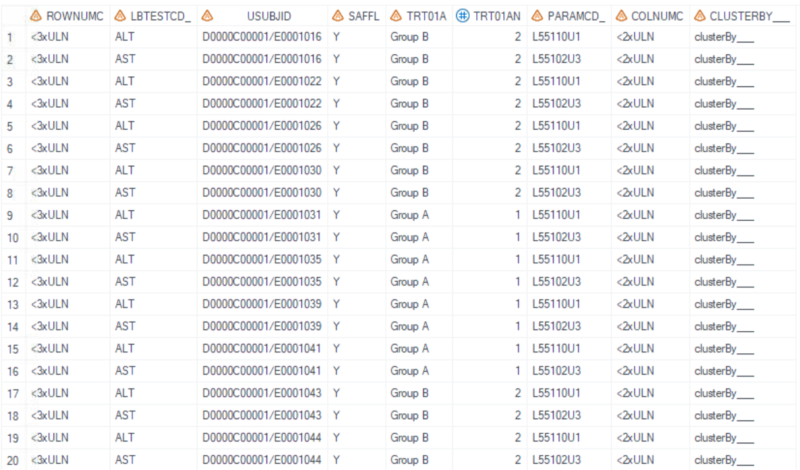

# Example

[Example Maximum on-treatment ALT and AST versus maximum on-treatment total bilirubin](#example-maximum-on-treatment-alt-and-ast-versus-maximum-on-treatment-total-bilirubin)<br>

---

## Example Maximum on-treatment ALT and AST versus maximum on-treatment total bilirubin

**Details**<br>

This example does the following:<br>
Output Maximum on-treatment ALT and AST versus maximum on-treatment total bilirubin [AZTLB11](https://azcollaboration.sharepoint.com/sites/O-GEM2/Shared%20Documents/General/O-GEM%20Index.xlsx?d=wb25d071b4025404caf18f0d7487c4b1d&csf=1&web=1&e=B0O6wH&nav=MTVfe0Y3NDlCRTQ3LUI0MzUtNEY4MC05ODkzLTc1MzQwODdEQTVBOX0).<br>

**Program**

```sas
%**Proc format used in TLF **;
proc format;
	value _t_lb_hyslaw_rowc
	1="<3xULN"
	2=">=3 - <5xULN"
	3=">=5 - <10xULN"
	4=">=10xULN"
	;
	value _t_lb_hyslaw_colc
	1="<2xULN"
	2=">=2xULN"
	;
run;
%** Call display macros **;
%m_t_lb_hyslaw(
	inds=adlb
	,pop_flag=SAFFL='Y'
	,whr=TRT01AN in (1 2 3)  
	,pop_mvar=saspopb
	,trtgrpn=TRT01AN 
	,trtTot=Y
	,UniqueIDVars=USUBJID
	,whr1=
		LBTESTCD_="ALT"
		,rowvarc1=ROWNUMC /*char*/
		,rowtxt1=ALT 
		,rowfmt1=_t_lb_hyslaw_rowc
		,rowtot1=N
		,leading1=Y
	,whr2=
		LBTESTCD_="AST"
		,rowvarc2=ROWNUMC /*char*/
		,rowtxt2=AST
		,rowfmt2=_t_lb_hyslaw_rowc
		,rowtot2=N
		,leading2=Y
	,colvarc=COLNUMC /*char*/
	,colfmt=_t_lb_hyslaw_colc
	,coltot=N
	,pg=20
	,sfx=saf
	,deBug=Y
); 
```

**Program Description**<br>
***Input data feature***<br> 
A dataset, including variables of USUBJID, SAFFL, TRT01AN, LBTESTCD_, ROWNUMC, and COLNUMC is the input dataset. In this example, variable rownumc is derived based on the ratio of AVAL and normal range upper limit for ALT and AST. Variable colnumc are derived based on the ratio of AVAL and normal range upper limit for BILI. <br>

><br>

***Parameter description***<br>
1. Need total<br>
There's no total group in input dataset `inds`, so set `trtTot='Y'` and utilize `pop_mvar=saspopb` to display the total group. Global macro `saspopb` which includes total group is created in [%m_u_popn](../../utility/m_u_popn/m_u_popn_descp.md) which should be executed prior to invoking this macro.<br> 

2. There are two blocks of the row, first block is `rowtxt1=ALT` and second block is `rowtxt2=AST`. No matter how many row blocks there are, column variable is only one parameter `colvarc=COLNUMC`. 

3. "Total" is not needed in format "_t_lb_hyslaw_rowc" and "_t_lb_hyslaw_colc", thus set `rowtot1=N` and `rowtot2=N` and `coltot=N`.

4. By setting `sfx = saf` with the program name being "t_lb_hyslaw" in this example, the resulting output files will be named as "t_lb_hyslaw_saf.sas7bdat" and "t_lb_hyslaw_saf.rtf".<br>

**Output**<br>

***Output Dataset***<br>
Generate output datasets "work.final2qc.sas7bdat" and "tlf.t_lb_hyslaw_saf.sas7bdat" (These two datasets are exactly the same dataset and used for QC), and "work.final2output.sas7bdat" (used in proc report process).<br>
Dataset output for QC contain the variables COL1-COL5. COL1 represents the column for treatment groups, COL2 is for the number of observations (Nobs), COL3 contains the categories for ALT and AST, and COL4 and COL5 represent the total bilirubin categories. <br>
<br>

***Output rtf***<br>
Corresponding "t-lb-hyslaw-saf.rtf" is generated.<br>  

<br>

 

