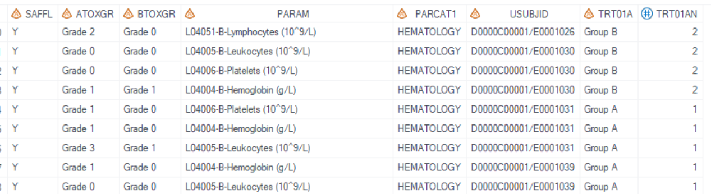

# Example

[Example Shift table for hematology](#example-shift-table-for-hematology)

---

## Example Shift table for hematology

**Details**<br>

This example does the following:<br>
Output the cross table: "Shift from baseline to maximum on-treatment CTCAE grade", following the template [AZTONCLB01](https://azcollaboration.sharepoint.com/sites/SS365/AD253/Clinical%20Data%20Standards%20Library/TLF/Oncology/TA/Template/AZ_AZSOL_Oncology_Table_Templates.xlsx?d=w1f4fc436b723455c92739353788c870f&csf=1&web=1&e=5Z4E7H&nav=MTVfezQ3MjA0MkVELTBFNEQtNEYwMS1CNjkxLUI4MzUxRUU3NEUxNn0).<br>

**Program**<br>

```sas
*Generated _param_fmt format, display param in subtitle by page;

proc sql;
create table _format 
( fmtname char(200), start char(200), label char(200), type char(1) );

insert into _format
select distinct '_param_fmt', PARAM, "Parameter: " || strip(PARAM), 'C' from adam.adlb group by PARAM;
quit;

proc format  cntlin=_format   ;
run;

* Call %m_t_lb_shift;
%m_t_lb_shift(
	inds=adam.adlb
	,pop_flag=SAFFL eq "Y"
	,whr=parcat1="HEMATOLOGY"
	,pop_mvar=saspopb
	,paramvar=PARAM
	,paramvarN=
	,paramvarfmt=$_param_fmt
	,trtgrpn= TRT01AN 
	,trtTot=Y
	,UniqueIDVars=USUBJID	
	,rowvarc= BTOXGR
	,rowfmt= 
	,rowtot= Y
	,colvarc= ATOXGR
	,colfmt=
	,coltot=Y	
	,lenlist=
	,headerlist= #Nobs#Baseline(*ESC*)nCTCAE grade
	,above_header=Maximum on-treatment CTCAE grade
    ,pg=  14
	,sfx= haem_saf
	,deBug=Y
);

```

**Program Description**<br>

***Input data feature***<br>
All required variables should be in input dataset `dsin`, inclduing USUBJID, TRT01AN, PARAM, baseline CTCAE grade variable (BTOXGR), and on-treatment CTCAE grade variable (ATOXGR).<br>


***Parameter description***<br>
1. Need total<br>
There's no total group in input dataset `inds`, so set `trtTot='Y'` and utilize `pop_mvar=saspopb` to display the total group. Global macro `saspopb` which includes total group is created in [%m_u_popn](../../utility/m_u_popn/m_u_popn_descp.md) which should be executed prior to invoking this macro.<br> 

2. Set `rowvarc=BTOXGR` and `colvarc=ATOXGR` to define "Baseline CTCAE grade" as the row variable and "Maximum on-treatment CTCAE grade" as the column variable.<br>

3. Set `paramvar=PARAM` which will be reflected in the subtitle. If you prefer to display the values in PARAM directly, set `paramvarfmt` to null. Otherwise, assign a format to `paramvarfmt`. In this example, set `paramvarfmt=$_param_fmt`.<br>

4. By setting `sfx = haem_saf` with the program name being "t_lb_shift" in this example, the resulting output files will be named as "t_lb_shift_haem_saf.sas7bdat" and "t_lb_shift_haem_saf.rtf".<br>

**Output**<br>
***Output Dataset***<br>
Generate output datasets "work.final2qc.sas7bdat" and "tlf.t_lb_shift_haem_saf.sas7bdat" (These two datasets are exactly the same dataset and used for QC), and "work.final2output.sas7bdat" (used in proc report process).<br>
Dataset output for QC includes variables from COL1 to COL9, as well as COL0 which stores the value for PARAM. Specifically, COL3 represents the "Baseline CTCAE grade", while COL4 through COL9 correspond to the "Maximum on-treatment CTCAE grade", ranging from Grade 0 to Grade 4, along with a total grade column.<br>


***Output rtf***<br>
The "t_lb_shift_haem_saf.rtf" file has been generated, and as a result of the formatting applied to PARAM, the subtitle now includes the prefix text "Parameter: " which is not included in output dataset.<br>
