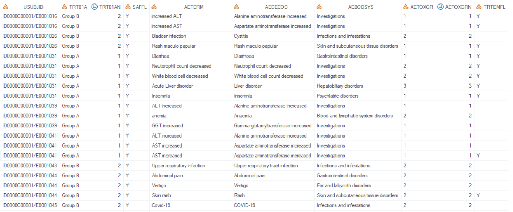
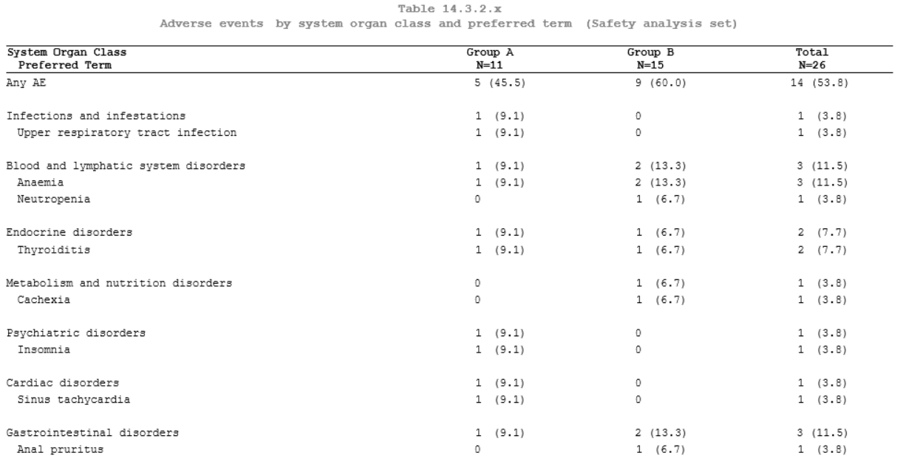
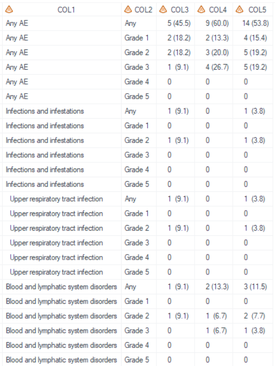
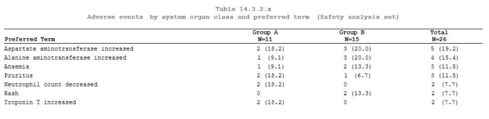

# Example

[Example 1 Adverse events by system organ class and preferred term](#example-1-adverse-events-by-system-organ-class-and-preferred-term)<br>
[Example 2 Adverse events by system organ class and preferred term and maximum CTCAE grade](#example-2-adverse-events-by-system-organ-class-and-preferred-term-and-maximum-ctcae-grade)<br>
[Example 3 Adverse events sorted by decreasing frequency on preferred term level](#example-3-adverse-events-sorted-by-decreasing-frequency-on-preferred-term-level)<br>

---

## Example 1 Adverse events by system organ class and preferred term

**Details**

This example does the following:<br>
Display adverse events by system organ class and preferred term, following the template of [AZTONCAE03](https://azcollaboration.sharepoint.com/sites/O-GEM2/Shared%20Documents/General/O-GEM%20Index.xlsx?d=wb25d071b4025404caf18f0d7487c4b1d&csf=1&web=1&e=SLErGk&nav=MTVfezlCQzQ0Mjk5LUFCNEMtNDAzNC1BQTYwLUVBOTFERjI1RkU4Qn0).<br>

**Program**

```sas
* Call %m_t_nested;
%m_t_nested(inds = adam.adae
	,pop_flag = %str(SAFFL="Y")
	,whr = %str(TRTEMFL="Y")
    ,pageByN =
    ,pageByFmt =
	,trtgrpn = TRT01AN
	,trtTot = Y
	,UniqueIDVars = USUBJID
	,lev1 = AEBODSYS
	,lev2 = AEDECOD
	,lev3 =
    ,comnvarn =
    ,comnvarnfmt =
    ,comnvarn_level =
	,rowtext = %str(Any AE)
    ,socfile =
    ,socint =
	,uncoded = %str(Not coded)
	,lab1 = %str(System Organ Class@  Preferred Term)
	,lab2 =
	,sortby = lev1soc#lev2ab
	,filterPctBy =
	,pop_mvar = saspopb
	,lenlist = 5#2#2#2
  	,justlist =
  	,justlist_header =
  	,nolblist =
  	,orderlist =
  	,idlist =
  	,grouplist =
  	,idpage =
  	,defcol =
  	,blank_after =
	,pg = 16
	,sfx = saf
	,deBug =
	);
```

**Program Description**<br>

***Input data feature***<br>
A standard dataset adam.adae serves as the input dataset, which contains required variables USUBJID, TRT01AN, SAFFL, TRTEMFL, AEBODSYS, and AEDECOD.


***Parameter description***<br>
1. `rowtext = %str(Any AE)` specifies that a leading row which row text is "Any AE" is generated. For the `lab1`, the symbol "@" is the split character which defined in PROC REPORT statement `split`. "(\*ESC*)n" could also be used to split.<br>  

2. For the `uncoded`, If the `lev1`(AEBODSYS) or `lev2`(AEDECOD) value is missing, it will be imputed and displayed as "Not coded", and placed at the end within each level.<br>

3. For the `sortby`, the value is "lev1soc#lev2ab", means that the `lev1`(AEBODSYS) sorts by SOC international order, and `lev2`(AEDECOD) sorts alphabetically.<br>

4. Since `trtTot` is set to "Y", the total treatment group column will be generated.

5. By setting `sfx = saf` with the program name being "t_ae_socpt" in this example, the resulting output files will be named as "t_ae_socpt_saf.sas7bdat" and "t_ae_socpt_saf.rtf".<br>

 
**Output**<br>
***Output Dataset***<br>
Dataset "tlf.t_ae_socpt_saf.sas7bdat" is generated. Results of the treatment groups start from COL2. Since `trtTot` is set to "Y", the total treatment group column is generated as the last column COL4 in output dataset.


***Output rtf***<br>
Corresponding "t_ae_socpt_saf.rtf" is generated.


---

## Example 2 Adverse events by system organ class and preferred term and maximum CTCAE grade

**Details**

This example does the following:<br>
Display adverse events by system organ class and preferred term, each system organ class / preferred term is summarized by CTC grade. Following the template of [AZTONCAE09](https://azcollaboration.sharepoint.com/sites/O-GEM2/Shared%20Documents/General/O-GEM%20Index.xlsx?d=wb25d071b4025404caf18f0d7487c4b1d&csf=1&web=1&e=wEl38z&nav=MTVfezZCOTQ3RkNELTUyQ0EtNDk0OC05MEQ5LTU4RDg5RTk4MTQyOH0).<br>

**Program**

```sas
* Define format;
proc format;
	value grd 
        1 = "Any"
        2 = "Grade 1"
        3 = "Grade 2"
        4 = "Grade 3"
        5 = "Grade 4"
        6 = "Grade 5"
    ;
run;

%m_t_nested(inds = adam.adae
	,pop_flag = %str(SAFFL="Y")
	,whr = %str(TRTEMFL="Y")
    ,pageByN =
    ,pageByFmt =
	,trtgrpn = TRT01AN
	,trtTot = Y
	,UniqueIDVars = USUBJID
	,lev1 = AEBODSYS
	,lev2 = AEDECOD
	,lev3 =
    ,comnvarn = AETOXGRN
    ,comnvarnfmt = grd
    ,comnvarn_level = %str(1 2 3 4 5|1|2|3|4|5)
	,rowtext = %str(Any AE)
    ,socfile =
    ,socint =
	,uncoded = %str(Not coded)
	,lab1 = %str(System Organ Class@  Preferred Term)
	,lab2 = %str(CTCAE Grade)
	,sortby = lev1soc#lev2ab
	,filterPctBy =
	,pop_mvar = saspopb
	,lenlist = 5#2#2#2#2
  	,justlist =
  	,justlist_header =
  	,nolblist =
  	,orderlist =
  	,idlist =
  	,grouplist =
  	,idpage =
  	,defcol =
  	,blank_after =
	,pg = 18
	,sfx = saf
	,deBug =
	);
```

**Program Description**<br>
***Input data feature***<br>
A standard dataset adam.adae serves as the input dataset, which contains required variables USUBJID, TRT01AN, SAFFL, TRTEMFL, AEBODSYS, AEDECOD, and AETOXGRN.


***Parameter description***<br>
1. `rowtext = %str(Any AE)` specifies that a leading row which row text is "Any AE" is generated. For the `lab1`, the symbol "@" is the split character which defined in PROC REPORT statement `split`. "(\*ESC*)n" could also be used to split.<br>  

2. For the `uncoded`, If the `lev1`(AEBODSYS) or `lev2`(AEDECOD) value is missing, it will be imputed and displayed as "Not coded", and placed at the end within each level.<br>

3. The `comnvarn` is set to "AETOXGRN", means that every `lev1`(AEBODSYS) and `lev2`(AEDECOD) will be summarized by "AETOXGRN".<br>

4. For the `comnvarnfmt`, the format "grd" had been defined in advance. <br>

5. For the `comnvarn_level`, the first values is "1 2 3 4 5" corresponding to row "Any", means `comnvarn`(AETOXGRN) value in (1 2 3 4 5). Likewise, the second value is "1" corresponding to row "Grade 1", filter is "AETOXGRN in (1)". etc.<br>

6. For the `sortby`, the value is "lev1soc#lev2ab", means that the `lev1`(AEBODSYS) sort by SOC international order, and `lev2`(AEDECOD) sort alphabetically.<br>

7. Since the `comnvarn` is specified, and `lab2` is needed. Therefore, the treatment group starts from COL3 accordingly.
 
8. By setting `sfx = saf` with the program name being "t_ae_tox" in this example, the resulting output files will be named as "t_ae_tox_saf.sas7bdat" and "t_ae_tox_saf.rtf".<br>

**Output**<br>
***Output Dataset***<br>
Dataset "tlf.t_ae_tox_saf.sas7bdat" is generated. Since the `comnvarn` is specified, the corresponding column is generated after the COL1, and the corresponding header name is defined in `lab2`. Therefore, the treatment groups start from COL3 accordingly.


***Output rtf***<br>
Corresponding "t_ae_tox_saf.rtf" is generated.


---

## Example 3 Adverse events sorted by decreasing frequency on preferred term level

**Details**

This example does the following:<br>
Create report for adverse events sorted by decreasing frequency on preferred term level. Following the template of [AZTAE03](https://azcollaboration.sharepoint.com/sites/O-GEM2/Shared%20Documents/General/O-GEM%20Index.xlsx?d=wb25d071b4025404caf18f0d7487c4b1d&csf=1&web=1&e=NE8SrX&nav=MTVfe0NCRURFMTJFLURBNEMtNEMwMy04MUQ3LUE0OEI1QTEwRkQ2RX0).<br>

**Program**

```sas
* Call %m_t_nested;
%m_t_nested(inds = adae
	,pop_flag = %str(SAFFL="Y")
	,whr = %str(TRTEMFL="Y")
    ,pageByN =
    ,pageByFmt =
	,trtgrpn = TRT01AN 
	,trtTot = Y
	,UniqueIDVars = USUBJID
	,lev1 = AEDECOD
	,lev2 =
	,lev3 =
    ,comnvarn =
    ,comnvarnfmt =
    ,comnvarn_level =
	,rowtext =
    ,socfile =
    ,socint =
	,uncoded =
	,lab1 = %str(Preferred Term)
	,lab2 =
	,sortby = %str(descending lev1total)
	,filterPctBy =
	,pop_mvar = saspopb
	,lenlist = 5#2#2#2
  	,justlist =
  	,justlist_header =
  	,nolblist =
  	,orderlist =
  	,idlist =
  	,grouplist =
  	,idpage =
  	,defcol =
  	,blank_after =
	,pg = 20
	,sfx = saf
	,deBug =
	);
```

**Program Description**<br>
***Input data feature***<br>
A standard dataset adam.adae serves as input dataset, which contains all variables required, including USUBJID, TRT01AN, SAFFL, TRTEMFL, and AEDECOD. No AEBODSYS is needed.


***Parameter description***<br>
1. For `lev1`, the value is "AEDECOD", and the sub-level `lev2`, `lev3` are null, means that this nested output only contain one level.<br>   

2. The `rowtext` set to missing, means that the first row (summary row) will not be displayed.<br>

3. For the `sortby`, the value is "descending lev1total", means that the `lev1`(AEDECOD) is sorted by descending frequency based on total column.<br>

4. By setting `sfx = saf` with the program name being "t_ae_pt" in this example, the resulting output files will be named as "t_ae_pt_saf.sas7bdat" and "t_ae_pt_saf.rtf".<br>

**Output**<br>
***Output Dataset***<br>
Dataset "tlf.t_ae_pt_saf.sas7bdat" is generated. Dataset is sorted by descending frequency of COL5 (total treatment group column).<br>


***Output rtf***<br>
Corresponding "t_ae_pt_saf.rtf" is generated. Preferred terms is displayed in COL1.<br>


 >Note: Based on this example, if you want to display the table of "Adverse events on preferred term level occurring in at least <<XX%>> of subjects across treatment groups" follwing the [AZTONCAE18](https://azcollaboration.sharepoint.com/sites/O-GEM2/Shared%20Documents/General/O-GEM%20Index.xlsx?d=wb25d071b4025404caf18f0d7487c4b1d&csf=1&web=1&e=vPptqB&nav=MTVfezVEQTAzRThGLTJDOUUtNEY5Ni1BRUFCLTIxODc5Mjk5RTYzOX0), you could just set `filterPctBy` option to filter the occurring percentage. Here, take 10% as an example and set  `filterPctBy= %str(lev1trt_pct1>=10 or lev1trt_pct2>=10 or lev1trt_pct3>=10)`. If any group has >=10% occurrence, the preferred term will be output. For the report, COL1 through COL4 will be utilized with COL1 storing preferred term, and the treatment groups' data starting from COL2.<br>

 ***Output Dataset***<br>
 Preferred term where occurring percentage >=10% is output.
 <br>

***Output rtf***<br>
 <br>
