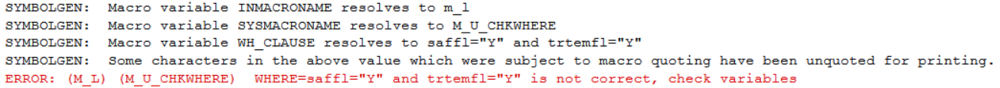
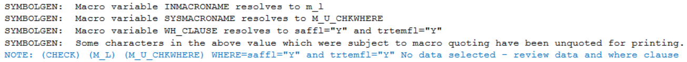

# Example

[Example Check whether the where-expression is valid](#example-Check-whether-the-where-expression-is-valid)<br>
 
 ---

 ## Example Check whether the where-expression is valid

 **Details**<br>

This example does the following:<br>
Check whether the where-expression is valid.


**Program**

```sas
* Call %m_u_chkwhere via another macro %m_l;
%m_u_chkwhere(intab=adae
	,wh_clause=%str(saffl="Y" and trtemfl="Y")
	,inmacroname=m_l
	);
```

**Program Description**<br>

For the example, the macro is used by macro [%m_l](../../display/m_l/m_l_descp.md). therefore, the `inmacroname` is set to m_l.<br>
1. If variable trtemfl not exist in input dataset, the log will generate the following message:
>ERROR: (M_L) (M_U_CHKWHERE)  WHERE=saffl="Y" and trtemfl="Y" is not correct, check variables<br>
2. If no record meet the `wh_clause`, the log will generate the following message: 
>NOTE: (CHECK) (M_L) (M_U_CHKWHERE) WHERE=saffl="Y" and trtemfl="Y" No data selected - review data and where clause<br>


**Output**<br>




---