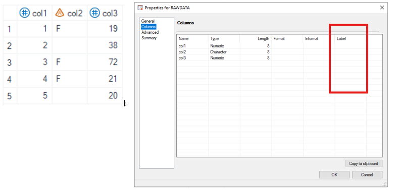
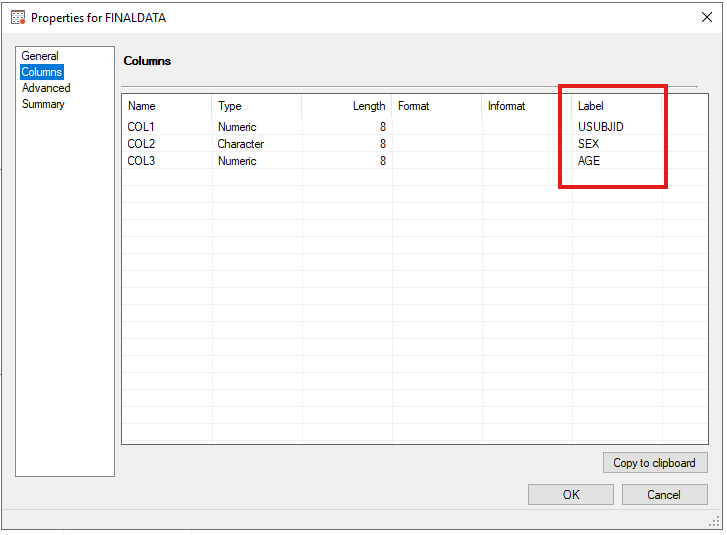
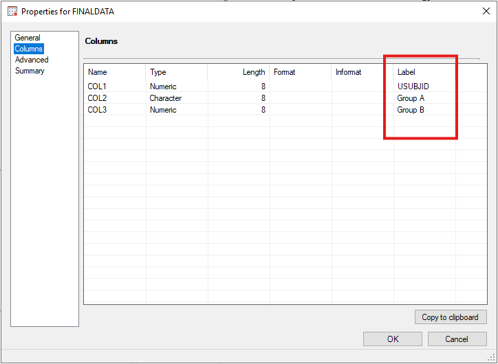

# Example

[Example 1 Append headers onto columns manually](#example-1-append-headers-onto-columns-manually)
[Example 2 Append headers onto columns using m_u_popn generated variables](#example-2-append-headers-onto-columns-using-gmacro)<br>

---

## Example 1 Append headers onto columns manually

**Details**<br>

This example does the following:
Append headers onto columns in the input dataset by utilizing `collabel`.

**Program**

```sas
%m_u_col_header(inds=   rawdata
							, outds= finaldata
							, gmacro= 
							, modcol=
							, collabel= col1='USUBJID' col2='SEX' col3='AGE'
							);
```
**Program Description**

***Input data feature***<br>
The input dataset needs to contain columns with values.
Note that currently there are no labels.



***Parameter description***<br>
1. `inds,outds` specifies the input and output dataset names.<br>

2. `collabel` defines the labels that will be applied onto the dataset. Please make sure all columns defined in `collabel` exist within the `inds` dataset.

**Output**

Generate a dataset name defined by `outds` where labels are applied to the corresponding columns.

 


## Example 2 Append headers onto columns using gmacro

**Details**<br>

This example does the following:
Append headers onto columns in the input dataset by utilizing `gmacro`.

**Program**

```sas
%m_u_col_header(inds=   rawdata
							, outds= finaldata
							, gmacro= saspopb
							, modcol= 1
							, collabel= col1='USUBJID'
							);
```
**Program Description**

***Input data feature***<br>
The input dataset needs to contain columns with values.
Note that currently there are no labels.


***Parameter description***<br>
1. `inds,outds` specifies the input and output dataset names.<br>

2. `gmacro` defines the group that will be used within `m_u_popn`. 
   `modcol` defines the number difference between treatment group number and column number.

**Output**

Generate a dataset name defined by `outds` where labels are applied to the corresponding columns.
In this example, there are 2 treatment groups and I want to apply the header onto col2 and col3. Thus, `modcol` is set to 1 to accommodate for the difference.
Since `m_u_popn` only generates headers for treatment groups, we still need to define header for col1 manually within `collabel`.

 

