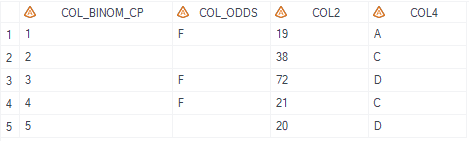
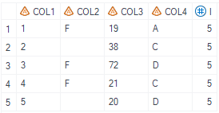
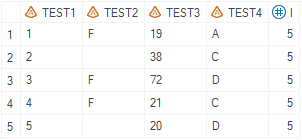

# Example

[Example 1 Reorganize columns into default column names](#example-1-reorganize-columns-into-default-column-names)
[Example 2 Reorganize columns into customized column names](#example-2-reorganize-columns-into-customized-column-names)<br>

---

## Example 1 Reorganize columns into default column names

**Details**<br>

This example does the following:
Reorganize columns that follows naming convention (column name MUST start with prefix `col`) into default column names (col1 col2 col3 etc.).

**Program**

```sas
%m_u_col_reorg(inds=   rawdata
							, outds= finaldata
							, colin= 
							, colout=
							, keep=
							);
```
**Program Description**

***Input data feature***<br>
The input dataset needs to contain columns that follows naming convention.<br> 
Very important: column name MUST start with prefix `col`. <br>


***Parameter description***<br>
1. `inds,outds` specifies the input and output dataset names.<br>

2. When `colin` and `colout` are left blank, the output dataset column names will be set as default.

**Output**

Generate a dataset name defined by `outds` with columns reorganized.

 


## Example 2 Reorganize columns into customized column names

**Details**<br>

This example does the following:
Reorganize columns that follows naming convention (column name MUST start with prefix `col`) into customized column names.

**Program**

```sas
%m_u_col_reorg(inds=   rawdata
							, outds= finaldata
							, colin= 
							, colout= test1 test2 test3 test4
							, keep=
							);
```
**Program Description**

***Input data feature***<br>
The input dataset needs to contain columns that follows naming convention.<br> 
Very important: column name MUST start with prefix `col`. <br>


***Parameter description***<br>
1. `inds,outds` specifies the input and output dataset names.<br>

2. Parameter `colout` defines the column names in the output dataset.

**Output**

Generate a dataset name defined by `outds` with columns reorganized with customized names.

 

 ---
