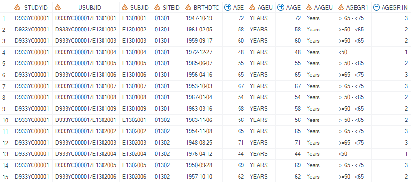
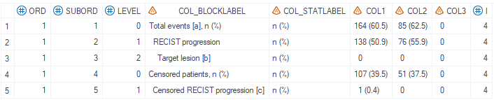
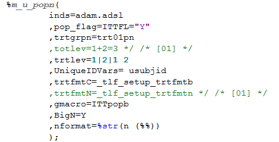
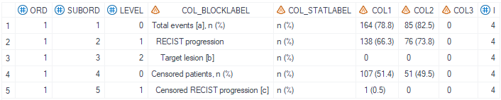

# Example

[Example 1 Calculate counts and percentages without additional denominator dataset](#example-1-calculate-counts-and-percentages-without-additional-denominator-dataset)
[Example 2 Calculate counts and percentages with specified denominator dataset](#example-2-calculate-counts-and-percentages-with-specified-denominator-dataset)
---

## Example 1 Calculate counts and percentages without additional denominator dataset

**Details**<br>

This example does the following: <br>
Calculate counts and percentages based on index information. <br>

**Program**

```sas
%m_u_effcount(inds= adam.adtte
							, pop_flag= ITTFL="Y"
							, whr= paramcd='TRPROGM' and parqual='INDEPENDENT ASSESSOR'
							, trtgrpn= trt01pn
							, denomds= 
							, pop_mvar= ITTpopb
							, index= {cond=CNSR=0 # label=%nrbquote(Total events [a], n (%)) #level=0 subord=1}
                                     {cond=cnsr=0 and find(evntdesc,'RECIST progression') label=RECIST progression level=1 subord=2}
                                     {cond=cnsr=0 and find(evntdesc,'RECIST progression with target') label=Target lesion [b] level=2 subord=3}
                                     {cond=cnsr=1 label=%nrbquote(Censored patients, n (%)) level=0 subord=4}
                                     {cond=cnsr=1 and find(evntdesc,'Censored RECIST progression') label=Censored RECIST progression [c] level=1 subord=5}
							, statlabel= Y
							, denomcond=
                            , ord= 1
                            , debug= N
							);
```

**Program Description**<br>

***Input data feature***<br>
The input dataset can be any dataset that is not empty and contains variables to be analyzed such as trtgrpn and variables specified in where condition.
In this example, we are using a standard ADAM adtte dataset.


***Parameter description***<br>
1. `inds` specifies the input dataset name, the output dataset is defaulted to name `final_effcount_`.<br>

2. `index` parameter contains information of condition, suborder, level and label for each row. <br> `{cond=cnsr=0 and find(evntdesc,'RECIST progression with target') label=Target lesion [b] level=2 subord=3}` indicates that in this row, we want to count numer of people that satisfies this condition: cnsr=0 and find(evntdesc,'RECIST progression with target'). <br> `label=Target lesion [b]` means the display label for this row should be `Target lesion [b]`. <br> `level = 2` indicates that this row is a sub-level and should have one indentation. <br> `subord=3` represents that it should be the third line within the output dataset.

**Output**

Generate a dataset, name defined by `final_effcount_`, with counts and percentages statistics.
 

In this example, `ITTpopb` in m_u_popn defined three treatment groups: 1|2|1 2. <br> However, in `trtgrpn` variable, only 1 and 2 exist. Thus, col3 in the output dataset has zero values.

 

## Example 2 Calculate counts and percentages with specified denominator dataset

**Details**<br>

This example does the following: <br>
Calculate counts and percentages based on index information with specified denominator dataset. <br>

**Program**

```sas
%m_u_effcount(inds= adam.adtte
							, pop_flag= ITTFL="Y"
							, whr= paramcd='TRPROGM' and parqual='INDEPENDENT ASSESSOR'
							, trtgrpn= trt01pn
							, denomds= ADSL_partial
							, pop_mvar= ITTpopb
							, index= {cond=CNSR=0 # label=%nrbquote(Total events [a], n (%)) #level=0 subord=1}
                                     {cond=cnsr=0 and find(evntdesc,'RECIST progression') label=RECIST progression level=1 subord=2}
                                     {cond=cnsr=0 and find(evntdesc,'RECIST progression with target') label=Target lesion [b] level=2 subord=3}
                                     {cond=cnsr=1 label=%nrbquote(Censored patients, n (%)) level=0 subord=4}
                                     {cond=cnsr=1 and find(evntdesc,'Censored RECIST progression') label=Censored RECIST progression [c] level=1 subord=5}
							, statlabel= Y
							, denomcond=
                            , ord= 1
                            , debug= N
							);
```

**Program Description**<br>

***Input data feature***<br>
The input dataset can be any dataset that is not empty and contains variables to be analyzed such as trtgrpn and variables specified in where condition.
In this example, we are using a standard ADAM adtte dataset.


***Parameter description***<br>
1. `inds` specifies the input dataset name, the output dataset is defaulted to name `final_effcount_`.<br>

2. `denomds` defines the denominator dataset to use. This overwrites the total big N calculated in m_u_popn.


3. `index` parameter contains information of condition, suborder, level and label for each row. <br> `{cond=cnsr=0 and find(evntdesc,'RECIST progression with target') label=Target lesion [b] level=2 subord=3}` indicates that in this row, we want to count numer of people that satisfies this condition: cnsr=0 and find(evntdesc,'RECIST progression with target'). <br> `label=Target lesion [b]` means the display label for this row should be `Target lesion [b]`. <br> `level = 2` indicates that this row is a sub-level and should have one indentation. <br> `subord=3` represents that it should be the third line within the output dataset.

**Output**

Generate a dataset, name defined by `final_effcount_`, with counts and percentages statistics. <br> In this example, denominator dataset is defined (`denomds= ADSL_partial`) and it is a subset of the original adam.adsl. <br> Note that the calculated percentage is bigger than the result from exmaple 1 as a result of smaller denominator value.
 

In this example, `ITTpopb` in m_u_popn defined three treatment groups: 1|2|1 2. <br> However, in `trtgrpn` variable, only 1 and 2 exist. Thus, col3 in the output dataset has zero values.

 

 ---