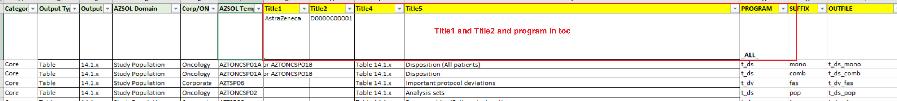
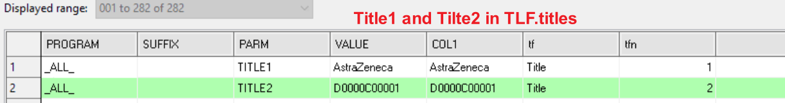
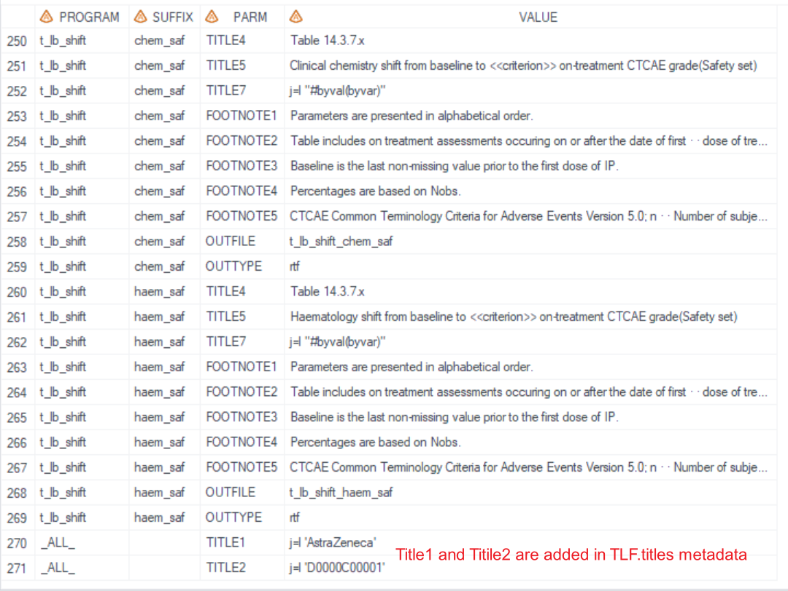
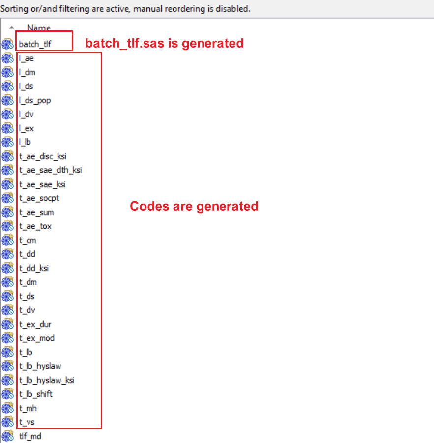

# Example

[Example 1 Use title1 and title2 in toc index file](#example-1-use-title1-and-title2-in-toc-index-file)<br>
[Example 2 Use title1 and title2 as additional specifications](#example-2-use-title1-and-title2-as-additional-specifications)<br>
[Example 3 Generate codes for each TLF in toc index file](#example-3-generate-codes-for-each-tlf-in-toc-index-file)<br>

---

## Example 1 Use title1 and title2 in toc index file

**Details**<br>

This example does the following:<br>
Create tlf.titles metadata from toc index file, including title1 and title2.

**Program**

```sas
* Call %m_u_tlf_md;
%m_u_tlf_md(
	filein=root/cdar/xxx/xxxx/ar/xx/tlf/doc/toc_index.xlsx,
	sheet=Index,
	_all_= N,
	title1=,
	title2=,
	pgmgen=N,
	prgmpath=,
	repopath=,
	batch=N,
	error_override=,
	deBug=N
	);

```
**Program Description**

Input toc index file contains title1 and title2. `_all_=N` must be provided.<br>


**Output**

TLF.titles dataset is created and title1 and title2 are created from toc file.<br>



---

## Example 2 Use title1 and title2 as additional specifications

**Details**<br>

This example does the following:<br>
Create tlf.titles metadata from toc index file, however, title 1 and title 2 information are not presented in toc (or will not use title 1 and title 2 in toc) and require additional provision.

**Program**

```sas
 * Call %m_u_tlf_md;
%m_u_tlf_md(
	filein=root/cdar/xxx/xxxx/ar/xx/tlf/doc/toc_index.xlsx,
	sheet=Index,
	_all_= Y,
	title1= %str(j=l 'AstraZeneca') ,
	title2= %str(j=l 'D0000C00001'),
	pgmgen=N,
	prgmpath=,
	repopath=,
	batch=N,
	error_override=,
	deBug=N
);

```

**Program Description** 

When `_all_=Y`, then title1 and title2 must be provided. Other TLF metadata information (except for title1 and title2) is created from the toc_index.xlsx. <br>

**Output**

Title1 and title2 are added in tlf.titles.<br>

 
---

## Example 3 Generate codes for each TLF in toc index file

**Details**<br>

This example does the following:<br>
Create tlf codes according to toc and generate batch_tlf.sas<br>

**Program**

```sas
* Call %m_u_tlf_md;
%m_u_tlf_md(
	filein=root/cdar/xxx/xxxx/ar/xx/tlf/doc/toc_index.xlsx,
	sheet=Index,
	_all_= N,
	title1= ,
	title2= ,
	pgmgen= Y ,
	prgmpath= root/cdar/xxx/xxxx/ar/xx/tlf/dev/program,
	repopath= root/global_tools/oncology/o_gem/pgm/pilot_core/tlf/dev/program,
	dev/program,
	batch=Y,
	error_override=N,
	deBug=N
	);

```
**Program Description**<br>

Set `pgmgen=Y`, parameters of `prgmpath`, `batch`, and `error_override` are all provided. `prgmpath` provide location of generated codes. `repopath` provide the developed O-GEM codes as reference, and codes will be copied to `prgmpath` location. If TLF codes are not existed in `prgmpath` and not in `repopath`, then blank codes will be generated. <br>

**Output**<br>
Batch_tlf.sas and program codes are generated.<br>

