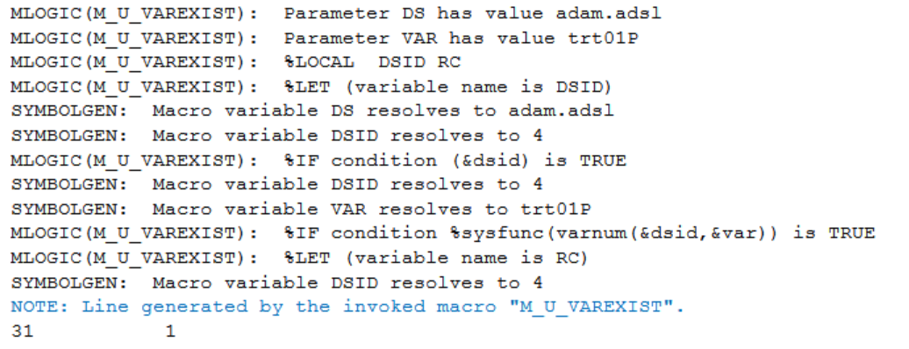
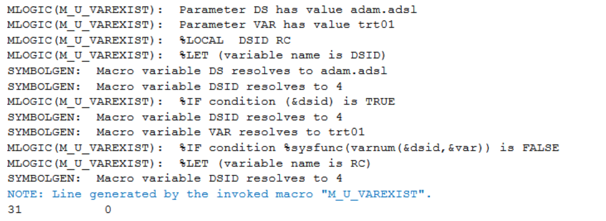

# Example

[Example Check if the variable exists](#example-check-if-the-variable-exists)

---

## Example Check if the variable exists

**Details**<br>

This example does the following: <br>
Verify if TRT01PN and TRT01 are present in the adam.adsl dataset.<br>

**Program**

```sas

* Call %m_u_varexist;
****case 1;
%m_u_varexist(
    ds=adam.adsl
    ,var=TRT01PN 	
   );

****case 2;
%m_u_varexist(
    ds=adam.adsl
    ,var=TRT01
   );
```

**Program Description**<br>

Input the dataset adam.adsl and variable name as `var=TRT01PN` or `var=TRT01`. Check whether TRT01PN, TRT01 variables exist in adam.adsl. <br>
 
**Output**<br>
Case 1 result=1 are print in the log, indicating that TRT01PN exists in adam.adsl.<br>


Case 2 result=0 are print in the log, indicating that TRT01 does not exist in adam.adsl.<br>



 