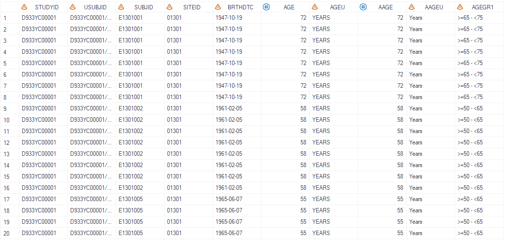
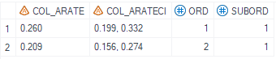

# Example

[Example Calculate adjust rate and confidence interval with stratification factors](#example-calculate-adjust-rate-and-confidence-interval-with-stratification-factors)<br>

---


## Example Calculate adjust rate and confidence interval with stratification factors

**Details**<br>
This example does the following:<br>
Calculate adjust rate and confidence interval considering stratification factors for objective response. <br>

**Program**<br>

```sas
%m_u_binom_adjrate(inds=   adeff_all
							, outds= test
							, trtgrpn= trt01an,
							, strata= strat1n strat2n
							, where= paramcd='TRORESPU' and OTLVBPFL='Y' and PARQUAL='INDEPENDENT ASSESSOR'
							, popfl= ittfl='Y'
							, var=
							, event=
							, alpha=
							, missval= NR
							, cidecim = 3
							, deBug= N
							);
```
**Program Description**<br>

***Input data feature***<br>
The input dataset is a standard ADEFF adam dataset and contains required variables: USUBJID, TRT01PN,TRT01P,AVAL,PARAM,PARAMCD etc. The dataset must include variable AVAL with value of 0 or 1. 


***Parameter description***<br>
1. Filter the dataset using either the `where` variable, or during data-preprocess of the input dataset and make sure only one `PARAMCD` is selected. <br>

2. Parameter `strata` defines the stratification variables to be consifered if any, note that the value type for `strata` must be numeric.

**Output**<br>

Generate a dataset name defined by `outds` that contains the adjusted rate and its confidence interval.
If unable to calculate the confidence interval , display text defined by `missval` will be displayed.<br>

 

---

