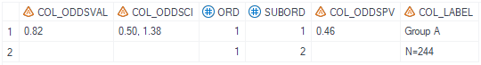

# Example

[Example 1 Calculate Odds Ratio related only with stratification factors](#example-1-calculate-odds-ratio-related-only-with-stratification-factors)<br>
[Example 2 Calculate Odds Ratio and relative risk related without stratification factors](#example-2-calculate-odds-ratio-and-relatvie-risk-risk difference-related-without-stratification-factors)<br>

---


## Example 1 Calculate odds ratio related only with stratification factors

**Details**<br>
This example does the following:<br>
Calculate odds ratio, confidence interval and p-value of odds ratio considering stratification factors for objective response. <br>

**Program**<br>

```sas
%m_u_binom_odds(inds=   adeff_all
							, whr= paramcd='TRORESPU' and OTLVBPFL='Y' and PARQUAL='INDEPENDENT ASSESSOR'
							, pop_flag= ittfl='Y'
							, trtgrpn= trt01pn
							, trtgrp= trt01p
							, trtpair= str(1 2)
							, trtfmt=
							, trtref= 2
							, strata= strat1n strat2n
							, var=
							, event=
							, alpha=
							, pvalside=
							, pvdecim=
							, cidecim=
							, relcal= N
							, cltype=
							, supds=
							, missval=
							, ord= 1
							, deBug= N
							);
```
**Program Description**<br>

***Input data feature***<br>
The input dataset is a standard ADEFF adam dataset and contains required variables: USUBJID, TRT01PN,TRT01P,AVAL,PARAM,PARAMCD etc. The dataset must include variable AVAL with value of 0 or 1. 


***Parameter description***<br>
1. Filter the dataset using either the `whr` variable, or during data-preprocess of the input dataset and make sure only one `PARAMCD` is selected. <br>

2. The parameter `trtpair` defines the treatment group pair for analysis and `trtref` specifies the treatment group that will be used as reference. The `trtref` should be within `trtpair`. <br>

3. Parameter `strata` defines the stratification variables to be consifered if any, note that the value type for `strata` must be numeric.

**Output**<br>

Generate a dataset named `final_odds_1` that contains the odds ratio, odds ratio confidence interval and odds ratio p-value.
If unable to calculate the confidence interval , display text defined by `missval` will be displayed.<br>

 

---

## Example 2 Calculate odds ratio and relative risk risk difference related without stratification factors

**Details**<br>
This example does the following:<br>
Calculate odds ratio, confidence interval and p-value of odds ratio along with relative risk estimate and confidence interval, risk difference estimate, confidence interval and p-value without considering stratification factors for objective response.  <br>

**Program**<br>

```sas
%m_u_binom_odds(inds=   adeff_all
							, whr= paramcd='TRORESPU' and OTLVBPFL='Y' and PARQUAL='INDEPENDENT ASSESSOR'
							, pop_flag= ittfl='Y'
							, trtgrpn= trt01pn
							, trtgrp= trt01p
							, trtpair= str(1 2)
							, trtfmt=
							, trtref= 2
							, strata=
							, var=
							, event=
							, alpha= 0.1
							, pvalside= 
							, pvdecim= 3
							, cidecim= 3
							, relcal= Y
							, cltype=
							, supds=
							, missval=
							, ord= 1
							, deBug= N
							);
```
**Program Description**<br>

***Input data feature***<br>
The input dataset is a standard ADEFF adam dataset and contains required variables: USUBJID, TRT01PN,TRT01P,AVAL,PARAM,PARAMCD etc. The dataset must include variable AVAL with value of 0 or 1. 


***Parameter description***<br>
1. Filter the dataset using either the `whr` variable, or during data-preprocess of the input dataset and make sure only one `PARAMCD` is selected. <br>

2. The parameter `trtpair` defines the treatment group pair for analysis and `trtref` specifies the treatment group that will be used as reference. The `trtref` should be within `trtpair`. <br>

3. Note that in order to obtain relative risk and risk difference related calculations, `relcal` must be set to 'Y'.

4. `pvdecim, cidecim` are both set to 3 and in the output dataset, the rounding are corresponding to the decimal places defined.

**Output**<br>

Generate a dataset named `final_odds_1` that contains the odds ratio, odds ratio confidence interval and odds ratio p-value.
If unable to calculate the confidence interval , display text defined by `missval` will be displayed.<br>

 

Generate a dataset named `final_cmh_1` that contains the relative risk estimate and confidence interval, risk difference estimate, confidence interval and p-value.


---
