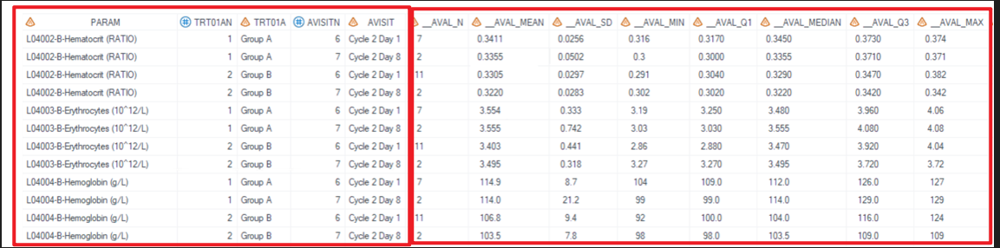
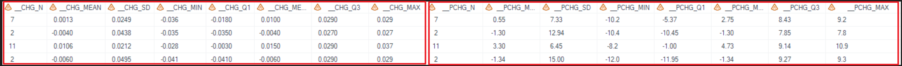
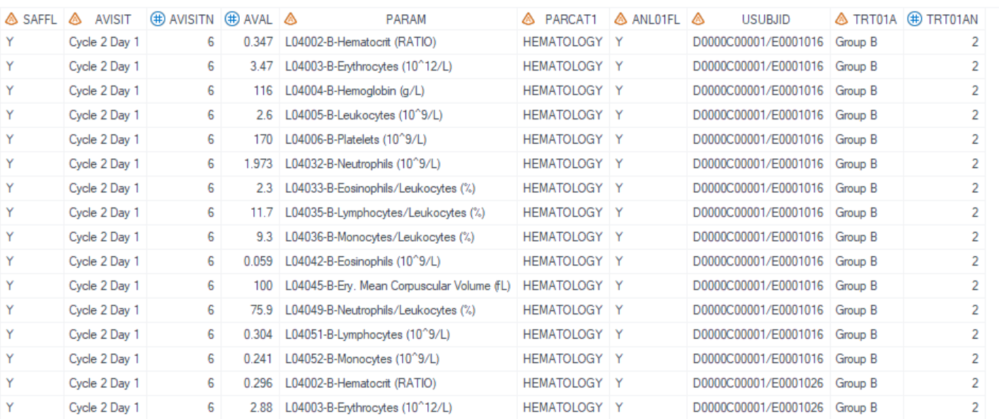
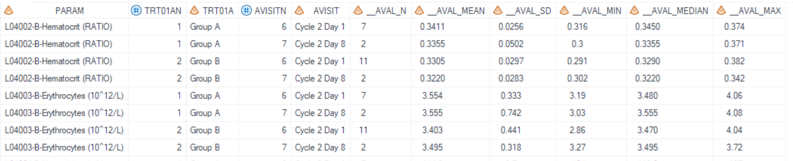

# Example

[Example 1 Create description statistics for one or more numeric variables](#example-1-create-description-statistics-for-one-or-more-numeric-variables)<br>
[Example 2 Remove description statistics](#example-2-remove-description-statistics)<br>

---

## Example 1 Create description statistics for one or more numeric variables

**Details**<br>

This example does the following:<br>
1. Summarized hematology tests results, change from baseline results and percentage change from baseline results for analysis visit "Cycle 2 Day 1" and "Cycle 2 Day 8". Output statistics include "n", "Mean", "SD", "Min", "Q1", "Median", "Q3", and "Max".<br>
2. Set the decimal place as required.<br>

**Program**

```sas
%** Call display macros **;
	%m_u_cont(
		inds=adam.adlb
		,whr=%str(SAFFL='Y' and ANL01FL='Y' and not missing(AVAL) and PARCAT1 = "HEMATOLOGY" and AVISIT in ('Cycle 2 Day 1','Cycle 2 Day 8' ) ) 
		,outds=final_m_u_nested_cont
		,varlist=AVAL#CHG#PCHG
		,rowVars=PARAM TRT01A AVISIT 
		,decimBy=PARAM
		,decim=indata#indata#1
	    ,statsmiss=NC
		,sortBy=PARAM#TRT01AN#TRT01A#AVISITN#AVISIT
		,exclude_stats= 
		,deBug=N
	);
```
**Program Description**<br>

***Input data feature***<br> 
The input dataset `adam.adlb` contains all variables needed, including SAFFL, ANL01FL, AVAL, PARCAT1. PARAM, TRT01AN, TRT01A, AVISITN, AVISIT, AVAL, CHG, and PCHG variables. <br>


***Parameter description***<br>
1. `varlist=AVAL#CHG#PCHG` specifies the variables to be analyzed. <br> 
`decim=indata#indata#1` and `decimBy=PARAM` indicate that decimal places for AVAL and CHG depends on PARAM (different PARAM may have different decimal places), and 1 for PCHG variable. <br>

2. `rowVars=PARAM TRT01A AVISIT` specifies the variables to be the class variables in proc means process. <br> 

3. The output dataset, `dsout= final_m_u_nested_cont`, is sorted by PARAM, TRT01AN, TRT01A, AVISITN, and AVISIT when `sortBy=PARAM#TRT01AN#TRT01A#AVISITN#AVISIT` option is specified. All statistical measures ("n", "Mean", "SD", "Min", "Q1", "Median", "Q3", and "Max") are included in the output, as no statistics are excluded as exclusion is not specified for `exclude_stats`.<br>

**Output**<br>

***Output Dataset***<br>
Output dataset is "work.final_m_u_nested_cont.sas7bdat".<br>
This dataset includes `rowVars` (PARAM, TRT01A, and AVISIT). The statistical results are named after a combination of `varlist` and statistics (e.g., &#95;&#95;AVAL&#95;n, &#95;&#95;AVAL&#95;Mean, &#95;&#95;AVAL&#95;SD, &#95;&#95;AVAL&#95;Min, &#95;&#95;AVAL_Q1, &#95;&#95;AVAL_Median, &#95;&#95;AVAL_Q3, &#95;&#95;AVAL_Max).<br>

<br>

For records with PARAM="L04002-B-Hematocrit (RATIO)", the decimal places are as follows: for CHG, it is set to indata (with &#95;&#95;CHG_Min and &#95;&#95;CHG_Max showing three decimal places), and for PCHG, it is set to 1 (with &#95;&#95;PCHG&#95;Min and &#95;&#95;PCHG&#95;Max displaying one decimal place).

 <br>
<br>

---

## Example 2 Remove description statistics

**Details**<br>

In this example, "Q1" and "Q3" are not required, then use parameter `exclude_stats=` to remove them.

**Program**

```sas
%** Call display macros **;
%m_u_cont(
	inds=adam.adlb
	,whr=%str(SAFFL='Y' and ANL01FL='Y' and not missing(AVAL) and PARCAT1 = "HEMATOLOGY" and AVISIT in ('Cycle 2 Day 1','Cycle 2 Day 8' ) ) 
	,outds=final_m_u_nested_cont
	,varlist=AVAL
	,rowVars=PARAM TRT01A AVISIT 
	,decimBy=PARAM
	,decim=indata
	,statsmiss=NC
	,sortBy=PARAM#TRT01AN#TRT01A#AVISITN#AVISIT
	,exclude_stats= Q1 Q3
	,deBug=N
);
```

**Program Description**<br>

Similar to Example 1, to exclude "Q1" and "Q3" from the output dataset, apply `exclude_stats=Q1 Q3`, with parameter values separated by spaces. The input dataset remains the same as in Example 1.
 <br>

**Output**<br>

***Output Dataset***<br>
The generated output dataset "work.final_m_u_nested_cont.sas7bdat" contains statistical results in sequential columns for "n", "Mean", "SD", "Min", "Median", and "Max", with "Q1" and "Q3" excluded.

 <br>

