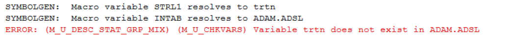
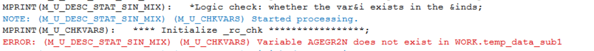

# Common Error
**Mandatory and Conditional values** 
Note: At least one `varlist_cat` or `varlist_cont` should be provided. 
>ERROR:(M_U_DESC_STAT_GRP_MIX) no variable is specified. 

**Check exist dataset and variables** 
Note: input data `inds` must exist and can be open to check the valid values. 
>ERROR:(M_U_DESC_STAT_GRP_MIX) (M_U_CHKVARS) Dataset `inds` does not exist 

>ERROR:(M_U_DESC_STAT_GRP_MIX) (M_U_CHKVARS) Open for dataset `inds` failed 

Note: variable in `byvar` must exist in `dsin` dataset if `byvar` is provided. Otherwise, will trigger the following alert(&&strl&chkvarsI. is the variable name being checked). For example, if `inds`=ADAM.ADSL and `byvar`=TRTN not exist, will cause following error. 
>ERROR: (M_U_DESC_STAT_GRP_MIX) Variable &&strl&chkvarsI. does not exist in &inds 

Note: [%m_u_desc_stat_sin_mix](../../analysis/m_u_desc_stat_sin_mix/m_u_desc_stat_sin_mix_descp.md) is used in this macro. All variables of `varlist_cat` or `varlist_cont` should be exist in `dsin`. Otherwise, will trigger the following alert(&&strl&chkvarsI. is the variable name being checked). For example, if `varlist_cat=AGEGR2N` not exist, will cause following error.   
>ERROR: (M_U_DESC_STAT_SIN_MIX) Variable &&strl&chkvarsI. does not exist in &inds 

