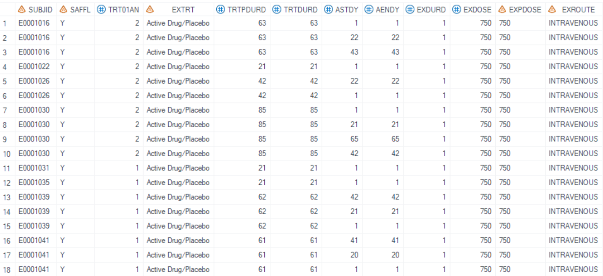
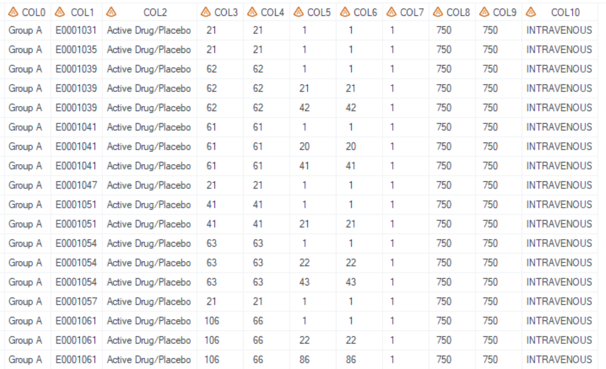
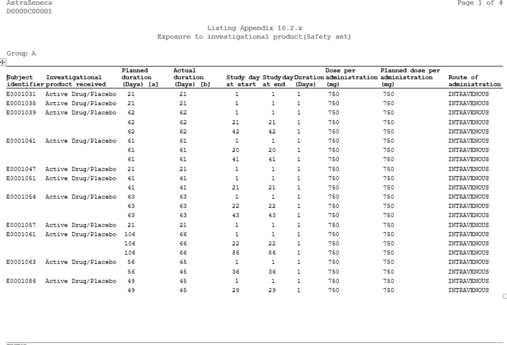
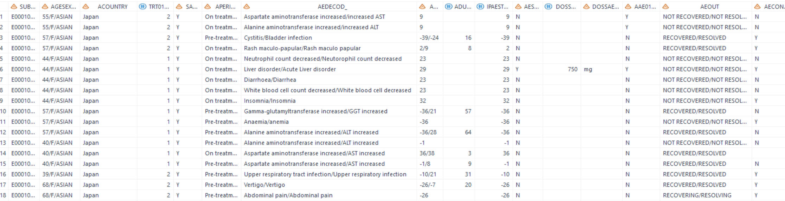
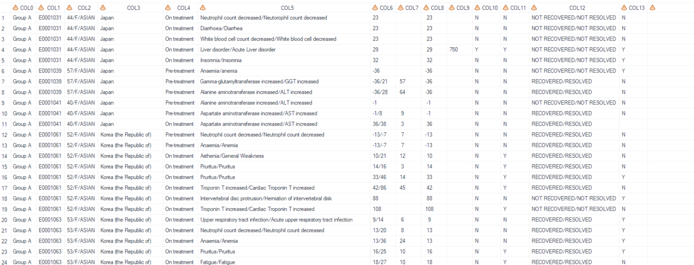
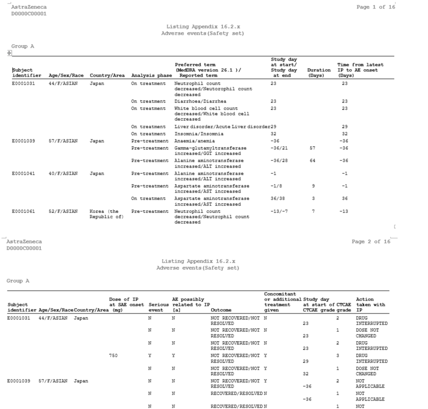

# Example

[Example 1 Display exposure listing](#example-1-display-exposure-listing)<br>
[Example 2 Use idcoln and idpage to control the pagination for AE listing](#example-2-use-idcoln-and-idpage-to-control-the-pagination-for-ae-listing)<br>

---

## Example 1 Display exposure listing

**Details**<br>

This example does the following:<br>
Output the exposure listing, following the template of [AZLEX01](https://azcollaboration.sharepoint.com/sites/O-GEM2/Shared%20Documents/General/O-GEM%20Index.xlsx?d=wb25d071b4025404caf18f0d7487c4b1d&csf=1&web=1&e=QgQf4n&nav=MTVfezY4OTc5OTA5LUU4NUUtNENGOC1CQ0JDLUJFODUxOEZDQkUxNH0).

**Program**

```sas
%**Proc format used for pagebyN **;
proc format;
 	value _tlf_setup_trtfmtl 
	1 = "Group A"
	2 = "Group B"
	;
run;

%** Call display macros **;
%m_l(
   inds= adex
   ,pop_flag= SAFFL='Y'
   ,pageByN=TRT01AN
   ,pageByFmt=_tlf_setup_trtfmtl
   ,varlist=   
		SUBJID
		#EXTRT
		#TRTPDURD
		#TRTDURD
		#ASTDY
		#AENDT
		#EXDURD
		#EXDOSE
		#EXDOSU
		#EXROUTE
   ,headerlist= 
		Subject identifier
		#Investigational product received
		#Planned duration (Days) [a]
		#Actual duration (Days) [b]
		#Study day at start
		#Study day at end
		#Duration (Days)
		#Dose per administration (mg) 
		#Planned dose per administration (mg) 
		#Route of administration 
   ,sortBy= SUBJID
   ,lenlist= 15#29#20#20#14#12#12#21#26#21
   ,jdvarlist=
   		TRTPDURD
		#TRTDURD
		#ASTDY
		#AENDT
		#EXDURD
		#EXDOSE /* aligned with decimals */
   ,pg= 15
   ,sfx= saf   
   ,deBug=N
);
```
**Program Description**<br>

***Input data feature***<br>
In this example, a post-processing dataset combined variables for plan and 
actual duration, which data coming from adam.adexsum, and other variables are from adam.adex, used as input dataset. Variables listed in `varlist`, `pageByN`, `sortBy` and other variables mentioned in filter condition must exist in input dataset. 



***Parameter description***<br>
1. Listing format and page by treatment group <br>
The general format is generated in the localsetup.sas, but the in this example, the format is different and cannot be directly referenced. In this example, `pageByN=TRT01AN` option specifies page by TRT01AN and `pageByFmt=_tlf_setup_trtfmtl` specifies that the subtitle displayed based on this format.<br>

2. Sort order<br>
All variables with the `sortBy= SUBJID#EXTRT#ASTDY` option determine the order of the report dataset. If `pageByN` option is stated, then `pageByN` value will be sorted first. In this example, reported dataset order is TRT01AN, SUBJID, EXTRT, and ASTDY.<br>

3. Analysis varibles<br>
The `varlist` and `headerlist` options specify all the variables used in this listing and headers. `idcoln=2` specifies the first two columns
(SUBJID, EXTRT) are ID columns and ORDER columns, which will compress values if they have the same values as in the previous row.<br> 

4. By setting `sfx = saf` with the program name being "l_ex" in this example, the resulting output files will be named as "l_ex_saf.sas7bdat" and "l_ex_saf.rtf".

**Output**<br>

***Output Dataset***<br>
Generate output datasets "work.final2qc.sas7bdat" and "tlf.l_ex_saf.sas7bdat"(These two datasets are exactly the same dataset and used for QC), and "work.final2output.sas7bdat" (used in proc report process).<br>
The dataset for QC includes variables from COL1 to COL10, which correspond to those specified in `varlist`, and COL0, which stores the value for `pageByN` and is displayed in the subtitle in rtf report. <br>

<br>

***Output rtf***<br>
Corresponding "l_ex_saf.rtf" is generated.<br>  

<br>

---

## Example 2 Use idcoln and idpage to control the pagination for AE listing

**Details**<br>

This example does the following:<br>

Output the AE listing, following the template of [AZLAE01](https://azcollaboration.sharepoint.com/sites/O-GEM2/Shared%20Documents/General/O-GEM%20Index.xlsx?d=wb25d071b4025404caf18f0d7487c4b1d&csf=1&web=1&e=6naJUF&nav=MTVfezlGNTlGMTIyLURCNEYtNEM4NS04QTMyLUFFRjc3NjI4MUMzN30), and paginate the columns.

**Program**

```sas
%** Proc format used for pagebyN**;
proc format;
 	value _tlf_setup_trtfmtl 
	1 = "Group A"
	2 = "Group B"
	;
run;
%** Call display macros **;

%m_l(
	inds=adae 
   ,pop_flag=SAFFL="Y" 
   ,pagebyN=TRT01AN
   ,pagebyFmt=_tlf_setup_trtfmtb
	,varlist= 
		SUBJID
		#AGESEXRA 
		#ACOUNTRY
		#APERIODC
		#AEDECOD_ 
		#ADY_ 
		#ADURN
		#IPAESTDY 
		#DOSSAEO
		#AESER
		#AAE016FL
		#AEOUT
		#AECONTRT
		#ASTDY_SEV
		#AETOXGR
		#AEACN
	,headerlist= 
		Subject identifier
		#Age/Sex/Race
		#Country/Area
		#Analysis phase
		#Preferred term@(MedDRA version &meddrav.)/@  Reported term
		#Study day@at start/@Study day@ at end
		#Duration@(Days)
		#Time from latest@IP to AE onset@(Days)
		#Dose of IP @at SAE onset@ (mg)
		#Serious @event
		#AE possibly @related to IP [a]
		#Outcome
		#Concomitant@or additional@treatment given
		#Study day@at start of@CTCAE grade
		#CTCAE @grade
		#Action @taken with IP
	,sortBy=SUBJID#ASTDY#AENDY	
    ,lenlist=16#18#18#19#42#16#13#25#20#12#20#27#20#17#10#17 
	,idcoln=3
	,idpage= N#N#N#N#N#N#N#N#Y#N#N#N#N#N#N#N
    ,jdvarlist=ADURN #IPAESTDY /* aligned with decimals */
    ,pg=12   
	,sfx=saf
)
;

```
**Program Description**<br>

***Input data feature***<br>
Similar to Example 1, a post-processing dataset which combined adam.adae and adam.adfa information is used as input dataset. Variables listed in `varlist`, `pageByN`, `sortBy` and other variables mentioned in fitter condition must exist in input dataset. Listing format must be created before calling this macro.


***Parameter description***<br>
1. Analysis varibles<br> 
`varlist` and `headerlist` specify all the variables used in this listing and header display. Used @ to split the header to adaptate the width. "(\*ESC*)n" could also be used to split.<br>

2. Pagination<br> 
The `idcoln=3` option specifies the first three columns are ID columns and ORDER columns, which will compress values if they have the same values as in the previous row. These columns are displayed in every page. The `idpage=N#N#N#N#N#N#N#N#Y#N#N#N#N#N#N#N` option specifies paginating new page from the ninth column when 'Y' value is set in column 9 position.<br>
 
3. By setting `sfx = saf` with the program name being "l_ae" in this example, the resulting output files will be named as "l_ae_saf.sas7bdat" and "l_ae_saf.rtf".

**Output**<br>

***Output Dataset***<br>
Generate output datasets "work.final2qc.sas7bdat" and "tlf.l_ae_saf.sas7bdat" (These two datasets are exactly the same dataset and used for QC), and "work.final2output.sas7bdat" (used in proc report process).<br>
The dataset for QC includes variables from COL1 to COL13, which correspond to those specified in `varlist`, and COL0, which stores the value for `pageByN` and is displayed in the subtitle in rtf report. <br>
Although output rtf is interleaving, the output dataset structure is kept the same as non-interleaving listing. <br>
<br>

***Output rtf***<br>
Corresponding "l_ae_saf.rtf" is generated.<br> 
COL1-COL3 are ID columns and appear at the left of every page.
<br>
 