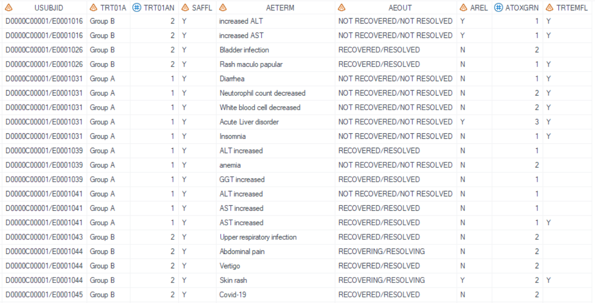
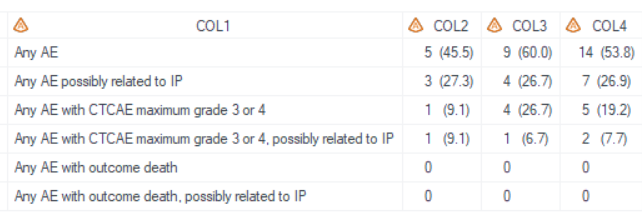
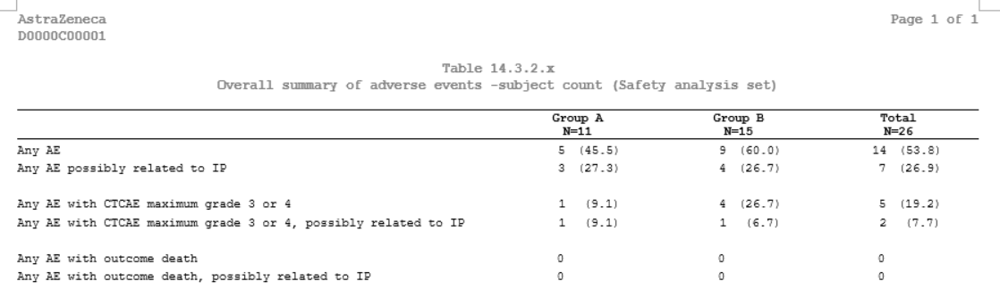
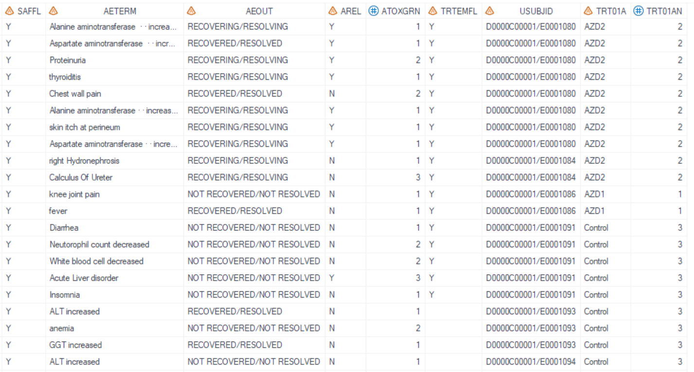
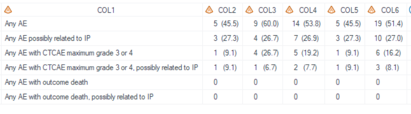
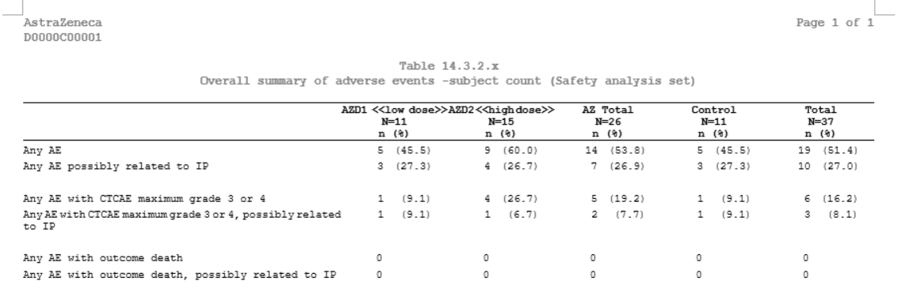
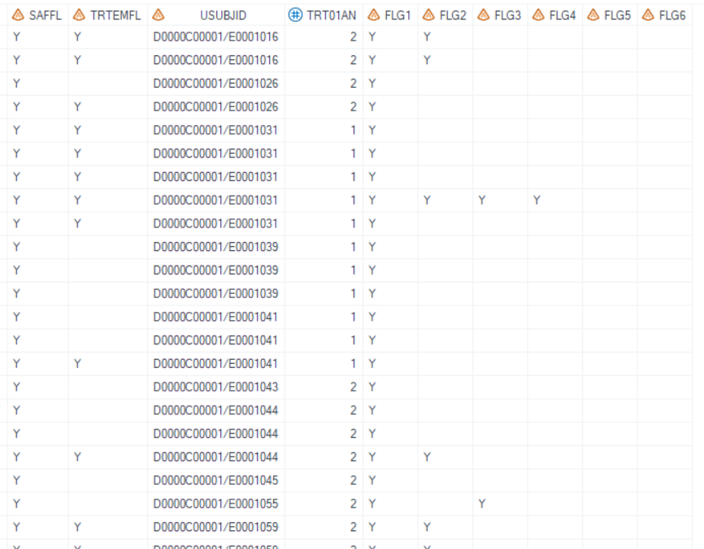
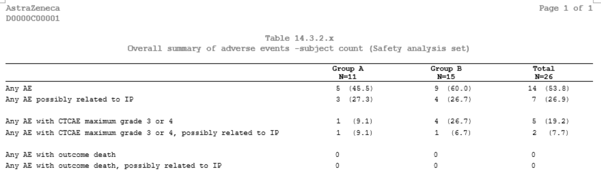

# Example

[Example 1 Overall summary of adverse events-Monotherapy](#example-1-overall-summary-of-adverse-events-monotherapy)<br>
[Example 2 Overall summary of adverse events-Combination Therapy](#example-2-overall-summary-of-adverse-events-combination-therapy)<br>
[Example 3 Overall summary of adverse events-flag variables in input dataset](#example-3-overall-summary-of-adverse-events-flag-variables-in-input-dataset)<br>

---

## Example 1 Overall summary of adverse events-Monotherapy

**Details**

This example does the following:<br>
Display overall summary of adverse events in monotherapy treatment group, following the template of [AZTONCAE01A](https://azcollaboration.sharepoint.com/sites/O-GEM2/Shared%20Documents/General/O-GEM%20Index.xlsx?d=wb25d071b4025404caf18f0d7487c4b1d&csf=1&web=1&e=QW1GYF&nav=MTVfe0M4ODdCQTZGLUUxM0UtNDI4MC05ODZGLUJCRDM2OUQ2OUFBQ30).<br>

**Program**

```sas
* Call %m_t_ae_sum;
%m_t_ae_sum(inds= adam.adae
    , merge_adsl = adam.adsl
    , pop_flag = %str(SAFFL="Y")
    , whr = %str(TRTEMFL="Y")
    , pop_mvar = saspopb
    , trtgrpN = TRT01AN
    , denominator = 
    , total_YN = Y
    , data_order_list = %str(1|1|2|2|3|3)
    , flg_list =
    , where_list = %str(not missing(AETERM)
            |AREL="Y"
            |ATOXGRN in (3, 4)
            |ATOXGRN in (3, 4) and AREL="Y"
            |AEOUT="FATAL"
            |AEOUT="FATAL" and AREL="Y"
            )
    , label_list= %str(Any AE
            |Any AE possibly related to IP
            |Any AE with CTCAE maximum grade 3 or 4
            |Any AE with CTCAE maximum grade 3 or 4, possibly related to IP
            |Any AE with outcome death
            |Any AE with outcome death, possibly related to IP
            )										
    , lenlist = 6#2#2#2
    , justlist = l#c#c#c
    , justlist_header = l#c#c#c
    , nolblist = Y#N#N#N
    , orderlist =	
    , defcol =
    , pg = 20
    , sfx = saf
    , debug = Y
    );

```

**Program Description**

***Input data feature***<br>
Input dataset adam.adae contains all variables used in the macro, including USUBJID, SAFFL, TRT01AN, TRTEMFL, AETERM, AREL, AEOUT, and ATOXGRN.


***Parameter description***<br>
1. For the `where_list`, there are 6 filter conditions which separated by "|", each filter corresponding to each row.<br>

2. For the `label_list`, there are 6 displayed texts which separated by "|", and corresponding to the filter condition in `where_list`.<br>

3. The `data_order_list` set to "1|1|2|2|3|3", means that each row of `where_list` are assign to value 1, 1, 2, 2, 3, 3, respectively. The rows with the same value will be regarded as a block, and will be separated by a blank row in *.rtf output. The sorting order is also based on the value.<br> 

4. By setting `sfx = saf` with the program name being "t_ae_sum" in this example, the resulting output files will be named as "t_ae_sum_saf.sas7bdat" and "t_ae_sum_saf.rtf".<br>

**Output**

***Output Dataset***<br>
Generate output datasets "work.final2qc.sas7bdat" and "tlf.t_ae_sum_saf.sas7bdat" (These two datasets are exactly the same dataset and used for QC), and "work.final2output.sas7bdat" (used in proc report process).<br>
The dataset for QC includes variables from COL1 to COL4. COL1 is the `label_list` and COL2-COL4 are result columns of treatment groups.<br>


***Output rtf***<br>
Corresponding "t_ae_sum_saf.rtf" is generated. It is a simple AE summry table which contain 6 rows and 4 columns.<br>


---


## Example 2 Overall summary of adverse events-Combination Therapy

**Details**

This example does the following:<br>
Display overall summary of adverse events in combination therapy group, following the template of [AZTONCAE01A](https://azcollaboration.sharepoint.com/sites/O-GEM2/Shared%20Documents/General/O-GEM%20Index.xlsx?d=wb25d071b4025404caf18f0d7487c4b1d&csf=1&web=1&e=QW1GYF&nav=MTVfe0M4ODdCQTZGLUUxM0UtNDI4MC05ODZGLUJCRDM2OUQ2OUFBQ30).<br>

**Program**

```sas
proc format;
        value _trtfmtb 
        1 = "AZD1 <<low dose>>" 
        2 = "AZD2 <<high dose>>" 
        3 = "AZ Total" 
        4 = "Control" 
        5 = "Total" 
  ;
quit;

%m_u_popn(inds=adam.adsl
    , pop_flag = %str(SAFFL="Y")  
    , trtgrpn = TRT01AN
    , trtlev = %str(1 | 2 | 1 2 | 3 | 1 2 3)
    , UniqueIDVars= USUBJID  
    , trtfmtC = _trtfmtb
    , gmacro = saspopb_a
    , BigN = Y
    , nformat = %str(n (%%)) 
); 


* Call %m_t_ae_sum;
%m_t_ae_sum(inds= adam.adae
    , merge_adsl = adam.adsl
    , pop_flag = %str(SAFFL="Y")
    , whr = %str(TRTEMFL="Y")
    , pop_mvar = saspopb_a
    , trtgrpN = TRT01AN
    , denominator = 
    , total_YN = Y
    , data_order_list = %str(1|1|2|2|3|3)
    , flg_list =
    , where_list = %str(not missing(AETERM)
            |AREL="Y"
            |ATOXGRN in (3, 4)
            |ATOXGRN in (3, 4) and arel="Y"
            |AEOUT="FATAL"
            |AEOUT="FATAL" and AREL="Y"
            )
    , label_list= %str(Any AE
            |Any AE possibly related to IP
            |Any AE with CTCAE maximum grade 3 or 4
            |Any AE with CTCAE maximum grade 3 or 4, possibly related to IP
            |Any AE with outcome death
            |Any AE with outcome death, possibly related to IP
            )										
    , lenlist = 6#2#2#2#2#2
    , justlist = l#c#c#c#c#c
    , justlist_header = l#c#c#c#c#c
    , nolblist = Y#N#N#N#N#N
    , orderlist =		
    , defcol =
    , pg = 20
    , sfx = saf
    , debug = Y
    );

```

**Program Description**

***Input data feature***<br>
It is similar to Example 1, only the treatment group is different. There are only 3 treatment levels in input dataset (TRT01AN=1: AZD1; TRT01AN=2: AZD2; TRT01AN=3: Control). <br>


***Parameter description***<br>
1. If need to calculate results for subtotal group, then the 'pop_mvar' should be fed the correpsonding 'gmacro' pre-defined in  %m_u_popn.  For example, when need to display 'AZD1 <<low dose>>', 'AZD2 <<high dose>>', 'AZ Total', 'Control', 'Total', the `trtlev` in %m_u_popn should be "1 | 2 | 1 2 | 3 | 1 2 3", the 1st group is TRT01AN in (1), 2nd group is TRT01AN in (2), 3rd group is TRT01AN in (1, 2), and so on. In this example, the `gmacro` is set to "saspopb_a", which will be used for `pop_mvar` in %m_t_ae_sum.<br>

2. Reporting-related parameter `lenlist`, `justlist`, `justlist_header` are updated accordingly based on the number of column.<br>

3. Other parameters is same as that in Example 1, no need to change. The macro will calculate for each group automatically.<br>

**Output**<br>

***Output Dataset***<br>
Generate output datasets "work.final2qc.sas7bdat" and "tlf.t_ae_sum_saf.sas7bdat" (These two datasets are exactly the same dataset and used for QC), and "work.final2output.sas7bdat" (used in proc report process).<br>
The dataset for QC includes variables from COL1 to COL6. COL1 is the `label_list` and COL2-COL6 are results for treatment groups. COL2-COL3 are AZD1 treatment groups. COL4 is subtotal group of AZD1 and AZD2 treatment. COL5 is then control group. COL6 is total treatment group of AZD1, AZD2, and control treatment.<br>


***Output rtf***<br>
Corresponding "t_ae_sum_saf.rtf" is generated.<br>


---


## Example 3 Overall summary of adverse events-flag variables in input dataset

**Details**

This example does the following:<br>
Use `flg_list` option, which specifies the flag varaibles exist in input dataset, to summary of adverse events, following the template of [AZTONCAE01A](https://azcollaboration.sharepoint.com/sites/O-GEM2/Shared%20Documents/General/O-GEM%20Index.xlsx?d=wb25d071b4025404caf18f0d7487c4b1d&csf=1&web=1&e=QW1GYF&nav=MTVfe0M4ODdCQTZGLUUxM0UtNDI4MC05ODZGLUJCRDM2OUQ2OUFBQ30).<br>

**Program**

```sas
* Call %m_t_ae_sum;

%m_t_ae_sum(inds= adae
    , merge_adsl = adam.adsl
    , pop_flag = %str(SAFFL="Y")
    , whr = %str(TRTEMFL="Y")
    , pop_mvar = saspopb
    , trtgrpN = TRT01AN
    , denominator = 
    , total_YN = Y
    , DATA_ORDER_LIST = %str(1|1|2|2|3|3)
    , flg_list = %str(FLG1 FLG2 FLG3 FLG4 FLG5 FLG6)
    , label_list= %str(Any AE
            |Any AE possibly related to IP
            |Any AE with CTCAE maximum grade 3 or 4
            |Any AE with CTCAE maximum grade 3 or 4, possibly related to IP
            |Any AE with outcome death
            |Any AE with outcome death, possibly related to IP
            )										
    , lenlist = 6#2#2#2
    , justlist = l#c#c#c
    , justlist_header = l#c#c#c
    , nolblist = Y#N#N#N
    , orderlist =	
    , defcol =
    , pg = 20
    , sfx = saf
    , debug = Y
    );

```

**Program Description**

***Input data feature***<br>
Same as Example 1,  `flag_list` could also be used instead of  `where_list` to generate the summary table. The input dataset includes variables FLG1 through FLG6, with the following conditions for each flag:<br>
For FLG1: aeterm is not missing.<br>
For FLG2: arel equals "Y".<br>
For FLG3: atoxgrn is within the set (3, 4).<br>
For FLG4: atoxgrn is within the set (3, 4) and arel equals "Y".<br>
For FLG5: aeout is "FATAL".<br>
For FLG6: aeout is "FATAL" and arel equals "Y". <br>

    
***Parameter description***<br>
1. For the `flg_list`, list the flag varibales needed and separated by spaces. Variables name must be named as FLGxx, xx means 1-6.<br>

2. For the `label_list`, there are 6 displayed texts which separated by "|", and corresponding to the variable list in `flg_list`.<br>

3. The `data_order_list` set to "1|1|2|2|3|3", means that each row of `flg_list` are assign to value 1, 1, 2, 2, 3, 3, respectively. The rows with the same value will be regarded as a block, and will be separated by a blank row in *.rtf output. The sorting order is also based on the value.<br> 

**Output**

***Output Dataset***<br>
Generate output datasets "work.final2qc.sas7bdat" and "tlf.t_ae_sum_saf.sas7bdat"(These two datasets are exactly the same dataset and used for QC), and "work.final2output.sas7bdat" (used in proc report process).<br>
The dataset for QC includes variables from COL1 to COL4. COL1 is the `label_list` and COL2-COL6 are results for treatment groups.<br>
The dataset is exact same as Example 1 since the conditions are all the same. However, this example offers an alternative approach for summarizing the data.<br>


***Output rtf***<br>
Corresponding "t_ae_sum_saf.rtf" is generated.<br>


---