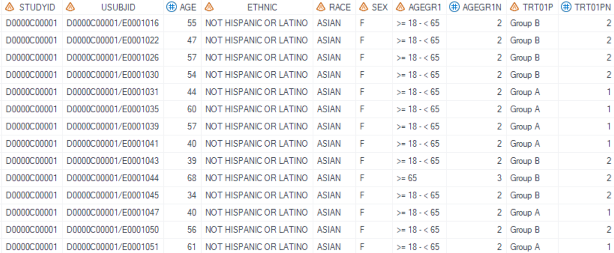
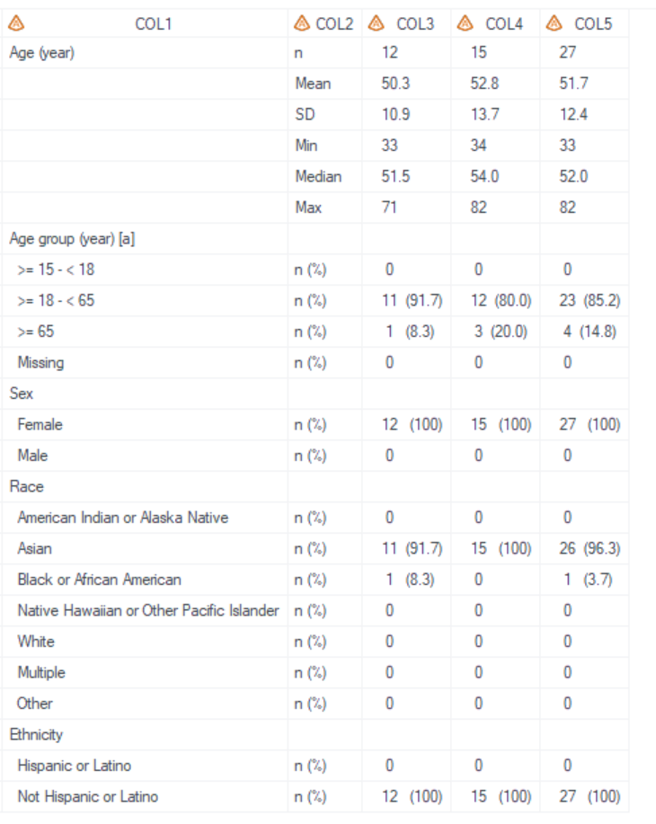
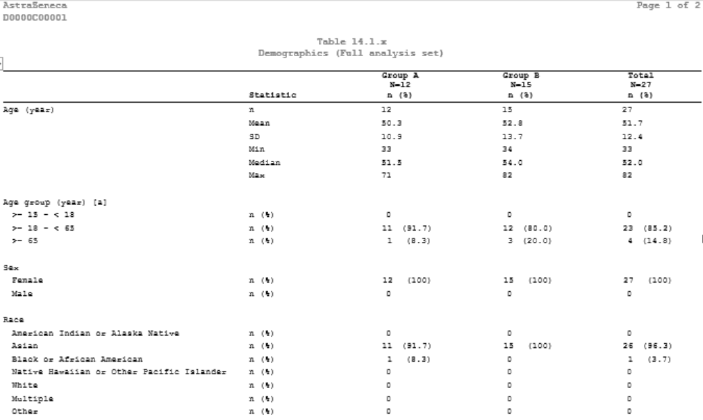
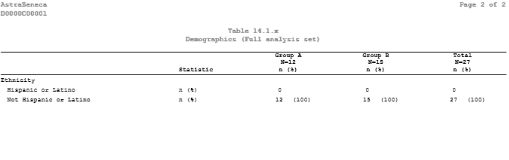

# Example

[Example Descriptive statistics of Demographics](#example-descriptive-statistics-of-demographics)<br>

---

## Example Descriptive statistics of Demographics

**Details**<br>

This example does the following:<br>
Output descriptive statistics of demographics, following the template of [AZTSP08](https://azcollaboration.sharepoint.com/sites/O-GEM2/Shared%20Documents/General/O-GEM%20Index.xlsx?d=wb25d071b4025404caf18f0d7487c4b1d&csf=1&web=1&e=RlCOTk&nav=MTVfezhBNEE0RTc5LUM3MEEtNEY0Ri1BNUYxLUU2QzcwNEVGQzYzMn0).

**Program**

```sas
%**Proc format used in TLF **;
 proc format; 
	value $gender (notsorted)
	"F"="Female"
	"M"="Male"
	;
	value age1_cat (notsorted)
	1=">= 15 - < 18"
	2=">= 18 - < 65"
	3=">= 65"
	4="Missing"
	;
	value $race (notsorted)
	'AMERICAN INDIAN OR ALASKA NATIVE'='American Indian or Alaska Native'
	'ASIAN'='Asian'
	'BLACK OR AFRICAN AMERICAN'='Black or African American'
	'NATIVE HAWAIIAN OR OTHER PACIFIC ISLANDER'='Native Hawaiian or Other Pacific Islander'
	'WHITE'='White'
	'MULTIPLE'='Multiple'
	'OTHER'='Other'
	;
	value $ethnic (notsorted)
	'HISPANIC OR LATINO'='Hispanic or Latino'
	'NOT HISPANIC OR LATINO'='Not Hispanic or Latino'
	;
quit;

%m_t_dm(
	/*Result Setting*/
	inds = ADAM.ADSL
	, whr =
	, pop_flag = FASFL="Y"
	, trtgrpn = TRT01PN
	, pop_mvar=FASpopb
	, varlist_cat = AGEGR1N SEX  RACE ETHNIC
	, varlist_cont = AGE 
	, output_order = AGE  AGEGR1N SEX RACE ETHNIC
	, formatlist = format AGEGR1N age1_cat. SEX $gender. RACE $race. ETHNIC $ethnic.
	, labellist = label AGE='Age (year)' AGEGR1N='Age group (year) [a]' SEX='Sex' RACE='Race' ETHNIC='Ethnicity'
	, exclude_stat =
	
	/*Report Setting*/
	, lenlist = 31#17#17#17#17   
	, justlist= l#l#c#c#c
	, justlist_header= l#l#c#c#c
	, nolblist= Y#N#N#N#N
	, orderlist= Y#N#N#N#N
	, defcol=
    , pg=21
    , sfx = fas
	, deBug = Y
	);
```

**Program Description**

***Input data feature***<br> 
A dataset with a standard per-subject structure serves as the input, with USUBJID, TRT01PN, SAFFL, analysis variables AGEGR1N, SEX, RACE, ETHNIC, and AGE present as columns within the dataset.<br> 


***Parameter description***<br>
1. `output_order = AGE  AGEGR1N SEX RACE ETHNIC` defines the display order of variables in output.<br>
   
2. For continuous variable AGE , the decimal is determined by values in `inds`. The default value `decimal_list=` will be used. (Refer [Example 3 for %m_u_desc_stat_grp_mix](../../analysis/m_u_desc_stat_grp_mix/m_u_desc_stat_grp_mix_examp.md) for other usage)<br>

3. The `formatlist` option indicates the row text for categorical variables, ensuring all format values are displayed; if not specified, only the values present in the dataset will be shown. Meanwhile, `labellist` is used to define the leading text that appears in the report.

4. By setting `sfx = fas` with the program name being "t_dm" in this example, the resulting output files will be named as "t_dm_fas.sas7bdat" and "t_dm_fas.rtf".<br>

**Output**<br>

***Output Dataset***<br>
Generate output datasets "work.final2qc.sas7bdat" and "tlf.t_dm_fas.sas7bdat" (These two datasets are exactly the same dataset and used for QC), and "work.final2output.sas7bdat" (used in proc report process).<br>
The dataset for QC includes variables from COL1 to COL5. COL1 is the `labellist` and `formatlist`. COL2 contains the names of statistics, and the results for the treatment groups start from COL3.<br>
<br>
 
***Output rtf***<br>
Corresponding "t_dm_fas.rtf" is generated.<br>  
<br>
<br>

 

