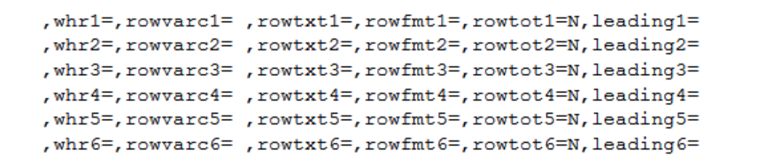

# Syntax

%m_t_lb_hyslaw(<br>
[***inds***=&lt;input-data-set&gt;](#inds), <br>
[***pop_flag***=&lt;filtered-population-condition&gt;](#popflag),<br>
[***whr***=&lt;additional-filtered-condition&gt;](#whr),<br>
[***pop_mvar***=&lt;macro-prefix-label-for-treatment(s)&gt;](#popmvar),<br>
[***trtgrpn***=&lt;numeric-treatment-variable&gt;](#trtgrpn),<br>
[***trtTot***=&lt;Y|N (total treatment needed or not)&gt;](#trttot),<br>
[***UniqueIDVars***=&lt;unique-identifier-variable&gt;](#uniqueidvars),<br>
[***whrXX***=&lt;filtered-condition-for-XX-block&gt;](#whrxx),<br>
[***rowvarcXX***=&lt;row-variable-for-XX-block&gt;](#rowvarcxx),<br>
[***rowtxtXX***=&lt;leading-texts-for-XX-block&gt;](#rowtxtxx),<br>
[***rowfmtXX***=&lt;format-for-XX-block&gt;](#rowfmtxx),<br>
[***rowtotXX***=&lt;Y|N (total row needed or not for XX block)&gt;](#rowtotxx),<br>
[***leadingXX***=&lt;Y|N (leading texts needed or not for XX block)&gt;](#leadingxx),<br>
[***colvarc***=&lt;column-variable&gt;](#colvarc),<br>
[***colfmt***=&lt;format-of-column-variable&gt;](#colfmt),<br>
[***colTot***=&lt;Y|N (total column needed or not)&gt;](#coltot),<br>
[***lenlist***=&lt;list-of-column-width&gt;](#lenlist),<br>
[***headerlist***=&lt;list-of-label-for-first-3-columns&gt;](#headerlist),<br>
[***above_header***=&lt;above-header-for-last-columns&gt;](#aboveheader),<br>
[***pg***=&lt;maximum-rows-per-page&gt;](#pg),<br>
[***sfx***=&lt;suffix&gt;](#sfx),<br>
[***deBug***=&lt;Y|N&gt;](#debug)<br>
)
;

---
# Parameter

## Control input


#### inds
specifies the input data set.<br>

Item|Contents
:---|:---
Default|
Value| A one or two level dataset name. 
Requirement|Mandatory
Restriction|
Interaction|
Eg.|`adlb` <br>`adam.adlb`

#### pop_flag
specifies filtered population, condition used in where statement.<br>

Item|Contents
:---|:---
Default|
Value|
Requirement|Optional
Restriction|
Interaction|Filter input dataset for `inds`
Eg.|`SAFFL="Y" `

#### whr
specifies additional filtered condition used in where statement.<br>

Item|Contents
:---|:---
Default|
Value|
Requirement|Optional
Restriction|
Interaction|Condition used to further filter the input dataset `inds`, which has already been filtered by `pop_flag`.
Eg.|`TRT01AN in (1 2 3) `

## Control analysis

#### pop_mvar
specifies the macro variable used to class different groups which will be displayed as headers or contents.<br>

Item|Contents
:---|:---
Default|
Value|
Requirement|Mandatory
Restriction|This should be the same as the `gmacro` in [%m_u_popn](../../utility/m_u_popn/m_u_popn_descp.md).
Interaction|Same as `pop_mvar` in [%m_u_cross_occn](../../analysis/m_u_cross_occn/m_u_cross_occn_param.md).
Eg.|`saspopb`

#### trtgrpn
specifies the treatment variable(N).<br>

Item|Contents
:---|:---
Default|
Value|
Requirement|Mandatory
Restriction|Type of `trtgrpn` is numeric.
Interaction|Same as `trtgrpn` in [%m_u_cross_occn](../../analysis/m_u_cross_occn/m_u_cross_occn_param.md).
Eg.|`TRT01AN`

#### trtTot
specifies whether display total treatment or not. If leave it as null or not to state it, the default values will be used.<br>

> **Note:**<br>
>Recommend not to change the structure of `inds` dataset to include total group (more details for total group calculation refer to [%m_u_popn](../../utility/m_u_popn/m_u_popn_descp.md)).<br>
> If in `inds`, `trtgrpn` doesn't include total group but need to display, then `trtTot=Y` (The last format value of `pop_mvar` defined by %m_u_popn should be the total group).<br>
> If `trtgrpn` already includes total group in `inds`, then if the last format value of `pop_mvar` is total group, `trtTot=N`; else if the last format value of `pop_mvar` is not the total group, `trtTot=Y`.<br>

Item|Contents
:---|:---
Default|`N`
Value| `Y, N` (not case sensitive)
Requirement|Optional
Restriction|
Interaction| If "Y", the last group defined in `pop_mvar` will be treated as total group and kept. If "N", the last group defined in `pop_mvar` will be treated as total group and deleted. Thus, if "Y", the last format value should be the total group in `pop_mvar`.
Eg.|`N`

#### UniqueIDVars
specifies unique variables to count number of population for different groups. If leave it as null or not to state it, the default values will be used.<br>

Item|Contents
:---|:---
Default|`USUBJID`
Value|
Requirement|Optional
Restriction|
Interaction|Same as `UniqueIDVars` in [%m_u_cross_occn](../../analysis/m_u_cross_occn/m_u_cross_occn_param.md).
Eg.|`USUBJID`

**Block parameters for row: Start**<br>
>Note: As this macro allows different filter conditions for a dataset to be summarized with different display formats for the row section. These Parameters are as follows, with XX representing the variable's display sequence in the final table, where XX=1, 2, ..., 6.<br>
<br>

#### whrXX
specifies filter condition for XX block. Note: XX denotes 1 to 6.<br>

Item|Contents
:---|:---
Default|
Value|
Requirement|Optional
Restriction|
Interaction|Same as `whrXX` in [%m_u_cross_occn](../../analysis/m_u_cross_occn/m_u_cross_occn_param.md).
Eg.|`LBTESTCD_ in ("ALT")`

#### rowvarcXX
specifies the variable storing the row categories. Note: XX denotes 1 to 6.<br>

Item|Contents
:---|:---
Default|
Value|
Requirement|Mandatory
Restriction|
Interaction|Same as `rowvarcXX` in [%m_u_cross_occn](../../analysis/m_u_cross_occn/m_u_cross_occn_param.md).
Eg.|`ROWVARC1`

#### rowtxtXX
specifies leading texts for XX block, if blank then will display the variable name `rowvarcXX`. Note: XX denotes 1 to 6.<br>

Item|Contents
:---|:---
Default|
Value|
Requirement|Optional
Restriction|
Interaction|Same as `rowtxtXX` in [%m_u_cross_occn](../../analysis/m_u_cross_occn/m_u_cross_occn_param.md).
Eg.|`ALT`

#### rowfmtXX
specifies format of row variable aiming to add the order for the display sequence and also the contents, should be created before calling this macro. If null, then will use the values of `rowvarcXX`. Note: XX denotes 1 to 6.<br>

```
proc format;
	value _t_lb_hyslaw_rowc
	1="<3xULN"
	2=">=3 - <5xULN"
	3=">=5 - <10xULN"
	4=">=10xULN"
	;
```

Item|Contents
:---|:---
Default|
Value|
Requirement|Optional
Restriction|`rowfmt` should start with 1 and increase consecutively.
Interaction|`rowfmtXX` should include 'Total' as the last value when `rowTotXX=Y`.<br>Same as `rowfmtXX` in [%m_u_cross_occn](../../analysis/m_u_cross_occn/m_u_cross_occn_param.md).
Eg.|`_t_lb_hyslaw_rowc`

#### rowtotXX
specifies whether to need total row or not for XX block. Note: XX denotes 1 to 6. If leave it as null or not to state it, the default values will be used.<br>

Item|Contents
:---|:---
Default|`N `
Value|`Y, N `
Requirement|Optional
Restriction|
Interaction|If `rowTotXX`=Y then the `rowfmtXX`should be specified and include 'Total' as the last value.<br>Same as `rowtotXX` in [%m_u_cross_occn](../../analysis/m_u_cross_occn/m_u_cross_occn_param.md).
Eg.|`N`

#### leadingXX
specifies whether to display the leading texts for XX block. Note: XX denotes 1 to 6. If leave it as null or not to state it, the default values will be used.<br>

Item|Contents
:---|:---
Default|`N`
Value|`Y, N `
Requirement|Optional
Restriction|
Interaction|
Eg.|`Y`

**Block parameters for row: End**<br>

#### colvarc
specifies column variable. <br>

Item|Contents
:---|:---
Default|
Value|
Requirement|Mandatory
Restriction|
Interaction|Same as `colvarc` in [%m_u_cross_occn](../../analysis/m_u_cross_occn/m_u_cross_occn_param.md).
Eg.|`COLNUMC`

#### colfmt
specifies format of column variable aiming to add the order for the display sequence and also the contents, should be created before calling this macro. If null, then will use the format created automatically in the macro.<br>

```sas
proc format;
	value _t_lb_hyslaw_colc
	1="<2xULN"
	2=">=2xULN"
	;
run;
```

Item|Contents
:---|:---
Default|
Value|
Requirement|Optional
Restriction|`colfmt` should start with 1 and increase consecutively.
Interaction|`colfmt` should include 'Total' as the last value when `colTot=Y`.<br>Same as `colfmt` in [%m_u_cross_occn](../../analysis/m_u_cross_occn/m_u_cross_occn_param.md).
Eg.|`_t_lb_hyslaw_colc`

#### colTot
specifies whether total column is needed or not. If leave it as null or not to state it, the default values will be used.<br>

Item|Contents
:---|:---
Default|`N `
Value|`Y, N `
Requirement|Optional
Restriction|
Interaction|If `colTot=Y` then the `colfmt` should be specified and include 'Total' as the last value.<br>Same as `colTot` in [%m_u_cross_occn](../../analysis/m_u_cross_occn/m_u_cross_occn_param.md).
Eg.|`N`

## Control reporting

> **Note:**<br>
> Header and contents of the first 3 columns are left aligned. The rest of columns are centered aligned.
> Header of columns except first 3 columns are the same as the format of `colfmt`.<br>

> More details of `lenlist` and `pg` could refer  [%m_u_report](../../utility/m_u_report/m_u_report_param.md).<br>
 
#### lenlist
specifies the width proportion for each column. The lengths should be separated by "#" and their sum should be less than or equal to 99 per page. If this parameter is not provided, then column length will be calculated in macro automatically. The current algorithm for automatically calculating column widths is not yet mature enough. It is recommended that users manually adjust based on the output situation of RTF.<br>

Item|Contents
:---|:---
Default|Auto-assigned based on the length of header/content for each column.
Value|
Requirement|Optional
Restriction|If specified, all columns must be assigned with value respectively, the number of values separated by "#" must be equal to the number of columns.
Interaction|Same as `lenlist` in [%m_u_report](../../utility/m_u_report/m_u_report_param.md).
Eg.|`15#29#20#20#14`

#### headerlist
specifies the label for first 3 columns, separated by '#', If null, then would be set to Group#Nobs#.<br>

Item|Contents
:---|:---
Default|
Value|
Requirement|Mandatory
Restriction|
Interaction|
Eg.|`Group#Nobs#`

#### above_header
specifies above header for last columns, Eg. 'Total bilirubin'. If null, then would be set to 'Total bilirubin'.<br>

Item|Contents
:---|:---
Default|
Value|
Requirement|Mandatory
Restriction|
Interaction|
Eg.|`Total bilirubin`

#### pg
specifies the maximum number of rows displayed per page in the report.<br>

Item|Contents
:---|:---
Default|
Value|
Requirement|Mandatory
Restriction|
Interaction|Same as `pg` in [%m_u_report](../../utility/m_u_report/m_u_report_param.md).
Eg.|`18`

#### sfx
specifies the suffix for the output file. If multiple outputs are generated in one code, then sfx is used to distinguish the outputs.<br>

Item|Contents
:---|:---
Default|
Value|
Requirement|Mandatory
Restriction|
Interaction|
Eg.|`saf`

## Control debug

#### deBug
specifies whether need to debug or not, if not "Y" then intermediate datasets will be deleted. If leave it as null or not to state it, the default values will be used.<br>

Item|Contents
:---|:---
Default|`N`
Value|`Y, N` (not case sensitive)
Requirement|Optional
Restriction|
Interaction|
Eg.|`N`

