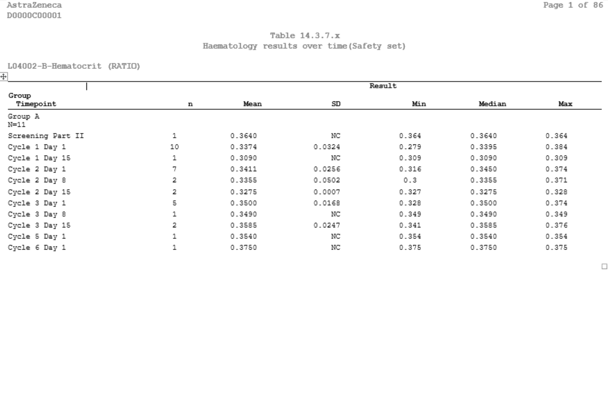
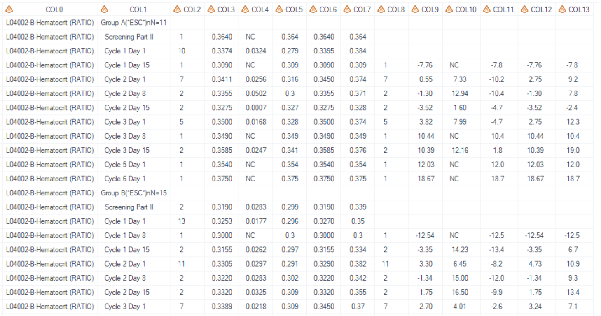
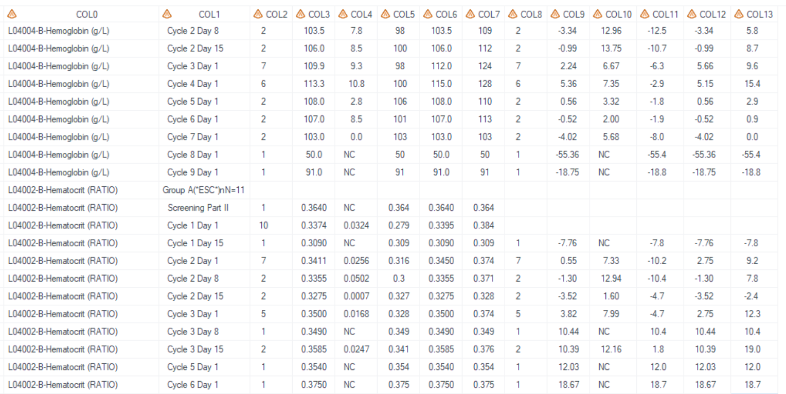

# Example

[Example 1 Create haematology results over time table with the wide page](#example-1-create-haematology-results-over-time-table-with-the-wide-page)<br>
[Example 2 Create haematology results over time table-resize the wide page by analysis variables](#example-2-create-haematology-results-over-time-table-resize-the-wide-page-by-analysis-variables)<br>
[Example 3 Create haematology results over time table-resize-the-wide page by custom column division](#example-3-create-haematology-results-over-time-table-resize-the-wide-page-by-custom-column-division)<br>
[Example 4 Create haematology results over time table-sort by paramn](#example-4-create-haematology-results-over-time-table-sort-by-paramn)<br>

---

## Example 1 Create haematology results over time table with the wide page

**Details**<br>

This example does the following:<br>
Generate the over time reuslts for haematology, following the template [AZTLB01](https://azcollaboration.sharepoint.com/sites/O-GEM2/Shared%20Documents/General/O-GEM%20Index.xlsx?d=wb25d071b4025404caf18f0d7487c4b1d&csf=1&web=1&e=QlIe8J&nav=MTVfezJBM0UxMDk1LTUxMUQtNDM1Ri04RDMyLTgxQzZDQTJDRTg0Mn0), all results displayed in one page.

**Program**

```sas
%** Call display macros **;
%m_t_nested_cont(inds=adam.adlb
	,pop_flag=SAFFL = 'Y'
	,whr=%str( (ANL01FL='Y' ) and not missing(AVAL) and PARCAT1 =  "HEMATOLOGY")
	,varlist=AVAL#PCHG
	,paramVar=PARAM
	,trtgrpn=TRT01AN
	,pop_mvar=saspopb
	,trtTot=Y
	,pageBy=PARAM
	,timepVar=AVISIT
	,timepVarN=AVISITN
	,decimBy=PARAM
	,decim=indata#1
	,statsmiss=NC
	,exclude_stats=	Q1 Q3 
    ,lenlist=15#5#7#9#7#7#7#5#7#9#7#7#7
	,idpageYN=N
	,lablist    =  Group(*ESC*)n  Timepoint
    ,headerlist= Result#Percent change from baseline
	,pg=12
	,pg_byvar= Y
	,sfx=haem_saf
	,deBug=N
	); 
```

**Program Description** <br>

***Input data feature***<br>
The adam.adlb dataset is utilized as the input. The variables specified in `varlist= AVAL#PCHG`, `paramVar=PARAM`, `trtgrpn=TRT01AN`, `timepVar=AVISIT`, `timepVarN=AVISITN`, along with any other variables referred in the filter conditions, must be present within the input dataset.
<br>


***Parameter description***<br>
1. Calculate treatment group through parameter `pop_mvar=saspop` <br>
Global macro `saspopb` which includes total group, is created in [%m_u_popn](../../utility/m_u_popn/m_u_popn_descp.md) which should be executed prior to invoking this macro.<br>

2. Sort order and page by order<br>
Set `paramVar=param` to make parameters presented in alphabetical order. Use `pageBy=param` to control pagination by param. <br>

3. Summary statisctic<br>
`decim=indata#1` show that decimal places for AVAL depends on the values in dataset, and decimal place is 1 for PCHG variable. If missing statistics, `NC` will be displayed. Statistics(n, Mean, SD, Min, Median, and Max) are generated since `exclude_stats=Q1 Q3` is stated. <br>

4. Analysis varibles and pagination<br>
`idpageYN=N` specifies that all AVAL and PCHG summary results are displayed in the same page when `idpageYN=N` and `idpage` option is not stated.<br>
`pg_byvar= Y` and `pageBy=param` option indicate that a new page will be created whenever a new PARAM is encountered to ensure the correct pagination for each PARAM. <br>

5. By setting `sfx = haem_saf` with the program name being "t_lb" in this example, the resulting output files will be named as "t_lb_haem_saf.sas7bdat" and "t_lb_haem_saf.rtf".<br>

**Output**<br>
***Output Dataset***<br>
Generate output datasets "work.final2qc.sas7bdat" and "tlf.t_lb_haem_saf.sas7bdat" (These two datasets are exactly the same dataset and used for QC), and "work.final2output.sas7bdat" (used in proc report process).<br>
The dataset for QC contains treatment, visit, and descriptive statistic results, with COL0 storing the value for `pageBy`, which is utilized in the subtitle in rtf report.<br>

<br>

***Output rtf***<br>
Corresponding "tlf.t_lb_haem_saf.rtf" is generated. All columns are displayed in the same page.<br>
<br>

Total treatment group is calcualted in this macro by using the `trtTot=Y` option.<br>
<br>

---


## Example 2 Create haematology results over time table-resize the wide page by analysis variables

**Details**<br>

This example does the following:<br>
Generate the over time reuslts for haematology, following the template  [AZTLB01](https://azcollaboration.sharepoint.com/sites/O-GEM2/Shared%20Documents/General/O-GEM%20Index.xlsx?d=wb25d071b4025404caf18f0d7487c4b1d&csf=1&web=1&e=QlIe8J&nav=MTVfezJBM0UxMDk1LTUxMUQtNDM1Ri04RDMyLTgxQzZDQTJDRTg0Mn0), page by analysis variables.

**Program**

```sas
%** Call display macros **;
%m_t_nested_cont(inds=adam.adlb
	,pop_flag=SAFFL = 'Y'
	,whr=%str( (ANL01FL='Y' ) and not missing(AVAL) and PARCAT1 =  "HEMATOLOGY")
	,varlist=AVAL#PCHG
	,paramVar=PARAM
	,trtgrpn=TRT01AN
	,pop_mvar=saspopb
	,pageBy=PARAM
	,timepVar=AVISIT
	,timepVarN=AVISITN
	,decimBy=PARAM
	,decim=indata#1
	,statsmiss=NC
	,exclude_stats=	Q1 Q3 
    ,lenlist=15#5#7#9#7#7#7#5#7#9#7#7#7
	,idpageYN=Y
	,lablist    =  Group(*ESC*)n  Timepoint
    ,headerlist= Result#Percent change from baseline
	,pg=12
	,pg_byvar= Y
	,sfx=haem_saf
	,deBug=N
	); 
 
```
**Program Description** <br>
***Input data feature***<br>
Input dataset is exactly same as the dataset used in Example 1.<br>
<br>

***Parameter description***<br>
Similar to Example 1 but by providing `idpageYN=Y` option to resize the wide page with too many result columns to fit in one page. <br>

**Output**<br>

***Output Dataset***<br>
Output dataset is exactly same as the output dataset in Example 1.<br>
<br>

***Output rtf*** <br>
Corresponding "t_lb_haem_saf.rtf" is generated, while results are presented on different pages.<br>


	
<br>

---


## Example 3 Create haematology results over time table-resize the wide page by custom column division

**Details**<br>

This example does the following:<br>
Generate the over time reuslts for haematology, following the template  [AZTLB01](https://azcollaboration.sharepoint.com/sites/O-GEM2/Shared%20Documents/General/O-GEM%20Index.xlsx?d=wb25d071b4025404caf18f0d7487c4b1d&csf=1&web=1&e=QlIe8J&nav=MTVfezJBM0UxMDk1LTUxMUQtNDM1Ri04RDMyLTgxQzZDQTJDRTg0Mn0), page by custom column division.

**Program**

```sas
%** Call display macros **;
%m_t_nested_cont(inds=adam.adlb
	,pop_flag=SAFFL = 'Y'
	,whr=%str( (ANL01FL='Y' ) and not missing(AVAL) and PARCAT1 =  "HEMATOLOGY")
	,varlist=AVAL#PCHG
	,paramVar=PARAM
	,trtgrpn=TRT01AN
	,pop_mvar=saspopb
	,pageBy=PARAM
	,timepVar=AVISIT
	,timepVarN=AVISITN
	,decimBy=PARAM
	,decim=indata#1
	,statsmiss=NC
	,exclude_stats=	Q1 Q3 
    ,lenlist=15#5#7#9#7#7#7#5#7#9#7#7#7
	,idpage= N#N#N#N#Y#N#N#Y#N#N#Y#N#N
	,lablist    =  Group(*ESC*)n  Timepoint
    ,headerlist= Result#Percent change from baseline
	,pg=12
	,pg_byvar= Y
	,sfx=haem_saf
	,deBug=N
	);  
 
```
**Program Description** <br>
***Input data feature***<br>
Input dataset is exactly same as Example 1 input dataset. <br>


***Parameter description***<br>
Similar to Example 1, but with the `idpage=N#N#N#N#Y#N#N#Y#N#N#Y#N#N` option provided to specify the pagination for COL5, COL8, and COL11 during the report process, regardless of whether the `idpageYN` option is set or not. In this scenario, display the "n", "Mean", and "SD" statistics on one page, and then present the "Min", "Median", and "Max" statistics on the subsequent page.<br>

**Output**<br>

***Output Dataset***<br>
Output dataset is exactly same as Example 1 output dataset. <br>
<br>

***Output rtf ***<br>
Corresponding "t_lb_haem_saf.rtf" is generated. Results of "n", "Mean", "SD" are displayed on the same page, and "Min", "Median", and "Max" are presented on different pages.<br>


	
<br>

---


## Example 4 Create haematology results over time table-sort by paramn

**Details**<br>

This example does the following:<br>
Generate the over time reuslts for haematology, following the template [AZTLB01](https://azcollaboration.sharepoint.com/sites/O-GEM2/Shared%20Documents/General/O-GEM%20Index.xlsx?d=wb25d071b4025404caf18f0d7487c4b1d&csf=1&web=1&e=QlIe8J&nav=MTVfezJBM0UxMDk1LTUxMUQtNDM1Ri04RDMyLTgxQzZDQTJDRTg0Mn0), parameters are presented as pre-defined order. 

**Program**

```sas
%** Call display macros **;
%m_t_nested_cont(inds= adlb
	,pop_flag=SAFFL = 'Y'
	,whr=%str( (ANL01FL='Y' ) and not missing(AVAL) and PARCAT1 =  "HEMATOLOGY")
	,varlist=AVAL#PCHG
	,paramVar=PARAM
 	,paramVarn=PARAMN
	,trtgrpn=TRT01AN
	,pop_mvar=saspopb
	,pageBy=PARAM
	,timepVar=AVISIT
	,timepVarN=AVISITN
	,decimBy=PARAM
	,decim=indata#1
	,statsmiss=NC
	,exclude_stats=	Q1 Q3 
    ,lenlist=15#5#7#9#7#7#7#5#7#9#7#7#7
	,idpageyn=N
	,lablist    =  Group(*ESC*)n  Timepoint
    ,headerlist= Result#Percent change from baseline
	,pg=12
	,pg_byvar= Y
	,sfx=haem_saf
	,deBug=N
	); 

```

**Program Description** <br>
***Input data feature***<br>
Similar to Example 1, but PARAMN must exist in input dataset.<br>


***Parameter description***<br>
In this example, `pageBy` and `paramVar` have the same values, `paramVarN=PARAMN` is used as order variable, regardless of `pageByN` option.<br>

**Output**<br>
***Output Dataset***<br>
The dataset "tlf.t_lb_haem_saf.sas7bdat" has been generated, with the parameter order following the sequence specified in PARAMN. The parameter "L04004-B-Hemoglobin (g/L)" is displayed initially, followed by "L04002-B-Hematocrit (RATIO)".<br>

<br>

***Output rtf***<br>
Corresponding "t_lb_haem_saf.rtf" is generated.<br>

<br>
<br>

---
