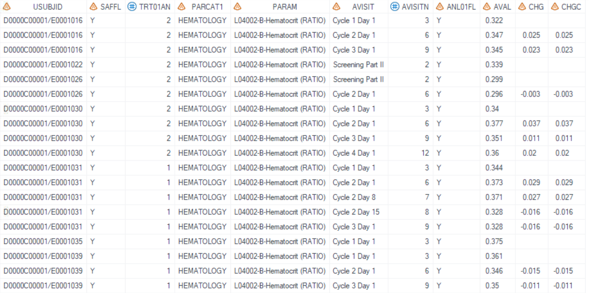
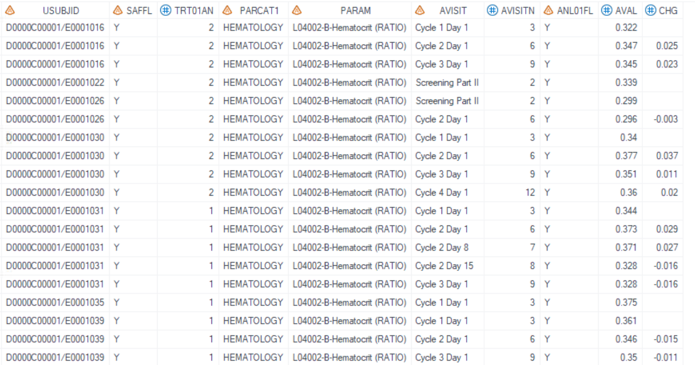

# Example

[Example 1 Align decimals for left aligned listings](#example-1-align-decimals-for-left-aligned-listings)<br>

[Example 2 Align decimals for left aligned listings and name variables with prefix](#example-2-align-decimals-for-left-aligned-listings-and-name-variables-with-prefix)<br>

---

## Example 1 Align decimals for left aligned listings

**Details**<br>

This example does the following:<br>
Align the decimal points for both numeric and character variables AVAL, CHG, and CHGC for input data (adlb), and the output data is _dsout1.

**Program**

```sas
* Call %m_u_align_decimal;
%m_u_align_decimal
	(inds= adlb
	,outds= __dsout1
	,var=AVAL#CHG#CHGC
	,prefix= 
	);
```
**Program Description**<br>

***Input data feature***<br>

Input dataset contains all variables listed in the option `var=AVAL#CHG#CHGC`. Both numeric and character variables are allowed. Numeric variables AVAL and CHG, and character variable CHGC are included in this example. <br>


**Output**

Dataset "work.__inds1.sas7bdat" is created. Original numeric variables AVAL and CHG are output as character variables. Decimals of character variables AVAL, CHG, and CHGC in output dataset are aligned and then final values are left aligned. <br>




## Example 2 Align decimals for left aligned listings and name variables with prefix

**Details**<br>

This example does the following:<br>
Align the decimal points for both numeric variables AVAL, CHG for input data (adlb), and the output data is _dsout1 where the prefix of aligned variables is "hema". <br>

**Program**

```sas
* Call %m_u_align_decimal;
%m_u_align_decimal
	(inds= adlb
	,outds= __dsout
	,var=AVAL#CHG 
	,prefix= hema
	);
```
**Program Description**<br>

***Input data feature***<br>

Input data should contain all variables listed in `var`, including numeric variables AVAL and CHG. Set character prefix as "HEMA" <br>



**Output**

Dataset "work.__inds2.sas7bdat" is created. Original numeric variables AVAL and CHG are output as character variables, named HEMA_AVAL and HEMA_CHG. Decimals of character variables HEMA_AVAL and HEMA_CHG are aligned and then final values are left aligned.<br>

