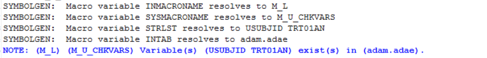
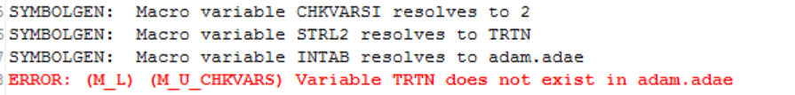
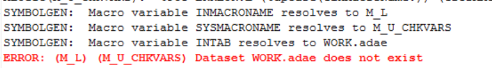

# Example

[Example Check whether input dataset and variables existing](#example-check-whether-input-dataset-and-variables-existing)<br>

---

## Example Check whether input dataset and variables existing

**Details**<br>

This example does the following:<br>
Check whether input dataset and variables existing for %m_l.

**Program**

```sas
*code1 input adam.adae;
%m_u_chkvars( INTAB=adam.adae 
	        ,STRLST=USUBJID TRT01AN
			,CONTINUE=NO, 
			INMACRONAME=M_L
            ); 

*code2 input adam.adae and check USUBJID TRTN;
%m_u_chkvars( INTAB=adam.adae 
	        ,STRLST=USUBJID TRTN
			,CONTINUE=NO, 
			INMACRONAME=M_L
            ); 

*code3 input adae;
%m_u_chkvars( INTAB=adae 
	        ,STRLST=USUBJID TRT01AN
			,CONTINUE=NO, 
			INMACRONAME=M_L
            ); 
```
**Program Description**

1. Code 1 set `INTAB= adam.adae` option to check adam.adae exist and can open successfully.<br>
2. Code 1 set `STRLST=usubjid trt01an` option to check usubjid and trt01an variables exist in adam.adae.
3. Code 2 set `STRLST=usubjid trtn` option to check usubjid and trtn variables exist in adam.adae.
4. Code 3 set `INTAB= adae` option to check  adae exist.

**Output**

1. Output notes in log if USUBJID and TRT01AN exist in adam.adae. <br>


2. Output notes in log if `USUBJID TRTN` exist in adam.adae. <br>


3. Output notes in log if `INTAB=adae` not exist. <br>



