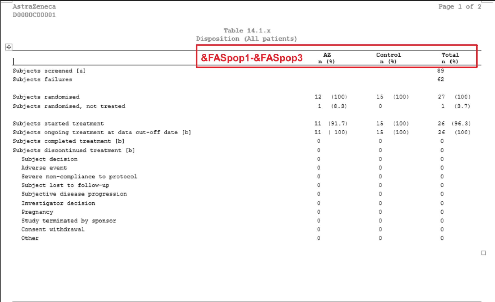
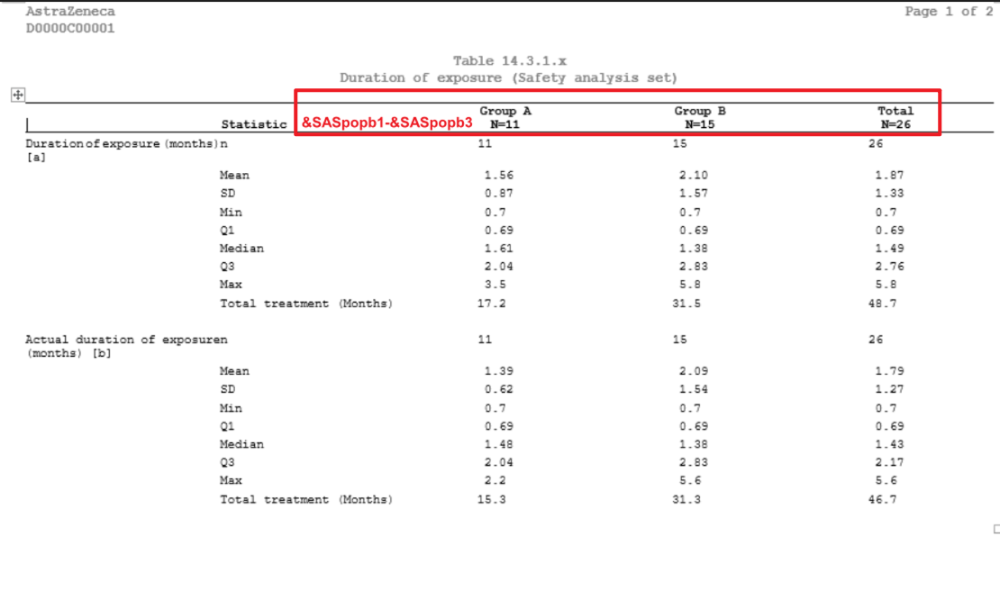
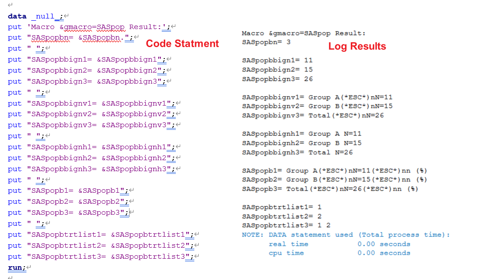

# Example

[Example 1 Display treatment group in disposition table](#example-1-display-treatment-group-in-disposition-table)<br>
[Example 2 Display treatment group with BigN and without other text](#example-2-display-treatment-group-with-bign-and-without-other-text)<br>
[Example 3 Display treatment group with BigN and other text](#example-3-display-treatment-group-with-bign-and-other-text)<br>
[Example 4 Display subtotal and total group-with AZ total](#example-4-display-subtotal-and-total-group-with-az-total)<br>

---

## Example 1 Display treatment group in disposition table 

**Details**<br>

This example does the following:<br>
 Create header of treatment without BigN for the template [AZTONCSP01A](https://azcollaboration.sharepoint.com/sites/O-GEM2/Shared%20Documents/General/O-GEM%20Index.xlsx?d=wb25d071b4025404caf18f0d7487c4b1d&csf=1&web=1&e=enrWS6&nav=MTVfezI3REUxMTFGLTc1QTgtNDNGNi04MzczLTNDRjk5Mzg4MjNGMn0)
 
**Program**

```sas
* Create format;
proc format;
	value _tlf_setup_trtfmt 
	1 = "AZ"
	2 = "Control"
	3 = "Total"
	;
run;

%m_u_popn(
		inds=adam.adsl
        ,pop_flag=FASFL="Y"  
		,trtgrpn=TRT01PN
		,trtlev=1|2|1 2
		,UniqueIDVars=USUBJID  
 		,trtfmtC=_tlf_setup_trtfmt
 		,gmacro=faspop
 		,BigN=N
		,nformat=%str(n (%%))
 		); 
```
**Program Description**<br>

***Input data feature***<br>
The input data includes three required variables: the numeric treatment variable (TRT01PN), the unique subject identifier variable (USUBJID), and the filter condition variable (FASFL).<br>


***Parameter description***<br>

1. Display treatment Group<br>
   Parameter `trtlev=1|2|1 2` provided rules for display treatment groups. In this example, there are 2 orginal treatment groups, and total group (using 1 2 formula for total, separated by a space) are created.  

2. Treatment group order and text in header<br>
   Parameter `trtlev=1|2|1 2` also provided treatment group order, treatment group are listed as sequence based on `trtlev` list treatment order.
   `trtfmtC=_tlf_setup_trtfmt` option provided treatment header text.

3. n (%) under the treatment group<br>
   In this example, set `nformat=%str(n %%))` and `BigN=N` to make (%) appear below treatment label and no BigN needed.

**Output**<br>

Set `gmacro=FASpop` then output global varibales of ***FASpopn***, ***FASpop1-FASpop3***, and ***FASpoptrtlist1-FASpoptrtlist3***. These global macro  variables can be used in dispostition table.<br>




---

## Example 2 Display treatment group with BigN and without other text

**Details**<br>

This example does the following:<br>
 Create header of formatted treatment with BigN and without other display text.
 
**Program**

```sas
* Create format;
proc format;
	value _tlf_setup_trtfmt 
	1 = "AZ"
	2 = "Control"
	3 = "Total"
	;
run;

%m_u_popn(
		inds=adam.adsl
        ,pop_flag= SAFFL="Y"  
		,trtgrpn=TRT01AN
		,trtlev=1|2|1 2
		,UniqueIDVars= USUBJID
 		,trtfmtC=_tlf_setup_trtfmt
 		,gmacro=SASpopb
 		,BigN=Y
		,nformat= 
 		);
```
**Program Description**<br>
  Similar to Example 1 but by providing the `pop_flag= SAFFL="Y"` condition and `trtgrpn=TRT01AN` to change the population, and set `BigN=Y` and `nformat= ` to calcalate BigN and make other text below treatment lable disappear.<br>

  

**Output**<br>

 Similar to Example 1, set `gmacro=SASpopb`, series of global macro variables are produced. In addition to ***SASpopbn***, ***SASpopb1-SASpopb3***, ***SASpopbtrtlist1-SASpopbtrtlist3***, other macro variables ***SASpopbbign1-SASpopbbign3***, ***SASpopbbignv1-SASpopbbignv3***,***SASpopbbignh1-SASpopbbignh3*** are also generated. These global macro variables can be used in other reports, such as duration of exposure table [AZTONCEX01](https://azcollaboration.sharepoint.com/sites/O-GEM2/Shared%20Documents/General/O-GEM%20Index.xlsx?d=wb25d071b4025404caf18f0d7487c4b1d&csf=1&web=1&e=ozvTk8&nav=MTVfezczNzJCODY2LTUzNjQtNDc5Qy1BRjJDLTExNkY3ODI5RTc5RX0) .<br>




---
 
## Example 3 Display treatment group with BigN and other text

**Details**<br>

This example does the following:<br>
Create header of formatted treatment with BigN and n (%) display text.
 
**Program**

```sas
* Create format;

proc format;
	value _tlf_setup_trtfmt 
	1 = "Group A"
	2 = "Group B"
	3 = "Total"
	;
run;

%m_u_popn(
		inds=adam.adsl
        ,pop_flag= SAFFL="Y"  
		,trtgrpn=TRT01AN
		,trtlev=1|2|1 2
		,UniqueIDVars= USUBJID
 		,trtfmtC=_tlf_setup_trtfmt
 		,gmacro=SASpopb
 		,BigN=Y
		,nformat=  %str(n (%%))
 		); 
```
**Program Description**<br>
  Similar to Example 2 but by providing the `nformat=  %str(n (%%))` to display n (%) below treatment lable.<br>
  
  
**Output**<br>

 Similar to Example 2, set `gmacro`=SASpopb, series of global macro variables, including ***SASpopbn***, ***SASpopb1-SASpopb3***, ***SASpopbtrtlist1-SASpopbtrtlist3***, ***SASpopbbign1-SASpopbbign3***, ***SASpopbbignv1-SASpopbbignv3***,***SASpopbbignh1-SASpopbbignh3*** are generated. These global macro variables can be used in other reports, such as summary of adverse events table [AZTONCAE01A](https://azcollaboration.sharepoint.com/sites/O-GEM2/Shared%20Documents/General/O-GEM%20Index.xlsx?d=wb25d071b4025404caf18f0d7487c4b1d&csf=1&web=1&e=v6U4D9&nav=MTVfe0M4ODdCQTZGLUUxM0UtNDI4MC05ODZGLUJCRDM2OUQ2OUFBQ30).<br>




---

## Example 4 Display subtotal and total group-with AZ total

**Details**<br>

This example does the following:<br>
1. Create format of treatments, treatment groups include subtotal and total.
2. Create global variables for treatment groups, including subtotal and total groups.  

**Program**

```sas
* Create format;
proc format;
	*Display text in table Header;
	value _tlf_setup_trtfmtb  
	1 = "AZD1 <<low dose>>"
	2 = "AZD2 <<high dose>>"
	3 = "AZ Total"
	4 = "Control"
	5 = "Total"
	;			 
run;
%m_u_popn(
	inds=adsl
	,pop_flag=SAFFL="Y"  
	,trtgrpn=TRT01AN
	,trtlev=1|2|1 2|3|1 2 3 
	,UniqueIDVars= USUBJID 
	,trtfmtC=_tlf_setup_trtfmtb
	,gmacro=SASpopb
	,BigN=Y
	,nformat=%str(n (%%)) 
	);  

```
**Program Description**<br>

***Input data feature***<br>
The input data includes three required variables: the numeric treatment variable (TRT01AN), the unique subject identifier variable (USUBJID), and the fit condition variable (FASFL). Note that there are only 3 treatment levels  in input dataset (TRT01AN=1: AZD1; TRT01AN=2: AZD2; TRT01AN=3: Control).<br>


***Parameter description***<br>
1. Subtotal/Total<br>
   Parameter `trtlev=1|2|1 2|3|1 2 3` provided rules for subtotal and total group. In this example, subtotal AZ group (using 1 2 formula for subtotal, separated by a space) is insert before control group. Total Group (using 1 2 3 formula for total, separated by a space) is displayed as the last column.  

2. Treatment group order and text in header<br>
   Parameter `trtlev=1|2|1 2|3|1 2 3` also provided treatment group order, treatment group are listed as sequence. In this example, there are 5 level treatment groups in total.
   `trtfmtC=_tlf_setup_trtfmtb` provided treatment header lable based on `trtlev=1|2|1 2|3|1 2 3` list treatment order.

3. BigN display format<br>
   In this example, BigN value and (%) appear below treatment label when `BigN=Y` and `nformat=%str(n %%))`.

**Output**<br>

Set `gmacro`=SASpopb, series of global macro variables, including ***SASpopbn***, ***SASpopb1-SASpopb5***, ***SASpopbtrtlist1-SASpopbtrtlist5***, ***SASpopbbign1-SASpopbbign5***, ***SASpopbbignv1-SASpopbbignv5***,***SASpopbbignh1-SASpopbbignh5*** are generated. These global macro variables can be used in other reports, such as summary of adverse events table [AZTONCAE01A](https://azcollaboration.sharepoint.com/sites/O-GEM2/Shared%20Documents/General/O-GEM%20Index.xlsx?d=wb25d071b4025404caf18f0d7487c4b1d&csf=1&web=1&e=v6U4D9&nav=MTVfe0M4ODdCQTZGLUUxM0UtNDI4MC05ODZGLUJCRDM2OUQ2OUFBQ30).<br>


---